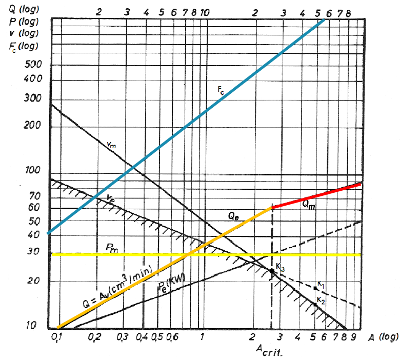
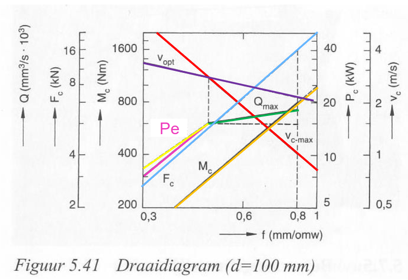
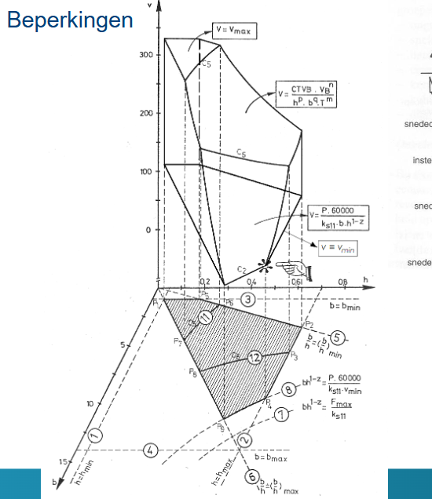

# Verspaning — Productietechnieken en Systemen (H01O1)
**KU Leuven · Prof. Brecht Van Hooreweder · Semester 6**

---

## Inhoudsopgave

1. [Overzicht productietechnieken](#1-overzicht-productietechnieken)
2. [Wat is verspaning?](#2-wat-is-verspaning)
3. [Gereedschapsgeometrie](#3-gereedschapsgeometrie)
4. [Spaanvorming](#4-spaanvorming)
5. [Bewegingen en krachten](#5-bewegingen-en-krachten)
6. [Snijmaterialen](#6-snijmaterialen)
7. [Gereedschapslijtage en standtijd (Taylor)](#7-gereedschapslijtage-en-standtijd-taylor)
8. [Snijvloeistoffen](#8-snijvloeistoffen)
9. [Draaidiagrammen](#9-draaidiagrammen)
10. [Boren](#10-boren)
11. [Frezen](#11-frezen)
12. [Economische aspecten en werkvoorbereiding](#12-economische-aspecten-en-werkvoorbereiding)
13. [Formuleoverzicht](#13-formuleoverzicht)

---

## 1. Overzicht productietechnieken

Er zijn **6 hoofdgroepen** van vervaardigingstechnieken:

| Hoofdgroep | Principe | Voorbeelden |
|---|---|---|
| **Oervormen** | Vorm geven aan vormloos materiaal | Gieten, spuitgieten, zandgieten |
| **Omvormen** | Plastisch vervormen zonder materiaalverlies | Smeden, walsen, plaatbuigen, ponsen |
| **Scheiden / Afnemen** | Materiaal verwijderen | Lasers, waterstraal, **verspanen** |
| **Verbinden** | Delen samenvoegen | Lassen, lijmen, schroeven |
| **Opbrengen van lagen** | Materiaal toevoegen aan oppervlak | Coaten, galvaniseren, spuiten |
| **Veranderen van materiaaleigenschappen** | Structuur aanpassen | Harden, gloeien, nitreren |

**Verspaning** valt onder *Scheiden/Afnemen*: door een snijbeweging wordt materiaal verwijderd als spaan.

### Bewerkingskeuze

De keuze van een productietechniek hangt af van:

- **Productiekosten** — eenmalige kosten (matrijs), herhaalkosten, repeterende kosten
- **Productiesnelheid** — hoe snel kan een batch gemaakt worden?
- **Materiaal** — niet elk materiaal is even goed verspanbaar of gietbaar
- **Flexibiliteit** — productgebonden vs. universeel gereedschap
- **Kwaliteit** — nauwkeurigheid, oppervlakteruwheid, mechanische eigenschappen
- **Milieueffect**
- **Ontwerp** — vlakke dunne delen kunnen niet gegoten worden; complexe vormen zijn moeilijk te smeden

---

## 2. Wat is verspaning?

### Definitie

Verspaning is het **verwijderen van materiaal** door de relatieve beweging tussen een **gereedschap** (met gedefinieerde snijkantgeometrie) en een **werkstuk**, waardoor een **spaan** gevormd wordt.

### Voordelen van verspaning

- **Vormvrijheid** — vrijwel elke vorm is mogelijk
- Geschikt voor **kleine series** (geen dure matrijs nodig)
- Vermijdt lange levertijd van smeedmatrijzen
- Hoge **nauwkeurigheid** en goede **oppervlaktegesteldheid**

### Nadelen van verspaning

- **Materiaalverlies** (verspaand materiaal wordt spaan → recycleerbaar maar energie-intensief)
- **Energie-intensief** proces
- **Tijdrovend** ten opzichte van massaproductietechnieken
- **Vervuiling** van machines en werkplaatsen
- Gebruik van **koelvloeistoffen** (milieu-impact) → trend naar MQL (Minimum Quantity Lubrication)

### Indeling van verspaningsprocessen

```
GECONTROLEERDE SNIJKANTGEOMETRIE
├── Enkelvoudige snijkant:   schaven, draaien, kotteren
├── Meervoudige snijkanten:  boren, frezen, ruimen, tappen, trekfrezen, zagen
│
ONGECONTROLEERDE SNIJKANTGEOMETRIE
└── Veelvuldige snijkanten:  slijpen, honen, lappen, polieren
    (1000 … ∞ abrasieve korrels)
```

### Nauwkeurigheid en ruwheid

Verspaning levert een van de **beste nauwkeurigheden** van alle productietechnieken:
- Toleranties: IT5 – IT10 (afhankelijk van de bewerking)
- Oppervlakteruwheid Ra: 0.1 – 6.3 µm (fijndraaien/slijpen zelfs fijner)

---

## 3. Gereedschapsgeometrie

### 3.1 De basishoeken

Het snijgereedschap (beitel) heeft een **wigvorm** met drie basishoeken die samenhangen:

$$\alpha + \beta + \gamma = 90°$$

| Symbool | Naam | Uitleg |
|---|---|---|
| **α** (alpha) | **Vrijloophoek** | Hoek tussen vrijloopvlak en het gesneden vlak. Vermindert wrijving op het vrijloopvlak. Typisch 6°–10°. |
| **β** (beta) | **Wighoek** | Bepaalt de sterkte van de snijwig en warmteafvoer. Zo groot mogelijk voor sterke beitel. |
| **γ** (gamma) | **Spaanhoek** | Hoek van het spaanvlak. Bepaalt hoe de spaan wegloopt. Typisch −10° tot +30°. |

**Extra hoeken:**

| Symbool | Naam | Uitleg |
|---|---|---|
| **κ** (kappa) | **Instelhoek** (= aanzethoek) | Hoek tussen hoofdsnijkant en voedingsrichting |
| **λ** (lambda) | **Hellingshoek** | Helling van de snijkant t.o.v. een vlak loodrecht op de snijrichting |
| **ε** (epsilon) | **Neushoek** | Hoek aan de punt van het gereedschap |

### 3.2 Invloed van de spaanhoek γ

**Positieve spaanhoek** (γ > 0°):
- Gereedschap snijdt gemakkelijk
- Kleinere snijkrachten, minder trillingsgevaar
- Spanen vloeien vlot weg
- **Maar**: wighoek β is kleiner → beitel is zwakker
- Toepassing: zachte, taaie materialen (aluminium, kunststoffen)

**Negatieve spaanhoek** (γ < 0°):
- Spaan wordt meer gestuikt → grotere krachten en meer warmte
- Beitel is echter **zeer sterk**
- Toepassing: harde, brosse materialen (staal >1200 N/mm², keramiek)

> **Vuistregel:** hoe harder het materiaal, hoe groter de wighoek β en hoe kleiner de spaanhoek γ.

### 3.3 Vrijloophoek α

- Te klein → veel wrijving tussen vrijloopvlak en werkstuk → warmte en slijtage
- Te groot → kleinere wighoek β → zwakkere beitel
- **Zachte/taaie materialen**: grote vrijloophoek
- **Harde materialen**: kleine vrijloophoek

### 3.4 Hellingshoek λ

De hellingshoek bepaalt de richting van de spaanafvoer:
- λ > 0°: spaan loopt weg van de neus (gunstig)
- λ = 0°: spaan loopt loodrecht weg
- λ < 0°: spaan loopt naar de neus (ongunstig, gevaar voor beschadiging)

### 3.5 Onderdelen van het gereedschap

```
Schacht
  └── Werkend deel
        ├── Hoofdsnijkant S        (doet het eigenlijke snijwerk)
        ├── Hulpsnijkant S'
        ├── Eerste spaanvlak Aγ1
        ├── Tweede spaanvlak Aγ2
        ├── Eerste vrijloopvlak Aα1
        ├── Tweede vrijloopvlak Aα2
        ├── Hulpvrijloopvlak Aα1'
        ├── Neus (punt)
        ├── Neusafronding rε
        └── Neusafschuining bε
```

---

## 4. Spaanvorming

### 4.1 Principe

Bij verspaning dringt de snijkant in het werkstuk. Het materiaal vóór de snijkant wordt **afgeschoven** langs een **afschuifvlak** en vormt een **spaan**.

Twee belangrijke diktes:
- **T₁ = snededikte** (dikte van het onvervormd materiaal)
- **T₂ = spaandikte** (dikte van de spaan na vervorming)

T₂ > T₁: de spaan is dikker dan de snede (opstuikverhouding).

### 4.2 Afschuifhoek φ (Merchant)

De afschuifhoek φ bepaalt de grootte van het afschuifvlak en daarmee de snijkrachten:

$$\boxed{\phi = 45° + \frac{\gamma}{2} - \frac{\mu}{2}}$$

- φ **groter** → kleiner afschuifvlak → **kleinere krachten**
- φ groter door: grotere spaanhoek γ of kleinere wrijving µ (coating, smering)
- Grotere spaanhoek → kleinere wighoek → zwakkere beitel (trade-off!)

> **Niet-examenleerstof:** de volledige afleiding van de Merchant-formule (4.2 fysische verspaningswetten).

### 4.3 Snededoorsnede

De snededoorsnede A is de doorsnede van het materiaal dat per snede verwijderd wordt:

$$A = a \times f = b \times h$$

Met de relaties (via de instelhoek κ):

$$b = \frac{a}{\sin \kappa} \qquad h = f \cdot \sin \kappa$$

| Symbool | Naam | Eenheid |
|---|---|---|
| a | snijdiepte (insteldiepte, ingrijping) | mm |
| f | voeding (aanzet per omwenteling) | mm/omw |
| b | snedebreedte | mm |
| h | snededikte | mm |
| κ | instelhoek (= aanzethoek) | ° |

### 4.4 Slankheid van de snede

De **slankheid** δ_κ is de verhouding snedebreedte / snededikte:

$$\delta_\kappa = \frac{b}{h}$$

Voor een goede spaanvorming en spaanbreking moet δ_κ binnen bepaalde grenzen liggen:
- **Staal**: 3 < δ_κ < 15
- **Gietijzer**: 3 < δ_κ < 30 (broos materiaal brokkelt gemakkelijker af)

### 4.5 Soorten spanen

| Type | Omstandigheden | Kenmerken |
|---|---|---|
| **Continue spaan** | Taaie materialen, positieve spaanhoek, hoge snijsnelheid | Lange aaneengesloten lint, gevaar voor verstrengeling |
| **Lamelspaan** (getande spaan) | Variabele afschuiving | Getand uiterlijk, tussentoestand |
| **Brokkelspaan** | Brosse materialen (gietijzer, brons, messing) | Losse brokjes, gunstig voor spaanafvoer |

> **Praktisch:** spaanbrekers op snijplaatjes zorgen ervoor dat continue spanen breken tot kortere stukken, wat spaanafvoer vergemakkelijkt.

---

## 5. Bewegingen en krachten

### 5.1 De drie bewegingen

Bij elke verspaningsbewerking zijn er drie bewegingen:

1. **Hoofdsnijbeweging** — de beweging die de spaan afneemt (bijv. rotatie werkstuk bij draaien, rotatie frees bij frezen). Snelheid = snijsnelheid v_c [m/min]
2. **Voedingsbeweging** — de langzame voorwaartse beweging. Voeding f [mm/omw] of [mm/tand]
3. **Instelbeweging** — eenmalige instelling van de snijdiepte a [mm]

### 5.2 De drie krachten

De totale snijkracht F wordt ontleed in drie componenten:

| Kracht | Symbool | Richting | Belang |
|---|---|---|---|
| **Hoofdsnijkracht** | F_c | Tangentieel, richting v_c | Bepaalt snijvermogen: P_c = F_c × v_c |
| **Voedingskracht** | F_f | Langs de voedingsrichting | Beïnvloedt doorbuiging |
| **Terugdrukkracht** | F_p | Loodrecht op bewerkt vlak | Beïnvloedt doorbuiging werkstuk |

**Waarom F_c kennen?**
- Berekenen van het benodigde **machinevermogen**: P_c = F_c × v_c
- De machinestructuur voldoende **stijf** construeren
- **Levensduur** van het gereedschap bepalen

### 5.3 Formule van Kienzle

Voor de hoofdsnijkracht F_c geldt de empirische wet van Kienzle:

$$\boxed{F_c = k_{c1.1} \times b \times h^{(1-e)}}$$

Of equivalent, uitgedrukt in snijdiepte a en voeding f (voor gegeven instelhoek κ):

$$F_c = k_{c1.1} \times a \times f^{(1-\varepsilon)}$$

| Parameter | Betekenis |
|---|---|
| k_c1.1 [N/mm²] | **Specifieke snijkracht** — materiaaleigenschap (zie tabel) |
| e (= z) | **Invloedscoëfficiënt** — hoe sterk verandert F_c met h |
| b | snedebreedte [mm] |
| h | snededikte [mm] |

**Waarden k_c1.1 en z (Kienzle):**

| Materiaal | k_c1.1 [N/mm²] | z |
|---|---|---|
| St 42 | 1780 | 0.167 |
| St 50 | 1190 | 0.253 |
| St 60 | 2110 | 0.155 |
| C 45 | 2190 | 0.139 |
| C 60 | 2120 | 0.173 |

### 5.4 Vermogen en temperatuur

**Snijvermogen:**
$$P_c = F_c \times v_c$$

Let op: spilvermogen ≠ motorvermogen (er zijn verliezen in reductiekast, lagers, enz.)

**Warmteontwikkeling:** bij verspaning komt energie vrij als warmte:
- **Vervormingswarmte** in de afschuifzone (primaire zone) — ~75%
- **Wrijvingswarmte** tussen spaan en spaanvlak (secundaire zone) — ~18%
- Kleinere hoeveelheden in het vrijloopvlak en werkstuk

**Warmhardheid** = het vermogen van het gereedschapsmateriaal om tot hoge temperaturen hard te blijven. Dit is de sleuteleigenschap die HSS, HM en keramiek onderscheidt.

---

## 6. Snijmaterialen

### 6.1 Hiërarchie van snijmaterialen

Van goedkoop/taai naar duur/hard — dit is ook de volgorde van **toenemende snijsnelheid, hardheid en warmhardheid**, en **afnemende taaiheid**:

```
Gereedschapsstaal (koolstofstaal)
    ↓
HSS (snelstaal)
    ↓
HM (hardmetaal / WIDIA)
    ↓
Gecoat HM
    ↓
Cermets
    ↓
Keramiek (Al₂O₃, Si₃N₄)
    ↓
CBN (kubisch boornitride)
    ↓
Diamant (PKD)
```

> **Examenrelevant:** een veelgestelde vraag is "rangschik deze snijmaterialen van lage naar hoge snijsnelheid en beschrijf samenstelling + manier van vormgeven" — zie de tabel in §6.2.

---

### 6.2 Overzichtstabel: samenstelling, eigenschappen en toepassing

**Tegenstrijdige eisen aan snijmaterialen** (waarom geen enkel materiaal "ideaal" is):
- Slijtagebestendig + warmhardheid (want hoge temperaturen)
- Breukbestendigheid (weerstand tegen stoten en impactbelasting)
- Weerstand tegen vermoeiing en thermoshock
- Oxidatiebestendigheid, weerstand tegen opbouwsnijkant
- Goede prijs, bewerkbaarheid, constantheid van eigenschappen

| Snijmateriaal | Samenstelling | Vormgeving (productie) | Hardheid & warmhardheid | v_c richtwaarde | Wanneer & waarom gebruikt | Belangrijkste beperking |
|---|---|---|---|---|---|---|
| **Gereedschapsstaal** (koolstofstaal) | Fe-C, 0.9–1.2 wt% C (+ soms Mn/V voor extra hardheid), gehard | Gieten en smeden | 60–65 HRC, **lage** warmhardheid (max ~200°C) | 5–7 m/min | Goedkoopste optie; eenvoudige gereedschappen, lage snelheden, hobbygebruik | Verliest snel hardheid bij opwarming → ongeschikt voor industriële v_c |
| **HSS** (snelstaal) | Hooggelegeerd staal: 20–30% W, Cr, V, Mo → vormen harde wolfraamcarbiden | Vroeger gesmeed, vandaag ook steeds meer gesinterd | ~60–65 HRC (iets lager dan koolstofstaal), maar veel betere warmhardheid (max ~500°C) | 20–40 m/min | **Complex gevormde gereedschappen** (boren, frezen, tappen, ruimers, profielfrezen): makkelijker te vormen, ductieler → betere impactweerstand → geschikt voor **onderbroken snede** | Lagere v_c dan HM/keramiek/CBN |
| **Hardmetaal** (HM, WIDIA) | Composiet: wolfraamcarbiden WC (hard) in kobaltmatrix Co (taai, bindmiddel). Meer Co = taaier maar minder hittebestendig | Poedermetallurgie (persen + sinteren) | ~75 HRC, max ~1000°C | 50–400 m/min | Meest gebruikte snijmateriaal vandaag; Co/WC-verhouding af te stemmen op toepassing via **ISO-codering** (zie §6.3) | Weinig taai → gevoelig voor stoten/schokken |
| **Gecoat HM** | Taaie HM-kern (hoog Co-aandeel) + dunne slijtvaste coating(s): TiN, TiC,N, Al₂O₃ (2–20 µm, eventueel multi-laags) | Substraat sinteren, daarna coating (CVD/PVD) | Substraat = taai, coating = zeer slijtvast/warmhard → combinatie van beide | Hoger v_c (of langere standtijd) dan ongecoat HM | Wanneer **zowel taaiheid (schokken) als slijtvastheid (warmte/wrijving)** nodig zijn | Coating kan afspringen bij extreme schokken/thermoshock |
| **Cermets** | Keramische fase (metaalcarbiden/-nitriden/-oxiden) in metalen matrix (Co, Ni, Fe of Mo) | Poedermetallurgie (sinteren), zoals HM | Hoger dan HM, lager dan keramiek | Hoger dan HM | Hoge snelheden/temperaturen, **niet-onderbroken snede**, kleine snededoorsneden (finishing) | Brozer dan HM → minder geschikt voor onderbroken snede/grote krachten |
| **Keramiek** | Al₂O₃ (aluminiumoxide), TiC, Si₃N₄ (siliciumnitride) | Sinteren van poeders | ~80 HRC, max ~1300°C — uitmuntende warmhardheid | 200–1000 m/min | Zeer hoge v_c bij harde materialen, niet-onderbroken snede | **Broos** → thermoshock-gevoelig → ongeschikt voor onderbroken snede |
| **CBN / PCBN** | (Poly)kristallijn kubisch boornitride, vaak met bindmiddel op HM-substraat | Sinteren | Tweede hardste materiaal na diamant, stabiel tot ~2000°C | tot ~3000 m/min | **Hardverspanen** van gehard staal (55–65 HRC) — alternatief voor slijpen | Duur |
| **Diamant** (PKD) | Polykristallijn diamant, eventueel met bindmiddel | Sinteren, vaak op HM-substraat | Hardste bekende materiaal, maar slechts stabiel tot ~600–700°C | Zeer hoog (non-ferro) | Aluminium, koper, composieten, keramiek, hout — zeer goede oppervlaktekwaliteit | **Niet bruikbaar voor staal**: koolstof diffundeert/lost op in het Fe van het werkstuk (zie §6.3) |

---

### 6.3 Extra informatie (examenrelevant)

#### Waarom wordt HSS vandaag nog gebruikt?

Ondanks de lagere v_c blijft HSS de eerste keus voor **complex gevormde gereedschappen** (boren, ruimers, tappen, profielfrezen):
- Eenvoudiger en goedkoper te vormen tot ingewikkelde geometrieën dan brosse HM/keramiek/CBN
- Ductieler → betere **impactweerstand** → beter bestand tegen de **onderbroken snede** bij boren en frezen

#### ISO-codering hardmetaal (HM)

**Format: XX-Y##**

**Eerste deel** (type snijmateriaal):
| Code | Betekenis |
|---|---|
| HW | Onbekleed hardmetaal op wolframbasis |
| HC | **Gecoat hardmetaal** |
| HT | Cermets |
| CA | Keramiek op aluminiumbasis |
| CM | Keramiek op siliciumnitridebasis |
| CC | Gecoat keramiek |
| BN | Kubisch boriumnitride (CBN) |
| DP | Polykristallijn diamant (PKD) |

**Tweede deel** (te bewerken werkstukmateriaal):
| Letter | Materiaal | Kleur |
|---|---|---|
| P | Staal (behalve RVS) | Blauw |
| M | Roestvrij/austenitisch staal | Geel |
| K | Gietijzer, non-ferro, Ti/Ni/Co legeringen | Rood |
| N | Non-ferrometalen | Groen |
| S | Hittebestendige legeringen | Oranje |
| H | Geharde materialen | Grijs |

**Derde deel** (getal 10–40):
- **Klein getal** (bijv. P10): **bros, hard, hittebestendig** → finisseren, hoge snijsnelheid
- **Groot getal** (bijv. P40): **taai** → grote snijkrachten, dynamische belastingen, schrobben

> **Voorbeeld:** `HC-K15` = gecoat hardmetaal, voor gietijzer, relatief hard/bros (finisseren)

#### Gecoate hardmetalen — coatinglagen

- **Coatinglagen:** TiN, TiC,N, Al₂O₃ — meerdere lagen mogelijk (**multi-coating**)
- **Principe:** taaie HM-soort als substraat + dunne slijtbestendige coating (2–20 µm)
- Gecoat HM heeft een **langere standtijd** dan ongecoat HM bij dezelfde snijsnelheid

#### Diamant — waarom niet op staal?

Het **koolstof** uit diamant **diffundeert/lost op** in het **ijzer (Fe)** van het werkstuk bij de hoge contacttemperaturen → snelle slijtage van het gereedschap. Daarom enkel gebruikt voor **non-ferro** materialen (Al, Cu), composieten, keramiek en hout.

---

### 6.4 Snijplaatjes (inserts)

In de praktijk worden **wisselplaatjes** gebruikt i.p.v. massieve beitels.

| Aspect | Uitleg |
|---|---|
| **Wat?** | Vervangbare plaatjes, op een stalen houder gesoldeerd of geklemd |
| **Materiaal** | Hardmetaal (wolfraamcarbiden), cermets, keramiek, PCBN, PKD — net de **brossere/duurdere** snijmaterialen uit §6.2 |
| **Voordeel t.o.v. massieve beitel** | Goedkoper (enkel plaatje vervangen, niet de schacht); meerdere bruikbare snijkanten per plaatje (**indexeerbaar**); laat toe brosse/dure materialen toch te gebruiken |
| **Productie** | **Sinterproces** (poedermetallurgie) — vorm beperkt door perstechniek; coatinglagen kunnen achteraf aangebracht worden |
| **Bepalende parameter voor gebruiksduur** | **Snijsnelheid v_c**, via de wet van **Taylor**: $v_c \cdot T^m = C_T$ |
| **Klemsystemen** | Klemvinger of klemstuk (zie cursus) |

---

## 7. Gereedschapslijtage en standtijd (Taylor)

### 7.1 Soorten slijtage

| Type | Locatie | Symbool | Typische waarden |
|---|---|---|---|
| **Vrijloopvlakslijtage** | Vrijloopvlak (flank) | VB | 0.3–0.6 mm |
| **Kolkslijtage** (kraterslijtage) | Spaanvlak (rake face) | KT | 40–200 µm |
| **Opbouwsnijkant** (BUE) | Snijkant | — | — |

**Oorzaken slijtage:**
- Mechanische slijtage (abrasie)
- Diffusieprocessen (materiaaluitwisseling op atomair niveau)
- Oxidatieprocessen
- Thermische spanningen (thermoshock)
- Opbouwsnijkant (BUE)

### 7.2 Opbouwsnijkant (BUE — Build-Up Edge)

- **Mechanisme:** zacht, ductiel werkstukmateriaal "last" vast aan de snijkant bij lage snijsnelheden
- Verandert de effectieve snijkantgeometrie → slechtere oppervlaktekwaliteit
- **Vermijden door:**
  - Grotere spaanhoek γ
  - Coating op het gereedschap
  - **Hogere snijsnelheid** (BUE verdwijnt bij hogere temperaturen)
  - Hogere druk van snijvloeistoffen

### 7.3 Slijtageverloop en standtijd

De vrijloopvlakslijtage VB neemt toe met de snijtijd. Er is een **slijtagecriterium** (bijv. VB = 0.3 mm) dat bepaalt wanneer het gereedschap verwisseld of nagescherpt moet worden.

De **standtijd T** [min] is de totale snijtijd waarbij het gereedschap het slijtagecriterium bereikt.

### 7.4 Formule van Taylor

Empirisch verband tussen snijsnelheid v_c en standtijd T:

$$\boxed{v_c \times T^n = C_T}$$

- **n** = Taylor-exponent (materiaalkonstante, afhankelijk van gereedschapsmateriaal)
  - HSS: n ≈ 0.1–0.2
  - HM: n ≈ 0.2–0.4
  - Keramiek: n ≈ 0.4–0.6
- **C_T** = constante (afhankelijk van gereedschaps-/werkstukmateriaal, VB, snededoorsnede)

**Interpretatie:** snijsnelheid v_c verhogen → standtijd T daalt sterk (machtsverband).

> **Voorbeeld:** als n = 0.125 en v_c stijgt met 50%, dan daalt T met factor (1.5)^(1/0.125) = (1.5)^8 ≈ 25 → standtijd wordt ~25× korter!

**Praktische vuistregels standtijd:**
- Draaien: T = 10–20 min
- Frezen: T = 60 min

### 7.5 Veralgemeende wet van Taylor

De eenvoudige Taylor-formule geldt alleen voor constante snededoorsnede. In werkelijkheid verandert C_T met VB, h en b:

$$\boxed{v \cdot T^m = \frac{C_{TVB} \cdot VB^n}{h^p \cdot b^q}}$$

**Richtwaarden constanten:**
- m ≈ 0.25–0.34 (afhankelijk van materiaal en gereedschap)
- n ≈ 0.42–0.47
- p ≈ 0.16–0.26 (invloed van snededikte h)
- q ≈ 0.05–0.1 (invloed van snedebreedte b, vaak verwaarloosbaar)

**Omgeschreven naar instelgrootheden f en a** (met h = f·sinκ en b = a/sinκ):

$$v \cdot T^m = \frac{C_{TVB} \cdot VB^n}{f^p \cdot a^q \cdot (\sin \kappa)^{p-q}}$$

**Invloed van instelhoek κ:** hoe schuiner de snijkant (kleinere κ), hoe groter de standtijd T of hoe hogere snijsnelheid v mogelijk is.

---

## 8. Snijvloeistoffen

### 8.1 Functies

| Functie | Effect |
|---|---|
| **Koelen** | Hogere maatnauwkeurigheid, lagere oppervlakteruwheid |
| **Smeren** | Langere standtijd, hogere snijsnelheid mogelijk, hogere voeding mogelijk, onderdrukken BUE |
| **Spaanafvoer** | Spanen wegspoelen uit de snijzone |

### 8.2 Types snijvloeistoffen

| Type | Eigenschappen | Toepassing |
|---|---|---|
| **Water** | Goede koeling, slechte smering | Bijproduct van emulsies |
| **Snijolie** | Goede smering, matige koeling | Lage snelheden, tappen, boren |
| **Water-olie emulsie** | Combinatie koeling + smering | Meest gebruikt (3–10% olie) |

### 8.3 Aandachtspunten

- **Onderbroken snede** (frezen, boren): opgelet met koeling! Plotselinge koeling bij warme beitel → thermoshock → scheuren in beitel. Ofwel continu koelen ofwel helemaal niet.
- **MQL (Minimum Quantity Lubrication):** minieme hoeveelheid olie verstuiven → milieuvriendelijker

---

## 9. Draaidiagrammen

### 9.1 De draaibank

**Onderdelen:**
- **Vaste kop** — bevat hoofdspil, aandrijving, schakelkasten voor spilsnelheden en voedingen
- **Klauwplaat** — klemming van het werkstuk (3 of 4 kaken)
- **Losse kop** — ondersteuning van het werkstuk + boren
- **Schort** — verbindt sleden met de spindel voor handmatige of automatische voeding
- **Langsslede** — beweging langs de rotatieas (z-richting)
- **Dwarsslede** — beweging loodrecht op de rotatieas (x-richting)
- **Beitelslede** — instelbeweging onder hoek (voor konische oppervlakken)

### 9.2 Kronenbergdiagram

#### Waarvoor dient het Kronenbergdiagram?

Het Kronenbergdiagram wordt gebruikt om de **capaciteit van het gereedschap (beitel) gelijk te stellen aan de capaciteit van de machine**. Het houdt **geen rekening met de nauwkeurigheid** van het werkstuk (doorbuiging, ruwheid) en leidt dus **niet noodzakelijk tot de economisch optimale snijvoorwaarden** — het geeft vooral **inzicht in de krachten, vermogens, snelheden en beperkingen** als functie van de snededoorsnede A.

#### Opbouw van de assen

- **Horizontale as:** snededoorsnede $A = b \cdot h$ [mm²], op logaritmische schaal
- **Verticale as:** **bilogaritmische** gecombineerde schaal voor v, F_c, P, Q en T — omdat elke grootheid een machtsfunctie is van A, wordt elk verband een **rechte lijn** op deze schaal.

#### De lijnen — betekenis én volgorde van opstellen

De lijnen worden in deze volgorde afgeleid, telkens steunend op de vorige:

| # | Lijn (kleur) | Formule | Betekenis |
|---|---|---|---|
| 1 | **F_c** (blauw) | $F_c = k_{c1.1}\cdot A^{(1-e)}$ (Kienzle) | Snijkracht als functie van A — de basis van het diagram |
| 2 | **P_m** (geel, horizontaal) | constant | Beschikbaar **motorvermogen** — vastgelegd door de machine, onafhankelijk van A |
| 3 | **v_m** | $v_m = P_m / F_c$ | Maximale snijsnelheid die de motor (qua vermogen) toelaat bij die A |
| 4 | **v_e** (paars) | uit veralgemeende Taylor bij $T = T_e$ | Economische snijsnelheid: snelheid die de gekozen economische standtijd oplevert |
| 5 | **P_e** | $P_e = F_c \cdot v_e$ | Vermogen nodig bij de economische snelheid |
| 6 | **Q_m** (rood) | $Q_m = v_m \cdot A$ | Spaandebiet bij maximale snelheid |
| 7 | **Q_e** (oranje) | $Q_e = v_e \cdot A$ | Spaandebiet bij economische snelheid |

#### Het optimale punt volgens Kronenberg

Er zijn **twee voorwaarden**, elk noodzakelijk maar **niet voldoende** afzonderlijk:

1. $T = T_e \;\Leftrightarrow\; v_e = v_m$ — de machine draait net aan de snelheid die de economische standtijd oplevert
2. $P_e = P_m$ — het vermogen bij die snelheid is exact het beschikbare motorvermogen

Het punt waar **beide voorwaarden samen** gelden, is het kritische punt **k₃** bij de **kritische snededoorsnede $A_{crit}$**. Dit is *het* Kronenberg-optimum: de machine draait op vol vermogen, terwijl het gereedschap precies zijn economische standtijd haalt.

#### Verder optimaliseren: van k₃ naar k₂ (A > A_crit)

Als de werkstukgeometrie een grotere snededoorsnede toelaat ($A > A_{crit}$), kan men van k₃ naar k₂ verschuiven:

- $F_c$ stijgt mee met A → om $P_m$ niet te overschrijden moet $v_c$ **dalen**
- Een lagere $v_c$ geeft (Taylor) een **hogere standtijd T** → **lagere gereedschapskost** $K_G/T$
- Het debiet $Q = v_c \cdot A$ blijft **stijgen** (A stijgt sneller dan $v_c$ daalt) → kortere hoofdtijd → **lagere bewerkingskost**
- We werken dus niet meer op de "economische" snelheid $v_e$, maar het resultaat is **toch goedkoper**

> **Beperking:** A kan niet onbeperkt stijgen. Het wordt begrensd door de **toelaatbare nauwkeurigheid** van het werkstuk (doorbuiging $y_w$, zie §12.4) en het **maximaal koppel** van de machine. → Voor verdere optimalisatie is het **TNO-diagram** nodig.



> **Examenvraag (2019):** *"Bespreek het Kronenbergdiagram: (a) waarvoor dient het, (b) wat is de betekenis van de lijnen en in welke volgorde worden ze opgesteld, (c) wat is het optimale punt, (d) hoe kan je verder optimaliseren?"* — zie de tabel en uitleg hierboven voor het volledige antwoord.

---

### 9.3 TNO-diagram

#### Waarvoor dient het TNO-diagram?

Het Kronenberg- en TNO-diagram werken met een **vaste verhouding tussen b en h** (vaste instelhoek κ). Het TNO-diagram werkt de **verdere optimalisatie van het spaandebiet** uit voor een **gegeven draaistuk** (vaste diameter d, bv. d = 100 mm). Het toont hoe de **voeding f** [mm/omw] alle andere grootheden beïnvloedt, en laat toe om binnen de machinecapaciteit het debiet te maximaliseren.

#### Assen

- **Horizontaal:** voeding f [mm/omw]
- **Verticaal (meerdere gecombineerde schalen):** F_c [kN], M_c [Nm], P_c [kW], v_c [m/s], Q [mm³/s]

#### Kleurcode van de lijnen

| Kleur | Grootheid | Betekenis |
|---|---|---|
| Blauw | F_c | Snijkracht (Kienzle), stijgt met f |
| Oranje | M_c | Koppel $= F_c \cdot d/2$ |
| Rood (horizontaal) | P_max | Maximaal motorvermogen (vast, bv. 15 kW) |
| Paars | v_c,opt = v_e | Economische (optimale) snijsnelheid |
| Rood (schuin) | v_c,max = v_m | Maximale snijsnelheid die de motor toelaat |
| Roze | P_e | Vermogen bij economische snelheid |
| Groen | Q_max = Q_m | Spaandebiet bij maximale snelheid |
| Geel | Q_e | Spaandebiet bij economische snelheid |

#### Hoe lees je het diagram af?

1. **Kies f** op de x-as — in de praktijk vaak begrensd door de toelaatbare ruwheid (§12.4: $f_{max} = \sqrt{8 r_\varepsilon R_{t,max}}$)
2. **Lees F_c en M_c af** (blauwe/oranje lijn) bij die f
3. **Controleer het vermogen**: ligt $P_e \leq P_{max}$? Zo niet, dan kan de machine $v_e$ niet leveren en is $v_m$ bindend
4. **Lees v_c af**: paarse lijn = $v_e$ (economisch), rode schuine lijn = $v_m$ (machinegrens) — de kleinste van beide is bindend
5. **Lees het debiet Q af**: groen ($Q_m$) of geel ($Q_e$), afhankelijk van welke snelheid effectief gebruikt wordt



---

### 9.4 COPTURN-diagram (3D b-h-v-volume)

#### Waarvoor dient het COPTURN-diagram?

Het COPTURN-diagram (Cutting Optimisation Program voor draaien) gaat een stap verder dan Kronenberg/TNO: het bakent een **volume af in de 3D-ruimte opgespannen door b (snedebreedte), h (snededikte) en v (snijsnelheid)**, door **alle** verspaningswetten en beperkingen tegelijk in rekening te brengen. Binnen dit volume is verspanen zowel **mogelijk** als **toelaatbaar**. Daarna optimaliseert een computerprogramma (COP/COPTURN) naar **minimale kost** of **maximale productiviteit** met **Lagrange-multiplicatoren**.

#### De grenzen van het volume (10 beperkingen)

| # | Grens | Verklaring |
|---|---|---|
| 1 | $h_{min}$ | Door de **neusafronding** $r_\varepsilon$: de snijkant is niet onbeperkt scherp; bij te kleine h "glijdt" de beitel over het werkstuk i.p.v. te snijden |
| 2 | $h_{max}$ | Door de **toelaatbare ruwheid**: $R_t = f^2/(8r_\varepsilon)$, met $h = f \cdot \sin\kappa$ |
| 3 | $b_{min}$ | Door de **afronding van de beitelpunt** (neusradius) |
| 4 | $b_{max}$ | $b \leq \tfrac{3}{4}$ van de totale lengte van de snijkant (stabiel proces) |
| 5 | $\delta_{min} \approx 3$ | Te kleine slankheid $b/h$ → spanen te "vierkant"/dik → te grote krachten |
| 6 | $\delta_{max} \approx 15$ (≈30 voor gietijzer) | Te grote slankheid → gevaarlijke lintspanen |
| 7 | Wet van **Kienzle** (max. kracht) | $F_c$ mag de toelaatbare kracht niet overschrijden (machinekoppel of nauwkeurigheid) |
| 8 | **Strengere Kienzle** bij laag toerental | Elektromotoren halen hun nominaal koppel niet bij laag toerental → strengere krachtgrens |
| 9 | $v_{min}$ | Minimale snijsnelheid om **opbouwsnijkant (BUE)** te vermijden |
| 10 | $v_{max}$ | Maximale snijsnelheid, bepaald door max. toerental/vermogen van de machine |

Daarnaast spelen ook mee:

- de **veralgemeende wet van Taylor** (bepaalt de economische standtijd $T_e$, zie §7.5 en §12.1)
- **Kienzle uitgedrukt t.o.v. het motorvermogen**: $P = P_m = F_c \cdot v_c$ — hierin is v een variabele (i.p.v. vastgelegd zoals bij grens 7-8), wat een echt **3D-oppervlak** geeft i.p.v. een grens die je op het b-h-vlak kan projecteren.

**Resultaat:** binnen het 3D-volume liggen alle **toelaatbare combinaties** (b, h, v). Het COP/COPTURN-programma zoekt hierin het punt dat de **kost minimaliseert** of de **productiviteit maximaliseert**.




> **Examenvraag (juni 2024):** *"Bespreek het COPTURN-diagram. Wat zijn de assen? Hoe wordt het opgesteld? Waarvoor dient het?"* — assen = b, h, v; opbouw = de 10 grenzen + Taylor + Kienzle-vermogensoppervlak; doel = optimalisatie naar kost/productiviteit via Lagrange.
>
> **Examenvraag (2019, alternatieve formulering):** *"Beschrijf het diagram in detail. Leg stap voor stap uit hoe men hiertoe komt."* — loop de 10 grenzen in volgorde af zoals in de tabel hierboven.

---

## 10. Boren

### 10.1 Principe

Bij **gatbewerkingen** (boren, kotteren, ruimen, tappen):
- **Hoofdbeweging:** rotatie van het gereedschap
- **Voedingsbeweging:** translatie langs de rotatieas

### 10.2 Types boren

| Type | Principe |
|---|---|
| **Volboren** | Boor door massief materiaal (geen voorgat nodig) |
| **Kernboren** | Boren met kernboor, laat kern staan (voor grote diameters) |
| **Opboren** | Vergroten van bestaand gat |
| **Verzinken** | Conische of cilindrische verzinking maken |

**Blind gat vs. doorlopend gat:** spaanafvoer is moeilijker bij blind gat. Bij rechte spaangroef: spanen gaan omhoog (moeilijk). Schroefvormige spaangroef helpt spaanafvoer bij blind gat.

**Nauwkeurigheid van boren:** lager dan draaien of ruimen. Voor precisisgaten: eerst boren, dan ruimen.

### 10.3 Boorgeometrie

De spiraalboor heeft dezelfde basishoeken als een draaibeitel, maar met extra complicaties:

```
Boor
├── Spiraalhoek (helix angle) — bepaalt spaanhoek
├── Punthoek (= 2 × κ) — halfpunthoek is de instelhoek
├── Hoofdsnijkanten (2 stuks)
├── Dwarssnijkant (chisel edge) — aan de punt, in het centrum
├── Geleiderand — centreert de boor in het gat
└── Spaangroeven — afvoer van de spanen
```

**Punthoeken voor verschillende materialen:**

| Punthoek | Toepassing |
|---|---|
| 60° | Plastics |
| 90° | Non-ferrometalen en hout |
| 118° | **Staal (algemeen gebruik)** |
| 135° | Harde en taaie materialen |

### 10.4 Variatie van spaanhoek over de diameter

**Aan de omtrek:** de effectieve spaanhoek ≈ spiraalhoek (gunstig, positief)

**Aan de ziel (centrum):** de effectieve spaanhoek wordt sterk **negatief** (tot −56°!) door de kleine omtreksnelheid. De verspaningscondities zijn hier **zeer ongunstig**.

**Spoedhoek σ** bepaalt de relatie tussen omtreksnelheid en voeding:

$$\sigma = \frac{f}{\pi \cdot d}$$

Hoe kleiner d (dichter bij de ziel), hoe groter de relatieve invloed van f op de effectieve hoeken.

### 10.5 Dwarssnijkant en aanpunten

De **dwarssnijkant** (chisel edge) in het centrum van de boor:
- Bijdrage tot **grote snijkrachten** (voedingskracht F_f)
- Klein bijdrage tot het snijmoment
- Functioneert meer als een **duwende** dan snijdende werking

**Aanpunten (web thinning):** de dwarssnijkant inkorten/dunner maken:
- Beperkt de voedingskracht F_f
- Verhoogt de standtijd
- Betere centreernauwkeurigheid

### 10.6 Krachten en vermogen bij boren

| Grootheid | Formule | Vergelijk draaien |
|---|---|---|
| Verspaningsmoment | M_c = C_M × d^x_M × f^y_M | F_c = k_c1.1 × a × f^(1-ε) |
| Verspaningsvermogen | P_c = M_c × ω = M_c × 2π × n | P_c = F_c × v_c |
| Voedingskracht | F_f = C_f × d^x_f × f^y_f | F_f ~ F_c |

Richtwaarden voor constructiestaal: C_f ≈ 1500, x_f ≈ 0.8, y_f ≈ 0.8; C_M ≈ 0.45, x_M ≈ 1.8, y_M ≈ 0.8

### 10.7 Keuze van de voeding f

De voeding f is beperkt door:
- **Maximaal toelaatbaar torsiemoment op de boorziel** (hoofdeis → breukgrens boor)
- Vrijslijphoek (effectieve vrijloophoek moet positief blijven)
- Spaanafvoer
- Vermogen van de boormachine
- Sterkte van het werkstuk en de opspanning
- "Happen van de boor" (bij te grote f springt de boor door)

### 10.8 Boormachines

Types: **tafelboormachine**, **kolomboormachine**, **radiaalboormachine**

**Spilconstructie:** de spil kan axiaal bewegen (voedingsbeweging) terwijl de spilbus stationair blijft.

---

## 11. Frezen

### 11.1 Principe en vergelijking met draaien

| Aspect | Draaien | Frezen |
|---|---|---|
| Hoofdbeweging | Rotatie werkstuk | Rotatie gereedschap |
| Werkstuk | Roteert | Staat stil |
| Snijkanten | Enkelvoudig | Meervoudig (z tanden) |
| Snededikte | Constant | **Varieert** tijdens rotatie |
| Snede | Ononderbroken | **Onderbroken** (intermitterend) |

Bij frezen: **zijdelingse krachten op de spil** → complexe lagering nodig.

### 11.2 Types frezen

| Type | Principe | Toepassing |
|---|---|---|
| **Mantelfrees** | Snijkanten op de mantel | Vlakke oppervlakken loodrecht op het gereedschap |
| **Kopfrees** | Snijkanten op de voorzijde | Vlakke oppervlakken (face milling) |
| **Mantelkopfrees** | Combinatie mantel + kop | Vlakke oppervlakken en schouders |

**Kopfrezen = face milling = rechte vlakken maken**

### 11.3 Meeloop vs. Tegenloop

Dit is een essentieel concept bij het frezen:

| | **Tegenloop** (conventional) | **Meeloop** (climb) |
|---|---|---|
| Rotatie vs. voeding | Tegen elkaar in | In dezelfde richting |
| Spaandikte | Begint dun, eindigt dik | **Begint dik, eindigt dun** |
| Eerste contact | Wrijven, dan snijden | Meteen snijden |
| Oppervlaktekwaliteit | Matig | **Goed** |
| Kracht op werkstuk | Optillen | Vastdrukken |
| Speling in voedingsmechanisme | Niet kritisch | **Speling moet gecompenseerd worden** |
| Voorkeur? | Oudere machines | **Moderne CNC-machines (voorkeur)** |

> **Samenvatting:** meeloop is te verkiezen op moderne machines (goede geleiding, geen speling) omdat de oppervlaktekwaliteit beter is en het werkstuk wordt vastgedrukt.

### 11.4 Krachten bij frezen

De gemiddelde snededikte bij mantelfrezen (tegenloop):

$$h_{gem} = f_z \times \sqrt{\frac{a}{d}}$$

Met f_z = voeding per tand, a = radiële ingrijping, d = freesdiameter.

**Snijkracht per tand:**
$$F_c = k_{c1.1} \times h_{gem}^{(1-\varepsilon)} \times b$$

**Koppel en vermogen:**
$$M_c = F_c \times \frac{d}{2} \times z_i \qquad P_c = F_c \times v_c \times z_i = M_c \times \omega$$

**Debiet:**
$$Q = a \times b \times f_z \times n \times z = a \times b \times v_f$$

### 11.5 Freesgereedschappen

**Mantelfrezen:**
- Zachte materialen → **grote spaangroef** (grote spanen, want zachte materialen geven lange continue spanen)
- Harde materialen → **veel tanden** (krachtvariaties beperken; kleine snededoorsnede per tand)
- Materiaal: HSS of hardmetaal

**Kopfrezen (meskopfrees):**
- Hardmetalen of keramische wisselplaten
- Hoge snijsnelheden mogelijk

### 11.6 Freesmachines

Types:
- **Verticale freesmachine** — spil verticaal (meest gebruikt voor kopfrezen)
- **Horizontale freesmachine** — spil horizontaal (voor mantelfrezen)
- **Vlakfreesmachine** — voor grote vlakken

---

## 12. Economische aspecten en werkvoorbereiding

### 12.1 Veralgemeende Taylor en economische standtijd

De veralgemeende Taylor (zie §7.5) geeft de standtijd als functie van v, f, a.

**Effectieve standtijd:** T = ψ₁(v, f, a | WM, GM, crit, ...) — de werkelijk bereikbare standtijd.

**Economische standtijd** (te kiezen i.f.v. doelstelling):

$$\boxed{T_e = \left(\frac{1}{m} - 1\right) \frac{K_G}{K_U}} \quad \text{(voor minimale kost per stuk)}$$

$$\boxed{T_p = \left(\frac{1}{m} - 1\right) T_{CT}} \quad \text{(voor minimale productietijd)}$$

| Symbool | Betekenis |
|---|---|
| m | Taylor-exponent |
| K_G | Gereedschapskost (aanschaf + wisselkost) per gereedschapsleven |
| K_U | Kost voor bezetten van de machine per tijdseenheid (= K_M + K_L) |
| T_CT | Gereedschapswisseltijd [min] |

> T_e > T_p altijd: minimale kost vereist langere standtijd dan maximale productiviteit.
> Te en Tp zijn lager voor betere gereedschapsmaterialen: hogere snijsnelheden zijn dan economisch.

**Voorbeelden:**

| Bewerking | T_e (min. kost) | T_p (max. prod.) |
|---|---|---|
| Draaien met HSS beitel | 23.3 min | 5.7 min |
| Draaien met gebraseerde HM plaat | 14.7 min | 2.0 min |
| Draaien met indexeerbare HM plaat | 11.1 min | 2.0 min |
| Frezen met HSS profielfrees | 3.6 uur | 1 uur |

### 12.2 Kostenformule

De totale verspaningskost per stuk K_V:

$$\boxed{K_V = t_h \cdot K_U + \frac{t_h}{T} \cdot K_G + t_a \cdot K_U}$$

| Term | Symbool | Betekenis |
|---|---|---|
| Directe verspaningskosten | K_Vh = t_h · K_U | Dalen bij hogere v (kortere hoofdtijd t_h) |
| Gereedschapskosten | K_VG = (t_h/T) · K_G | Stijgen bij hogere v (kortere T) |
| Vaste nevenkosten | K_Va = t_a · K_U | Onafhankelijk van v |

Met:
- t_h = hoofdtijd = eigenlijke verspaningstijd
- t_a = neventijd (opspannen, nameten, ...) — onafhankelijk van snijsnelheid
- T = standtijd gereedschap
- K_U = K_M + K_L (machine + loonkosten per tijdseenheid)
- K_G = gereedschapskost per gereedschapsleven

**Optimale snijsnelheid v_c,opt** ligt in het minimum van de K_V-curve (totale kostenoptimum).

> **Niet-examenleerstof:** berekeningsvoorbeelden voor kosten (§6.4) en wiskundige optimalisatieprocedure (§7.4.4).

### 12.3 Werkvoorbereiding

**Werkvoorbereiding** is het plannen van het productieproces vóór de eigenlijke productie:

```
Input tekening (maten, toleranties)
    ↓
Selectie werkstukmateriaal
    ↓
Identificatie van te bewerken features (vlakken, gaten, profielen)
    ↓
Analyse bewerkingsstappen
    ↓
Selectie bewerkingen per feature (voordraaien, finisseren, slijpen, ...)
    ↓
Selectie gereedschappen per bewerking
    ↓
Bepalen werkstukvolgorde
    ↓
Selectie machines per bewerking
    ↓
Bepalen van snijvoorwaarden (a, f, v)
    ↓
Bepalen opspanningen
    ↓
NC-programmatie / werkkaarten
```

### 12.4 Keuze van snijvoorwaarden (a, f, v)

De keuze van optimale snijvoorwaarden verloopt stapsgewijs:

**Stap 1: Koppel machine- en gereedschapscapaciteit**
- Via Kronenbergdiagram: zoek A_crit, stel T = T_e en P = P_m

**Stap 2: Optimaliseer debiet Q**
- Via TNO-diagram: kies f en v_c

**Stap 3: Corrigeer a op basis van beperkingen**

#### Beperking 1: Toelaatbare kracht

De terugdrukkracht F_p veroorzaakt **doorbuiging** van het werkstuk:

$$y_w = (s_m + s_w) \cdot F_p$$

- s_m = soepelheid machine [µm/N]
- s_w = soepelheid werkstuk [µm/N]

**Soepelheid werkstuk** (opspanning tussen 2 punten):

$$s_w = \frac{y_w}{F_p} = \frac{L^3}{48 \cdot E \cdot I} \qquad \text{met } I = \frac{\pi d^4}{64}$$

**Soepelheid werkstuk** (opspanning in klauwplaat):

$$s_w = \frac{L^3}{3 \cdot E \cdot I}$$

> Opspanning in klauwplaat geeft 16× meer doorbuiging dan tussen 2 punten bij gelijke L!

#### Beperking 2: Oppervlakteruwheid

Het beitelpunt heeft een afronding r_ε. Dit geeft een theoretische ruwheid:

$$R_t = \frac{(f/2)^2}{2 r_\varepsilon} = \frac{f^2}{8 r_\varepsilon}$$

De **maximale voeding** voor een gewenste ruwheid R_t,max:

$$f_{max} = \sqrt{8 \cdot r_\varepsilon \cdot R_{t,max}}$$

> **Praktisch:** de voeding f wordt in de praktijk bijna altijd beperkt door de toelaatbare oppervlakteruwheid, niet door de theoretische optimale waarde uit de kostenformule.

### 12.5 COP — Cutting Optimisation Program

**COP** (Cutting Optimisation Program, ook COPTURN) is een computerprogramma dat:

1. Alle verspaningswetten en beperkingen uitdrukt als functies van b, h, v
2. Een 3D-ruimte (v = f(b,h)) definieert waarbinnen oplossingen liggen
3. Optimaliseert naar minimale kost of maximale productiviteit (Lagrange-methode)

**Invoer:** machine-nr, gereedschap-nr, materiaal-nr, opspandata, werkstukgegevens

**Uitvoer:** lijst van optimale snijvoorwaarden (v_opt, f_opt, a_opt)

> Zie **§9.4** voor de volledige uitleg van het COPTURN-diagram (de 10 grenzen van het b-h-v-volume) — een veelgestelde examenvraag.

---

## 13. Formuleoverzicht

| Formule | Naam | Gebruik |
|---|---|---|
| α + β + γ = 90° | Hoekrelatie gereedschap | Altijd |
| φ = 45° + γ/2 − µ/2 | Afschuifhoek (Merchant) | Spaanvorming |
| A = a·f = b·h | Snededoorsnede | Kienzle |
| b = a/sinκ; h = f·sinκ | Geometrie → instelhoek | Kienzle |
| δ_κ = b/h | Slankheid snede | Spaanvorming (3 < δ < 15 staal) |
| F_c = k_c1.1 · b · h^(1-e) | Kienzle | Snijkracht |
| P_c = F_c · v_c | Snijvermogen | Vermogen |
| v_m = P_m / F_c | Max. snelheid bij motorvermogen | Kronenbergdiagram |
| Q = v · A (Q_m = v_m·A, Q_e = v_e·A) | Spaandebiet | Kronenberg-/TNO-diagram |
| v_c · T^n = C_T | Taylor (eenvoudig) | Standtijd |
| v·T^m = C_TVB·VB^n / (h^p·b^q) | Veralgemeende Taylor | Standtijd |
| T_e = (1/m−1)·K_G/K_U | Economische standtijd (min. kost) | Optimalisatie |
| T_p = (1/m−1)·T_CT | Productiviteitsstandtijd | Optimalisatie |
| K_V = t_h·K_U + (t_h/T)·K_G + t_a·K_U | Kostenformule | Economie |
| R_t = f²/(8·r_ε) | Theoretische ruwheid | Oppervlaktekwaliteit |
| y_w = (s_m + s_w)·F_p | Doorbuiging werkstuk | Nauwkeurigheid |
| s_w = L³/(48EI) | Soepelheid (tussen 2 punten) | Doorbuiging |
| s_w = L³/(3EI) | Soepelheid (klauwplaat) | Doorbuiging |

---

## Niet-examenleerstof (expliciet vermeld)

- §4.2 Fysische verspaningswetten (afleiding Merchant-formule)
- Proef van Mathon (§5.6.2.3)
- §6.4 Berekeningsvoorbeelden voor kosten
- §7.4.4 Wiskundige optimalisatieprocedure
- §7.4.5 Toepassing op optimalisatie van snijvoorwaarden

---

---

## Wat je echt moet kennen

- De 6 hoofdgroepen van productietechnieken en waar verspaning onder valt
- Het verschil tussen gecontroleerde en ongecontroleerde snijkantgeometrie
- De drie basishoeken van het gereedschap (α, β, γ) en hun som = 90°
- Wat de spaanhoek γ doet: positief = zachte materialen, negatief = harde materialen
- De drie bewegingen bij verspaning: hoofdsnijbeweging, voedingsbeweging, instelbeweging
- De drie krachten: F_c (tangentieel), F_f (voeding), F_p (terugdruk)
- De formule van Kienzle voor de hoofdsnijkracht: F_c = k_c1.1 × b × h^(1-e)
- De snededoorsnede: A = a × f = b × h, en de relaties via instelhoek κ
- De slankheid δ_κ = b/h en de grenzen (3–15 voor staal)
- De drie soorten spanen: continu, lamel, brokkel — en wanneer elke optreedt
- De twee soorten gereedschapsslijtage: vrijloopvlakslijtage (VB) en kolkslijtage (KT)
- Wat opbouwsnijkant (BUE) is en hoe je het vermijdt
- De formule van Taylor: v_c × T^n = C_T — en wat n betekent voor HSS vs HM vs keramiek
- De hiërarchie van snijmaterialen van goedkoop naar duur/hard
- De ISO-codering van hardmetalen: XX-Y## (type, materiaal, getal)
- Wat het getal in de ISO-code betekent: klein = bros/hard (finisseren), groot = taai (schrobben)
- Wanneer je gecoat HM gebruikt en waarom (taaiheid + slijtvastheid combineren)
- Waarom diamant niet op staal gebruikt mag worden (koolstof lost op in ijzer)
- De functies van snijvloeistoffen: koelen, smeren, spaanafvoer
- Waarom je bij onderbroken snede voorzichtig moet zijn met koeling (thermoshock)
- Het verschil tussen meeloop en tegenloop bij frezen (voorkeur meeloop op CNC)
- Waarom de spaanhoek van een boor sterk negatief wordt aan de ziel
- Wat de dwarssnijkant doet en hoe aanpunten helpt
- De economische standtijd T_e (minimale kost) vs T_p (maximale productiviteit)
- De kostenformule K_V = t_h·K_U + (t_h/T)·K_G + t_a·K_U en de drie termen daarin
- De ruwheidsformule R_t = f²/(8·r_ε) en de maximale voeding hieruit
- Doorbuigingsberekening via soepelheid: y_w = (s_m + s_w)·F_p
- **Het Kronenbergdiagram**: het doel (beitel- vs. machinecapaciteit), de opbouwvolgorde van de lijnen (F_c → P_m → v_m → v_e → P_e → Q_m → Q_e), en het optimale punt k₃ (T=T_e & P_e=P_m)
- Hoe je van k₃ naar k₂ optimaliseert als A > A_crit (v_c omlaag → T omhoog → Q blijft stijgen → goedkoper)
- **Het TNO-diagram**: assen (f t.o.v. F_c, M_c, P_c, v_c, Q) en de kleurcode van de lijnen (v_e vs. v_m, Q_e vs. Q_m)
- **Het COPTURN-diagram**: het 3D b-h-v-volume, de 10 grenzen die het afbakenen, en de optimalisatie naar kost/productiviteit via Lagrange

---

*Gebaseerd op slides Les 1, 2, 3, 4 en 6 — Productietechnologie H01O1, KU Leuven 2024*
