# Alle examenvragen met antwoorden — H01O1 Productietechnieken en -systemen

> **Doel van dit document:** alle **open (niet-meerkeuze) examenvragen** van de voorbije jaren verzamelen, **gegroepeerd per cursusthema** (in plaats van chronologisch), met telkens een **volledig en correct modelantwoord** — "in de stijl van de prof".

## Hoe dit document is opgebouwd

- **Enkel open vragen.** Vraag 1 van het examen (10 punten, 10 meerkeuzevragen) is **niet** opgenomen — zie [Richtlijnen examen H01O1.md](Richtlijnen%20examen%20H01O1.md) voor het volledige examenformat. Dit document focust op vraag 2 (schriftelijk, 20 punten) en vraag 3 (schriftelijke voorbereiding + mondeling, 20 punten): theorievragen en oefeningen.
- **Gegroepeerd per thema, niet per jaar.** Examenvragen worden vaak letterlijk of in lichte variatie hergebruikt. Bij elke vraag staat een regel **"Gesteld in: ..."** die aangeeft in welke examenzitting(en) deze vraag (of een variant ervan) voorkwam.
- **Modelantwoorden gebaseerd op de theorie.** De antwoorden zijn **niet** overgenomen uit de (door studenten opgestelde, mogelijk onvolledige of foutieve) antwoorddocumenten, maar primair gebaseerd op de theorie-samenvattingen: `Verspaning.md`, `Slijpen.md`, `Lassen.md`, `Scheiden.md`, `Oervormen.md`, `Omvormen.md`, `AdditiveManufacturing.md` en `Laserbewerking.md`.
- **Bronnen voor de vraagstelling:**
  - `Examenvragen 2022-2024 (Maxim Bijnens).md`
  - `Productietechnieken_en_systemen_examenvragen 2019 2021.md`
  - `wiki_examenvragen`
  - `examen_2026` (examen van 4 juni 2026 — het meest recente)
- **Notatie.** Wiskundige uitdrukkingen en formules staan in **zuivere LaTeX**. Symbolen die middenin een lopende zin staan (bv. $v_c$, $\gamma$) kunnen als gewone tekst of inline LaTeX voorkomen.
- **Beknopt en scanbaar.** De antwoorden zijn ingekort tot de kern: definities, hoofdoorzaken/mechanismen, formules en conclusies blijven 100% volledig, maar wollige tussenzinnen en herhalingen zijn geschrapt. Kernbegrippen zijn **vetgedrukt**, en numerieke oefeningen/afleidingen staan als genummerd stappenplan.
- **Laatste sectie: "Algemeen overzicht — productietechnieken herkennen."** Dit is een zelf opgestelde gids (niet uit de theoriebestanden overgenomen, maar een synthese) voor het type bijvraag *"je krijgt een voorwerp van de prof: welke productietechnieken kunnen gebruikt zijn om dit te maken?"* (gesteld op 17 juni 2019).

---

## Inhoudsopgave

### [Verspaning](#verspaning)
- [Beitelgeometrie: basishoeken, snededikte/spaandikte en afschuifhoek (Merchant)](#beitelgeometrie-basishoeken-snedediktespaandikte-en-afschuifhoek-merchant)
- [Gereedschapsmaterialen, ISO-codering en snijplaatjes (wisselplaatjes)](#gereedschapsmaterialen-iso-codering-en-snijplaatjes-wisselplaatjes)
- [Gereedschapsslijtage: kolkslijtage (KT) en vrijloopvlakslijtage (VB), slijtagemechanismen](#gereedschapsslijtage-kolkslijtage-kt-en-vrijloopvlakslijtage-vb-slijtagemechanismen)
- [Boren: geometrie, variatie van de spaanhoek, correct slijpen en wet van Kienzle voor boren](#boren-geometrie-variatie-van-de-spaanhoek-over-de-radius-belang-van-correct-slijpen-en-de-wet-van-kienzle-voor-boren)
- [Wet van Kienzle](#wet-van-kienzle)
- [Wet van Taylor, standtijd en kosten](#wet-van-taylor-standtijd-en-kosten)
- [Kronenbergdiagram](#kronenbergdiagram)
- [COPTURN-diagram](#copturn-diagram)
- [Oppervlakteruwheid en nauwkeurigheid bij draaien](#oppervlakteruwheid-en-nauwkeurigheid-bij-draaien)
- [Numerieke oefening bij draaien (St 50)](#numerieke-oefening-bij-draaien-st-50)

### [Slijpen](#slijpen)
- [Definitie, principe en spaandebiet bij slijpen](#definitie-principe-en-spaandebiet-bij-slijpen)
- [Slijpen versus draaien — vergelijking, configuraties en warmte-effecten](#slijpen-versus-draaien--vergelijking-configuraties-en-warmte-effecten)
- [Uitgebreide variant — schetsen, spaandebiet, schijfeffecten, mechanismen en warmte (incl. grind hardening)](#uitgebreide-variant--schetsen-spaandebiet-schijfeffecten-mechanismen-en-warmte-incl-grind-hardening)
- [Nabewerkingsprocessen en slijpschijf-onderhoud](#nabewerkingsprocessen-en-slijpschijf-onderhoud)

### [Lassen](#lassen)
- [Puntlassen vs. projectielassen, lasbaarheid van staal, radiator, toevoegmateriaal-technieken, temperatuursverloop bij puntlassen](#puntlassen-vs-projectielassen-lasbaarheid-van-staal-radiator-toevoegmateriaal-technieken-temperatuursverloop-bij-puntlassen)
- [Booglasprocessen — stroomgroottes, puntlassen/projectielassen, BMBE-bekleding, MAG-beschermgas, TIG-principe](#booglasprocessen--stroomgroottes-puntlassenprojectielassen-bmbe-bekleding-mag-beschermgas-tig-principe)
- [OP-lassen (onder poederdek) — principe en DCEP versus DCEN](#op-lassen-onder-poederdek--principe-en-dcep-versus-dcen)

### [Scheiden](#scheiden)
- [Subvraag A — Stansen/ponsen: snijspleet, krachten en afgeschuind gereedschap](#subvraag-a--stansenponsen-snijspleet-krachten-en-afgeschuind-gereedschap)
- [Subvraag B — Meerdere ponsen tegelijk en fijnstansen](#subvraag-b--meerdere-ponsen-tegelijk-en-fijnstansen)

### [Oervormen](#oervormen)
- [Zandgieten, wet van Chvorinov en ontwerp van een opkomer](#zandgieten-wet-van-chvorinov-en-ontwerp-van-een-opkomer)
- [Turbinebladen — gerichte stolling (DS): conductie versus radiatie](#turbinebladen--gerichte-stolling-ds-conductie-versus-radiatie)

### [Omvormen](#omvormen)
- [Cluster 1 — Walsen: theoretische afleidingen (gemiddelde vloeispanning, meeneemhoek, maximale diktereductie)](#cluster-1--walsen-theoretische-afleidingen-gemiddelde-vloeispanning-meeneemhoek-maximale-diktereductie)
- [Cluster 2 — Walsen: numerieke oefening (minimale walsdiameter)](#cluster-2--walsen-numerieke-oefening-minimale-walsdiameter)
- [Cluster 3 — Verstevigingskromme, arbeid, terugvering en warm vs. koud omvormen](#cluster-3--verstevigingskromme-arbeid-terugvering-en-warm-vs-koud-omvormen)
- [Cluster 4 — Minimale buigradius / maximale buigstraal: afleiding](#cluster-4--minimale-buigradius--maximale-buigstraal-afleiding)

### [Additive Manufacturing](#additive-manufacturing)
- [Voor- en nadelen van AM, SLS vs. FDM, en metaalkeuze bij SLM](#voor--en-nadelen-van-am-sls-vs-fdm-en-metaalkeuze-bij-slm)
- [EBM — opstelling en vergelijking met SLM](#ebm--opstelling-en-vergelijking-met-slm)
- [SLM-machine — schets, onderdelen en workflow](#slm-machine--schets-onderdelen-en-workflow)

### [Laserbewerking](#laserbewerking)
- [Lasersnijden — proces, snijgas en bundelkwaliteit](#lasersnijden--proces-snijgas-en-bundelkwaliteit)

### [Algemeen overzicht — productietechnieken herkennen aan een voorwerp](#algemeen-overzicht--productietechnieken-herkennen-aan-een-voorwerp)

---

## Verspaning

### Beitelgeometrie: basishoeken, snededikte/spaandikte en afschuifhoek (Merchant)

*Gesteld in: examen juni 2019, 17 juni 2019, 8 juni 2018 (voormiddag), 20 juni 2019, 27 juni 2018, en als voorbeeldvraag.*

**Vraag:** Teken en leg de beitelgeometrie uit: spaanhoek (γ), wighoek (β) en vrijloophoek (α), met de relatie α+β+γ=90°. Wat is het verschil tussen de snededikte (h) en de spaandikte (s)? Hoe hangen deze samen met de instelhoek (κ), de voeding (f) en de afschuifhoek (φ)? (Een variant vraagt expliciet om de afleiding/formule van de afschuifhoek φ volgens Merchant.)

**Modelantwoord.**

**1. De drie basishoeken van de beitel**

Een beitel is een **wig**; loodrecht op de snijkant onderscheiden we drie hoeken die samen **90°** vormen:

<div style="display: flex; gap: 16px; align-items: flex-start;">
  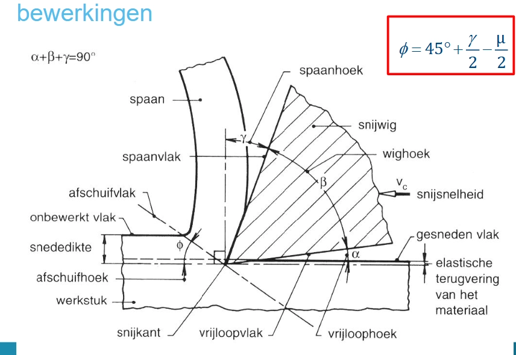
  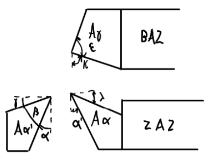
</div>

$$\alpha + \beta + \gamma = 90^\circ$$

| Symbool | Naam | Betekenis |
|---|---|---|
| **α** — vrijloophoek | tussen vrijloopvlak en bewerkt vlak | vermindert wrijving op het vrijloopvlak; typisch **6°–10°** |
| **β** — wighoek | hoek van de wig zelf (tussen Aγ en Aα) | bepaalt **sterkte** en **warmteafvoer**; zo groot mogelijk |
| **γ** — spaanhoek | hoek spaanvlak t.o.v. vlak ⊥ snijrichting | bepaalt spaanafvoer; typisch **−10° tot +30°** |

**Invloed van γ:**
- **Positief** (γ>0°): kleinere snijkrachten, minder trillingen, vlotte spaanafvoer — maar β kleiner → zwakkere beitel. Voor zachte/taaie materialen (Al, kunststoffen).
- **Negatief** (γ<0°): spaan stuikt meer op → grotere krachten/warmte, maar sterke beitel. Voor harde/brosse materialen (staal > 1200 N/mm², keramiek).

> **Vuistregel:** hoe harder het materiaal, hoe groter β en hoe kleiner (negatiever) γ.

**Invloed van α:** te klein → wrijving/warmte/slijtage op vrijloopvlak; te groot → kleinere β (zwakker). Zacht/taai materiaal → grote α; hard materiaal → kleine α.

**2. Snededikte h versus spaandikte s**

Materiaal vóór de snijkant wordt **afgeschoven** langs een **afschuifvlak** tot een **spaan**:
- **h (=T₁):** snededikte = dikte van het **onvervormde** materiaal (machine-instelling).
- **s (=T₂):** spaandikte = dikte van de spaan **na vervorming** door afschuiving.

Door plastische vervorming geldt steeds **s > h** (opstuiking).

**3. Instelhoek κ, voeding f en snededoorsnede**

$$A = a \cdot f = b \cdot h, \qquad b = \frac{a}{\sin\kappa}, \qquad h = f \cdot \sin\kappa$$

| Symbool | Naam | Eenheid |
|---|---|---|
| a | snijdiepte (insteldiepte) | mm |
| f | voeding (per omwenteling) | mm/omw |
| b | snedebreedte | mm |
| h | snededikte | mm |
| κ | instelhoek (hoek tussen hoofdsnijkant en voedingsrichting) | ° |

Een **kleinere κ** geeft (bij gelijke a, f) een kleinere h en grotere b → **slankere snede** (slankheid δ_κ = b/h, met 3 < δ_κ < 15 voor staal).

**4. Afschuifhoek φ (Merchant)**

$$\varphi = 45^\circ + \frac{\gamma}{2} - \frac{\mu}{2}$$

met **γ** = spaanhoek gereedschap, **µ** = wrijvingshoek tussen spaan en spaanvlak (verlaagd door coating/smering).

- **Groter φ** → kleiner afschuifvlak → **kleinere snijkrachten**.
- φ stijgt door grotere γ of kleinere µ — maar grotere γ geeft kleinere β → **zwakkere beitel** (trade-off).

**5. Samenhang h, s, φ, γ**

$$s = h \cdot \frac{\cos(\varphi - \gamma)}{\sin\varphi}$$

Een **grotere φ** (door grotere γ of kleinere µ) brengt s dichter bij h → minder opstuiking, minder vervormingswarmte, kleinere krachten — consistent met punt 4.

---

### Gereedschapsmaterialen, ISO-codering en snijplaatjes (wisselplaatjes)

*Gesteld in: voorbeeldvraag, 4 juni 2021.*

**Vraag:** Welke gereedschapsmaterialen worden gebruikt in de verspaning, en wat zijn hun eigenschappen en toepassingsgebieden? Hoe worden snijplaatjes (wisselplaatjes) gemaakt en hoe wordt hun levensduur bepaald?

**Modelantwoord.**

**1. Tegenstrijdige eisen aan snijmaterialen**

Geen snijmateriaal is "ideaal" — de eisen werken elkaar tegen: slijtagebestendigheid **en** warmhardheid (hoge contacttemperaturen), breukbestendigheid (schokken), weerstand tegen vermoeiing en thermoshock, oxidatiebestendigheid en weerstand tegen opbouwsnijkant (BUE), en goede prijs/bewerkbaarheid.

**Algemeen:** hoger in de hiërarchie van snijmaterialen → **hardheid, warmhardheid en toelaatbare v_c stijgen**, maar **taaiheid (breukvastheid) daalt**.

**2. Hiërarchie van snijmaterialen**

Van goedkoop/taai (lage v_c) naar duur/hard (hoge v_c):

```
Gereedschapsstaal → HSS → Hardmetaal (HM/WIDIA) → Gecoat HM → Cermets → Keramiek (Al₂O₃, Si₃N₄) → CBN → Diamant (PKD)
```

| Snijmateriaal | Samenstelling | Vormgeving | Hardheid & warmhardheid | v_c (richtwaarde) | Toepassing |
|---|---|---|---|---|---|
| **Gereedschapsstaal** | Fe-C, 0.9–1.2% C, gehard | Gieten/smeden | 60–65 HRC, max ~200°C | 5–7 m/min | Goedkoopst; eenvoudige gereedschappen, lage snelheden |
| **HSS** (snelstaal) | Hooggelegeerd staal (W, Cr, V, Mo → wolfraamcarbiden) | Gesmeed of gesinterd | ~60–65 HRC, max ~500°C | 20–40 m/min | Complexe gereedschappen (boren, frezen, tappen, ruimers): ductiel → bestand tegen onderbroken snede |
| **Hardmetaal (HM, WIDIA)** | WC (hard) in Co-matrix (taai); meer Co = taaier, minder hittebestendig | Poedermetallurgie (persen + sinteren) | ~75 HRC, max ~1000°C | 50–400 m/min | Meest gebruikt vandaag; Co/WC-verhouding via ISO-codering |
| **Gecoat HM** | Taaie HM-kern (hoog Co) + slijtvaste coating (TiN, TiC,N, Al₂O₃, 2–20 µm) | Sinteren + coaten (CVD/PVD) | Kern taai, coating zeer slijtvast/warmhard | Hoger dan ongecoat HM | Wanneer taaiheid (schokken) én slijtvastheid (warmte/wrijving) nodig zijn |
| **Cermets** | Carbiden/nitriden/oxiden in metalen matrix (Co, Ni, Fe, Mo) | Poedermetallurgie | Tussen HM en keramiek | Hoger dan HM | Hoge snelheden, niet-onderbroken snede, finishing |
| **Keramiek** | Al₂O₃, TiC, Si₃N₄ | Sinteren van poeders | ~80 HRC, max ~1300°C | 200–1000 m/min | Zeer hoge v_c bij harde materialen, niet-onderbroken snede; broos/thermoshockgevoelig |
| **CBN/PCBN** | (Poly)kristallijn CBN, vaak op HM-substraat | Sinteren | 2de hardst na diamant, stabiel tot ~2000°C | tot ~3000 m/min | Hardverspanen van gehard staal (55–65 HRC) — alternatief voor slijpen |
| **Diamant (PKD)** | Polykristallijn diamant | Sinteren, vaak op HM-substraat | Hardst bekend, maar stabiel tot slechts ~600–700°C | Zeer hoog (non-ferro) | Al, Cu, composieten, keramiek, hout — niet voor staal |

**Waarom HSS nog gebruikt wordt:** goedkoper/eenvoudiger te vormen tot complexe geometrieën dan brosse HM/keramiek/CBN, en **ductieler** → beter bestand tegen de onderbroken snede bij boren en frezen, ondanks lagere v_c.

**Waarom diamant niet op staal:** koolstof uit diamant diffundeert/lost op in het Fe van het werkstuk bij hoge contacttemperaturen → snelle slijtage. Daarom enkel non-ferro, composieten, keramiek en hout.

**3. ISO-codering hardmetaal (HM)** — formaat **XX-Y##**

*Type snijmateriaal:*

| Code | Betekenis |
|---|---|
| HW | Onbekleed hardmetaal (wolframbasis) |
| HC | Gecoat hardmetaal |
| HT | Cermets |
| CA | Keramiek op aluminiumbasis |
| CM | Keramiek op siliciumnitridebasis |
| CC | Gecoat keramiek |
| BN | Kubisch boornitride (CBN) |
| DP | Polykristallijn diamant (PKD) |

*Werkstukmateriaal:*

| Letter | Materiaal | Kleur |
|---|---|---|
| P | Staal (behalve RVS) | Blauw |
| M | Roestvrij/austenitisch staal | Geel |
| K | Gietijzer, non-ferro, Ti/Ni/Co-legeringen | Rood |
| N | Non-ferrometalen | Groen |
| S | Hittebestendige legeringen | Oranje |
| H | Geharde materialen | Grijs |

*Getal (10–40):* klein (bv. P10) = bros/hard/hittebestendig → finisseren, hoge v_c; groot (bv. P40) = taai → grote snijkrachten, schrobben.

Voorbeeld: `HC-K15` = gecoat hardmetaal, voor gietijzer, relatief hard/bros (finisseren).

**4. Snijplaatjes (inserts) — productie**

In de praktijk worden **wisselplaatjes** gebruikt i.p.v. massieve beitels, geklemd of gesoldeerd op een stalen houder.

- **Materiaal:** hardmetaal, cermets, keramiek, PCBN, PKD — de brossere/duurdere snijmaterialen uit de hiërarchie.
- **Voordeel t.o.v. massieve beitel:** goedkoper (enkel plaatje vervangen); meerdere bruikbare snijkanten per plaatje (**indexeerbaar**); maakt brosse/dure materialen praktisch bruikbaar.
- **Productie:** **sinterproces (poedermetallurgie)** — poeder geperst tot vorm en gesinterd; coatinglagen (TiN, TiC,N, Al₂O₃) achteraf via CVD/PVD.
- **Klemsystemen:** klemvinger of klemstuk.

**5. Bepalen van de levensduur (standtijd)**

Bepalende parameter: snijsnelheid v_c, via de wet van **Taylor**:

$$v_c \cdot T^n = C_T$$

- **T** [min] = standtijd: snijtijd tot het slijtagecriterium (bv. VB = 0.3 mm) bereikt is en het plaatje vervangen/geïndexeerd moet worden;
- **n** = Taylor-exponent, materiaalafhankelijk (HSS: n ≈ 0.1–0.2; HM: n ≈ 0.2–0.4; keramiek: n ≈ 0.4–0.6);
- **C_T** = constante, afhankelijk van gereedschaps-/werkstukmateriaal, slijtagecriterium en snededoorsnede.

Klein machtsverband → **kleine verhoging van v_c geeft sterke daling van T**: bij n = 0.125 geeft +50% op v_c een daling van T met factor $(1.5)^{1/0.125} \approx 25$ — T wordt dan ~25× korter.

---

### Gereedschapsslijtage: kolkslijtage (KT) en vrijloopvlakslijtage (VB), slijtagemechanismen

*Gesteld in: examen 2019, 17 juni 2019, 8 juni 2018 (voormiddag).*

**Vraag:** Welke slijtagemechanismen treden op bij verspaningsgereedschappen? Beschrijf kolkslijtage (KT) en vrijloopvlakslijtage (VB), inclusief typische grenswaarden. Welke fysische mechanismen liggen aan de basis van deze slijtage (bv. opbouwsnede/BUE, diffusie, oxidatie, abrasie, adhesie)?

**Modelantwoord.**

**1. De twee hoofdtypes slijtage**

| Type | Locatie | Symbool | Typische grenswaarden |
|---|---|---|---|
| **Vrijloopvlakslijtage** | Vrijloopvlak (flank), door wrijving met het reeds bewerkte oppervlak | VB | 0.3–0.6 mm |
| **Kolkslijtage** (kraterslijtage) | Spaanvlak, waar de afschuivende spaan onder hoge druk/temperatuur een krater uitslijt | KT | 40–200 µm |

Het slijtagecriterium (bv. VB = 0.3 mm) wordt vooraf per toepassing vastgelegd. VB neemt toe met de snijtijd; bij het bereiken van dit criterium is de **standtijd T** [min] bereikt — de basis van de wet van Taylor ($v_c \cdot T^n = C_T$). Te diepe kolkslijtage verzwakt de snijkant zelf → verhoogd **breukgevaar**.

**2. Oorzaken / fysische mechanismen van slijtage**

- **Abrasie:** harde deeltjes in werkstuk of spaan schuren gereedschapsmateriaal weg — belangrijke oorzaak van zowel VB als KT.
- **Adhesie:** lokaal "koud-vastlassen" van werkstuk- en gereedschapsmateriaal onder hoge druk/temperatuur; bij relatieve beweging worden stukjes meegesleurd.
- **Diffusie:** atomaire materiaaluitwisseling tussen werkstuk en gereedschap bij hoge contacttemperatuur — vooral op het spaanvlak (KT), waar T het hoogst is.
- **Oxidatie:** bij hoge temperatuur en aanwezigheid van lucht/koelvloeistof ontstaan oxidelagen die de slijtvastheid verminderen.
- **Thermoshock:** plotse temperatuurswisselingen (bv. onderbroken snede met intermitterende koeling) → scheurtjes/uitbrokkeling, vooral bij brosse snijmaterialen.
- **Opbouwsnijkant (BUE):** zie punt 3.

**3. Opbouwsnijkant (BUE — Build-Up Edge)**

- **Mechanisme:** bij lage snijsnelheid "last" zacht, ductiel werkstukmateriaal vast aan de snijkant.
- **Gevolg:** verandert de effectieve snijkantgeometrie → **slechtere oppervlaktekwaliteit**.
- **Vermijden door:** grotere spaanhoek γ, coating op het gereedschap, **hogere snijsnelheid** (BUE verdwijnt bij hogere temperatuur), hogere druk van snijvloeistof.

**4. Veralgemeende wet van Taylor**

$$v \cdot T^m = \frac{C_{TVB} \cdot VB^n}{h^p \cdot b^q}$$

Breidt de basiswet $v_c \cdot T^n = C_T$ uit met de afhankelijkheid van het slijtagecriterium VB en van de snededoorsnede (h, b).

---

### Boren: geometrie, variatie van de spaanhoek over de radius, belang van correct slijpen, en de wet van Kienzle voor boren

*Gesteld in: 27 juni 2023.*

**Vraag:** Schets een boorgereedschap en bespreek de geometrie, met aandacht voor de variatie van de spaanhoek/snijhoek over de radius (van omtrek naar ziel). Waarom is correct slijpen van een boor belangrijk? Hoe kan de wet van Kienzle toegepast worden bij boren (koppel M_c en axiale kracht)?

**Modelantwoord.**

**1. Schets en geometrie van de spiraalboor**

De spiraalboor heeft dezelfde basishoeken als een draaibeitel (spaanhoek, vrijloophoek, wighoek), maar met extra complicaties door de 3D-vorm:

<div style="display: flex; gap: 16px; align-items: flex-start;">
  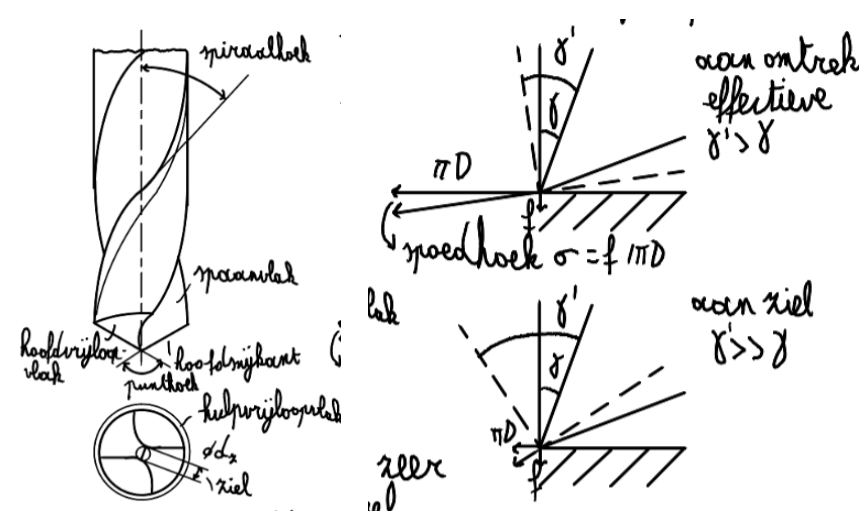
  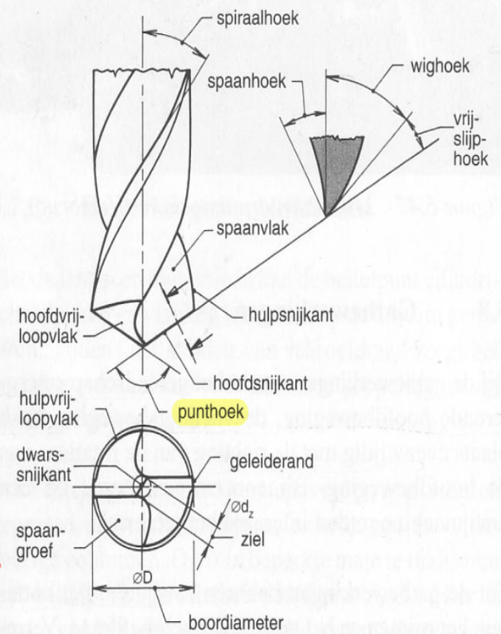
</div>

**Onderdelen:** spiraalhoek (helix angle, bepaalt mee de spaanhoek), punthoek (= 2κ, halve punthoek = instelhoek κ), twee hoofdsnijkanten, dwarssnijkant (chisel edge, in het centrum), geleiderand (centreert de boor) en spaangroeven (spaanafvoer).

**Punthoeken voor verschillende materialen:**

| Punthoek | Toepassing |
|---|---|
| 60° | Plastics |
| 90° | Non-ferrometalen en hout |
| 118° | Staal (algemeen gebruik) |
| 135° | Harde en taaie materialen |

**Spaanafvoer:** eenvoudiger bij een **doorlopend gat** dan bij een **blind gat** (bij een rechte spaangroef moeten spanen omhoog); een **schroefvormige spaangroef** helpt bij een blind gat.

**2. Variatie van de spaanhoek over de radius (omtrek → ziel)**

De effectieve spaanhoek van de spiraalboor is **niet constant**:

- **Aan de omtrek:** omtreksnelheid is het grootst → effectieve spaanhoek ≈ **spiraalhoek** — gunstig en positief.
- **Aan de ziel (centrum):** omtreksnelheid daalt naar nul terwijl de voeding gelijk blijft → effectieve spaanhoek wordt sterk **negatief — tot −56°!** Zeer ongunstige verspaningscondities.

Verklaring via de **spoedhoek σ** (verhouding voeding/omtrek):

$$\sigma = \frac{f}{\pi \cdot d}$$

Hoe kleiner d (dichter bij de ziel), hoe groter de relatieve invloed van f op de effectieve hoeken — vandaar de sterk negatieve spaanhoek nabij de ziel.

**Dwarssnijkant (chisel edge):** draagt sterk bij tot de krachten (vooral voedingskracht F_f), maar levert slechts een kleine bijdrage tot het snijmoment — werkt meer **duwend** dan snijdend (consistent met de sterk negatieve spaanhoek hier).

**Aanpunten (web thinning):** inkorten/verdunnen van de dwarssnijkant beperkt F_f, verhoogt de standtijd en geeft een betere centreernauwkeurigheid.

**3. Waarom is correct slijpen van een boor belangrijk?**

Een boor heeft **twee hoofdsnijkanten** die de belasting symmetrisch zouden moeten verdelen.

- Bij **asymmetrisch slijpen** (ongelijke lengte/hoek/afstand tot de hartlijn) snijdt de ene snijkant meer materiaal weg dan de andere → **onbalans**, zijwaartse belasting → **trillingen**, verhoogd **breukgevaar**, en een **oversized (opgeboord) gat** doordat de boor uitwijkt/slingert.
- De snijhoeken (spaanhoek, vrijloophoek, instelhoek) moeten over de **volledige snijkant correct** zijn — omdat deze al sterk variëren van omtrek naar ziel (tot −56°), verstoort fout slijpen deze hoeken verder: lokaal nog ongunstiger, hogere krachten/temperaturen, ongelijke slijtage, slechtere oppervlaktekwaliteit van het gat.

**Kort:** correct slijpen waarborgt zowel de **geometrische nauwkeurigheid** (symmetrie, gatdiameter, centrering) als de **mechanische/thermische prestaties** (krachten, slijtage, standtijd).

**4. Toepassing van de wet van Kienzle bij boren**

Bij draaien: $F_c = k_{c1.1} \cdot a \cdot f^{1-\varepsilon}$. Bij boren wordt, analoog, het **verspaningsmoment (koppel) M_c** en de **voedingskracht (axiale kracht) F_f** uitgedrukt als machtsfunctie van **diameter d** en **voeding f**:

| Grootheid | Formule | Vergelijk draaien |
|---|---|---|
| Verspaningsmoment | $M_c = C_M \cdot d^{x_M} \cdot f^{y_M}$ | $F_c = k_{c1.1} \cdot a \cdot f^{1-\varepsilon}$ |
| Verspaningsvermogen | $P_c = M_c \cdot \omega = M_c \cdot 2\pi \cdot n$ | $P_c = F_c \cdot v_c$ |
| Voedingskracht | $F_f = C_f \cdot d^{x_f} \cdot f^{y_f}$ | $F_f \sim F_c$ |

**Richtwaarden voor constructiestaal:** C_f ≈ 1500, x_f ≈ 0.8, y_f ≈ 0.8; C_M ≈ 0.45, x_M ≈ 1.8, y_M ≈ 0.8.

Koppel M_c en axiale kracht F_f groeien als **machtsfunctie** van d en f, met constanten analoog aan k_c1.1 en (1−ε) bij draaien. Het verspaningsvermogen volgt uit M_c en ω = 2πn (n = toerental), analoog aan P_c = F_c · v_c.

**5. Keuze van de voeding f bij boren**

f wordt begrensd door: het **maximaal toelaatbaar torsiemoment op de boorziel** (breukgrens), de **vrijslijphoek** (effectieve vrijloophoek moet positief blijven), de **spaanafvoer**, het **vermogen van de boormachine**, de **sterkte van werkstuk en opspanning**, en "**happen**" van de boor (bij te grote f springt de boor plots door).

---

### Wet van Kienzle

**Vragen:**
a) Geef de wet van Kienzle. Welke kracht is dit, toon die op een figuur, en leg uit hoe deze wet opgesteld en gebruikt wordt.
b) Wat is de betekenis van k_c1.1 in de vergelijking van Kienzle, en hoe wordt dit (en de exponent z) bepaald?
c) (Namiddag-bijvraag) Wat is de invloed van de snijsnelheid v_c op de snijkracht F_c volgens Kienzle?

*Gesteld in: examen 2019, 17 juni 2019, 8 juni 2018 voormiddag (+ namiddag-bijvraag over invloed van de snijsnelheid)*

**Antwoord:**

**(a) De wet van Kienzle.** Beschrijft de **hoofdsnijkracht F_c** — de tangentiële kracht in de richting van v_c:

$$F_c = k_{c1.1} \cdot b \cdot h^{1-z}$$

met b = snedebreedte, h = snededikte ($b = a/\sin\kappa$, $h = f \cdot \sin\kappa$).


**Op de figuur** (snede A = b·h tussen beitel en werkstuk): F_c staat **tangentieel** aan de cirkelbeweging van het werkstuk (richting v_c), loodrecht op zowel F_f (voedingskracht, langs voedingsrichting) als F_p (terugdrukkracht, radiaal). **F_c is van de drie krachten veruit de grootste** en bepaalt $P_c = F_c \cdot v_c$.

**Opstellen (empirisch):** op een draaibank wordt F_c met een dynamometer gemeten voor verschillende combinaties van b en h, waardoor een machtsfunctie gefit wordt. F_c stijgt **lineair** met b, maar met macht (1−z) < 1 met h — **minder dan proportioneel**: een dikkere spaan kost relatief minder specifieke energie (schaaleffect).

**Gebruik:** voorspelt F_c — en dus $P_c=F_c\cdot v_c$, machinekoppel en doorbuiging (via F_p) — voor nieuwe combinaties van a, f, κ zonder opnieuw te meten. Samen met de wet van Taylor, het Kronenbergdiagram en de toelaatbare ruwheid/nauwkeurigheid bepaalt dit de **optimale snededoorsnede en snijsnelheid**.

**(b) Betekenis van k_c1.1 en z, en hun bepaling.**

- **k_c1.1** [N/mm²] = **specifieke snijkracht**: F_c per mm² snededoorsnede bij **referentiesnede b = 1 mm, h = 1 mm**. Materiaaleigenschap (St 50: k_c1.1 = 1190 N/mm², z = 0.253; C45: k_c1.1 = 2190 N/mm², z = 0.139; bij onbekende data: **default z = 0.2**).
- **z** (formularium-notatie; ook e, of 1−z) = materiaalconstante (verstevigingsexponent): drukt uit hoe sterk F_c verandert met h.

**Bepaling:** reeks proefsnedes met **variërende h** bij vaste b, F_c telkens meten met een dynamometer. Op een log-log-grafiek van F_c versus h (bij b = 1 mm):

$$\log F_c = \log k_{c1.1} + (1-z) \cdot \log h$$

Dit is een **rechte lijn**: de **helling** is (1−z) → geeft z; het **snijpunt met h = 1** (log h = 0) geeft log k_c1.1 → k_c1.1. Bij meerdere meetpunten via lineaire regressie. (Bij b ≠ 1 mm: eerst F_c/b nemen, want F_c is lineair in b.)

**(c) Invloed van v_c op F_c.** Kienzle, $F_c = k_{c1.1} \cdot b \cdot h^{1-z}$, **bevat geen v_c-term** → in eerste benadering **onafhankelijk van v_c**.

In de praktijk daalt F_c licht (~10%) bij hogere v_c: meer warmte → materiaal verzacht lokaal → wrijvingscoëfficiënt µ daalt → (Merchant) $\varphi = 45^\circ + \gamma/2 - \mu/2$ stijgt → kleiner afschuifvlak → iets kleinere kracht.

Dit effect is **klein t.o.v. de invloed van b en h** en wordt in de wet van Kienzle **verwaarloosd**: voor (examen-)doeleinden is F_c **nagenoeg constant, onafhankelijk van v_c**.

---

### Wet van Taylor, standtijd en kosten

**Vragen:**
a) Wat is de standtijd T?
b) Geef de wet van Taylor (v_c·T^n = C_T) en leg alle grootheden uit.
c) Hoe wordt de economisch optimale snijsnelheid bepaald — via minimale kost per stuk K_V of via minimale productietijd?
d) Leg de totale verspaningskost K_V uit (de drie termen) en teken de grafiek van K_V in functie van v (en van T).
e) Wat is de invloed van de instelhoek κ op de standtijd T en op de snijkracht F_c?

*Gesteld in: examen 2021, 8 juni 2021, 25 juni 2024 namiddag, 13 juni 2023, 11 juni 2025 (uitgebreide variant), variant over de invloed van κ, 4 juni 2026 voormiddag ("leg de totale verspaningskost uit (Hoofdstuk 6, p4); teken de grafiek van K_v in functie van v en T"), en 4 juni 2026 namiddag (uitgebreide/veralgemeende wet van Taylor uitleggen + invloed van de instelhoek κ)*

**Antwoord:**

**(a) Standtijd T [min].** Tijdens het verspanen neemt VB (en KT) toe met de snijtijd. Bij een vooraf afgesproken **slijtagecriterium** (bv. VB = 0.3 mm) is de **standtijd T** de totale effectieve snijtijd waarna dit criterium bereikt wordt en het gereedschap vervangen of bijgeslepen moet worden.

**(b) Wet van Taylor.**

$$v_c \cdot T^n = C_T$$

- **v_c** = snijsnelheid [m/min]; **T** = standtijd [min]
- **n** = Taylor-exponent, materiaalconstante van het **gereedschapsmateriaal** (HSS: n ≈ 0.1-0.2; HM: n ≈ 0.2-0.4; keramiek: n ≈ 0.4-0.6) — hoe groter n, hoe minder T daalt bij stijgende v_c, hoe "warmhardiger" het gereedschapsmateriaal
- **C_T** = constante (werkstuk-/gereedschapsmateriaal, slijtagecriterium, snededoorsnede b, h) — numeriek gelijk aan de v_c die T = 1 min geeft

**Interpretatie:** een **kleine** verhoging van v_c geeft een **sterke** daling van T (machtsverband). Bv. n = 0.125, v_c +50% → T daalt met factor $(1.5)^{1/0.125} \approx 25$ — ~25× korter.

In werkelijkheid hangt C_T ook af van VB, h en b — de **veralgemeende wet van Taylor**:

$$v \cdot T^m = \frac{C_{TVB} \cdot VB^n}{h^p \cdot b^q}$$

met richtwaarden m ≈ 0.25-0.34, n ≈ 0.42-0.47, p ≈ 0.16-0.26 (invloed h), q ≈ 0.05-0.1 (invloed b, vaak verwaarloosbaar).

**(c) Economisch optimale snijsnelheid — twee doelstellingen, elk met eigen "economische" standtijd:**

- **Minimale kost per stuk (K_V min.)** → **economische standtijd T_e**:

$$T_e = \left(\frac{1}{m} - 1\right) \cdot \frac{K_G}{K_U}, \qquad K_U = K_M+K_L \text{ (machine- + loonkost/tijd)}$$

  Volgt uit $dK_V/dT = 0$ (zie (d)): T_e is het punt waar de **marginale besparing** op K_Vh (hogere v, kortere t_h) precies het **marginale verlies** op K_VG (meer wissels, kortere T) compenseert. Via T_e en de veralgemeende Taylor volgt de **economische snijsnelheid v_e**.

- **Minimale productietijd per stuk** → **productiestandtijd T_p**:

$$T_p = \left(\frac{1}{m} - 1\right) \cdot T_{cT}$$

  met T_{cT} = gereedschapswisseltijd [min]. Volgt analoog uit het minimaliseren van de **totale productietijd per stuk** (i.p.v. de kost) naar T.

**Steeds T_e > T_p**: minimale kost vereist een **langere** standtijd (lagere v_c) dan maximale productiviteit (hogere v_c, kortere T, vaker wisselen — maar elk stuk sneller af). Betere gereedschapsmaterialen geven **lagere T_e en T_p**, zodat hogere snijsnelheden economisch verantwoord worden. (Voorbeeld: HSS-beitel T_e ≈ 23.3 min, T_p ≈ 5.7 min; indexeerbare HM-plaat T_e ≈ 11.1 min, T_p ≈ 2.0 min.)

**(d) Totale verspaningskost K_V.**

$$K_V = \underbrace{t_h \cdot K_U}_{K_{Vh}} + \underbrace{\frac{t_h}{T} \cdot K_G}_{K_{VG}} + \underbrace{t_a \cdot K_U}_{K_{Va}}$$

| Term | Betekenis | Gedrag i.f.v. v |
|---|---|---|
| K_Vh = t_h·K_U | Machine- + loonkost tijdens hoofdtijd t_h | **Daalt** (hogere v → kortere t_h) |
| K_VG = (t_h/T)·K_G | Kost van gereedschapswissels tijdens t_h | **Stijgt** (T daalt sneller dan t_h, Taylor) |
| K_Va = t_a·K_U | Neventijd: opspannen, nameten, ... | **Constant**, onafhankelijk van v |

met t_h = hoofdtijd, t_a = neventijd, T = standtijd, K_U = K_M+K_L, K_G = gereedschapskost per gereedschapsleven.

**Grafiek van K_V in functie van v:**

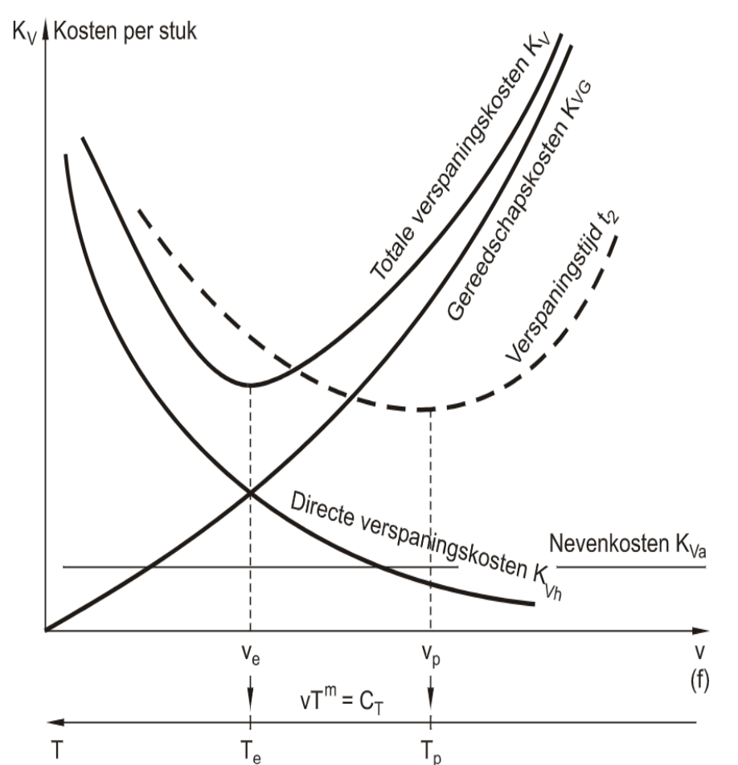


**K_V is de som van de drie curven** en heeft daardoor een **minimum**: voor kleine v domineert K_Vh, voor grote v domineert K_VG. Dit minimum ligt bij de **economische snijsnelheid v_e** met standtijd **T_e**. Equivalent kan K_V ook in functie van **T** getekend worden (via Taylor wordt elke v omgezet naar T): ook K_V(T) heeft een minimum, exact bij T = T_e — voor kleine T (hoge v) domineert K_VG, voor grote T (lage v) domineert K_Vh.

**(e) Invloed van de instelhoek κ op standtijd en snijkracht.**

*Snijkracht (Kienzle):* bij gelijke a en f geldt h = f·sinκ, b = a/sinκ, dus:

$$F_c = k_{c1.1} \cdot a \cdot f^{1-z} \cdot (\sin\kappa)^{-z}$$

Grotere κ → grotere h (dikkere spaan) en kleinere b (smallere snede). Omdat (sinκ)^(-z) daalt bij stijgende κ (z>0), neemt F_c **licht af** bij grotere κ — het netto-effect is klein, maar de **verdeling** van A=b·h verandert sterk: grotere κ → dikkere, smallere snede; kleinere κ → dunnere, bredere snede.

*Standtijd (veralgemeende Taylor):* met h = f·sinκ, b = a/sinκ ingevuld:

$$T = \left[ \frac{C_{TVB} \cdot VB^n}{f^p \cdot a^q \cdot (\sin\kappa)^{p-q} \cdot v} \right]^{1/m}$$

Omdat p > q (p≈0.16-0.26, q≈0.05-0.1) is (p−q)>0, dus T ~ (sinκ)^{-(p-q)/m}: **hoe groter κ, hoe lager de standtijd T**.

**Samengevat:** een kleinere κ verdeelt A=b·h over een breder, dunner profiel → hogere T, F_c nagenoeg gelijk of licht hoger. Een grotere κ geeft een dikkere, smallere snede → lagere T, F_c nagenoeg gelijk of licht lager.

---

### Kronenbergdiagram

**Vraag:** Bespreek het Kronenbergdiagram.
a) Waarvoor dient het?
b) Wat is de betekenis van de lijnen, en in welke volgorde worden ze opgesteld?
c) Wat is het optimale punt?
d) Hoe kan je verder optimaliseren?

*Gesteld in: examen 2019, 20 juni 2019, 27 juni 2018, 8 juni 2018 namiddag, 5 juni 2025*

**Antwoord:**


**(a) Doel.** Het Kronenbergdiagram stelt de **capaciteit van het gereedschap (beitel)** gelijk aan de **capaciteit van de machine**, in functie van de snededoorsnede A = b·h. Het houdt **geen rekening met de nauwkeurigheid** van het werkstuk (doorbuiging, oppervlakteruwheid) en geeft dus **niet automatisch de economisch optimale snijvoorwaarden** — het toont vooral hoe **F_c, P, v, Q en T** van A afhangen en waar hun grenzen elkaar kruisen.

**Assen:** horizontaal A = b·h [mm²] op **logaritmische** schaal; verticaal een **bilogaritmische** schaal voor v, F_c, P, Q en T — elke grootheid is een **machtsfunctie** van A, dus wordt elk verband een **rechte lijn**.

**(b) De lijnen — betekenis en opstelvolgorde.** De lijnen worden in deze volgorde afgeleid, telkens steunend op de vorige:

| # | Lijn (kleur) | Formule | Betekenis |
|---|---|---|---|
| 1 | **F_c** (blauw) | $F_c = k_{c1.1} \cdot A^{1-z}$ (Kienzle) | Snijkracht als functie van A — de basis van het diagram |
| 2 | **P_m** (geel, horizontaal) | constant | Beschikbaar **motorvermogen** — vastgelegd door de machine, onafhankelijk van A |
| 3 | **v_m** | $v_m = P_m / F_c$ | Maximale snijsnelheid die de motor (qua vermogen) toelaat bij die A |
| 4 | **v_e** (paars) | uit veralgemeende Taylor bij T = T_e | Economische snijsnelheid: snelheid die de gekozen economische standtijd T_e oplevert |
| 5 | **P_e** | $P_e = F_c \cdot v_e$ | Vermogen nodig bij de economische snijsnelheid |
| 6 | **Q_m** (rood) | $Q_m = v_m \cdot A$ | Spaandebiet bij de maximale (motorbeperkte) snelheid |
| 7 | **Q_e** (oranje) | $Q_e = v_e \cdot A$ | Spaandebiet bij de economische snelheid |

**(c) Het optimale punt volgens Kronenberg.** Er zijn **twee voorwaarden**, elk noodzakelijk maar **niet voldoende** afzonderlijk:

1. **T = T_e ⇔ v_e = v_m** — de machine draait net aan de snelheid die de economische standtijd oplevert
2. **P_e = P_m** — het vermogen bij die snelheid is exact het beschikbare motorvermogen

Het punt waar **beide voorwaarden samen** gelden, is het **kritische punt k₃** bij de **kritische snededoorsnede A_crit**. Dit is *het* Kronenberg-optimum: de machine draait op **vol vermogen**, terwijl het gereedschap **precies zijn economische standtijd** haalt.

**(d) Verder optimaliseren: van k₃ naar k₂ (A > A_crit).** Als de werkstukgeometrie een **grotere snededoorsnede** toelaat (A > A_crit), kan men van k₃ naar een punt k₂ verschuiven:

- F_c stijgt mee met A → om P_m niet te overschrijden moet v_c **dalen**
- Een lagere v_c geeft (via Taylor) een **hogere standtijd T** → **lagere gereedschapskost** K_G/T
- Het debiet Q = v_c · A blijft **stijgen** (A stijgt sneller dan v_c daalt) → kortere hoofdtijd t_h → **lagere bewerkingskost**

Men werkt dus niet meer op de "economische" snelheid v_e, maar het resultaat is **toch goedkoper** — de totale K_V daalt verder.

**Beperking op deze redenering:** A kan niet onbeperkt stijgen. Het wordt begrensd door:

- de **toelaatbare nauwkeurigheid** van het werkstuk (doorbuiging y_w)
- het **maximaal koppel/vermogen** van de machine

Voor deze verdere optimalisatie (gegeven b/h-verhouding, maar met variabele voeding f) is het **TNO-diagram** nodig; voor de volledige optimalisatie over b, h én v samen is het **COPTURN-diagram** nodig.

---

### COPTURN-diagram

**Vraag:** Bespreek het COPTURN-diagram.
a) Wat zijn de assen, en hoe wordt het diagram opgesteld (de 10 grenzen van het b-h-v-volume)?
b) Waarvoor dient het, en hoe wordt geoptimaliseerd (Lagrange)?
c) Duid op een schets van het draaigereedschap de hoofdsnijlijn en het vrijloopvlak aan.
d) Wat is het verschil tussen T_e (economische standtijd) en T_p (standtijd bij minimale productietijd)?

*Gesteld in: examen 10 juni 2024, Productietechnieken 2019-2021, 24 juni 2025, en een uitgebreide variant 11 juni 2025 met sub-vragen*

**Antwoord:**


**(a) Assen en opbouw — de 10 grenzen van het b-h-v-volume.** De assen zijn **b** (snedebreedte), **h** (snededikte) en **v** (snijsnelheid). Het toelaatbare volume wordt afgebakend door (minstens) 10 grenzen:

| # | Grens | Verklaring |
|---|---|---|
| 1 | **h_min** | Door de **neusafronding r_ε**: bij te kleine h "glijdt" de beitel i.p.v. te snijden |
| 2 | **h_max** | Door de **toelaatbare oppervlakteruwheid**: $R_t = f^2/(8 \cdot r_\varepsilon)$, met h = f·sinκ |
| 3 | **b_min** | Door de **afronding van de beitelpunt** (neusradius) |
| 4 | **b_max** | b ≤ 3/4 van de totale lengte van de snijkant (stabiel proces) |
| 5 | **δ_min ≈ 3** (δ = b/h) | Te kleine slankheid → spanen te "vierkant"/dik → te grote krachten |
| 6 | **δ_max ≈ 15** (≈ 30 voor gietijzer) | Te grote slankheid → gevaarlijke lintspanen |
| 7 | **Wet van Kienzle (max. kracht)** | F_c mag toelaatbare kracht niet overschrijden (machinekoppel of nauwkeurigheid) |
| 8 | **Strengere Kienzle bij laag toerental** | Elektromotoren halen nominaal koppel niet bij laag toerental → strengere krachtgrens dan grens 7 |
| 9 | **v_min** | Minimale snijsnelheid om **opbouwsnijkant (BUE)** te vermijden |
| 10 | **v_max** | Maximale snijsnelheid, bepaald door maximaal toerental/vermogen van de machine |

Daarnaast:

- **Veralgemeende wet van Taylor** ($v \cdot T^m = \frac{C_{TVB} \cdot VB^n}{h^p \cdot b^q}$): bepaalt bij een gekozen standtijd T (= T_e of T_p, zie (d)) het v-grensvlak als functie van b, h
- **Kienzle t.o.v. het motorvermogen**: $P = P_m = F_c \cdot v_c$ — hier is v een **vrije variabele** (i.p.v. vastgelegd zoals grens 7-8), wat een echt **3D-grensoppervlak** geeft i.p.v. een grens op het b-h-vlak

**(b) Doel en optimalisatie (Lagrange).** Het COPTURN-diagram (Cutting Optimisation Program voor TURNen) gaat een stap verder dan Kronenberg/TNO: het bakent een **volume af in de 3D-ruimte (b, h, v)** door **alle** verspaningswetten en beperkingen tegelijk in rekening te brengen. Binnen dit volume is verspanen zowel **mogelijk** (technisch haalbaar) als **toelaatbaar** (binnen alle grenzen). Een computerprogramma (COP/COPTURN) zoekt hierin, via **Lagrange-multiplicatoren**, het punt dat de **kost K_V minimaliseert** of de **productiviteit (debiet Q = v·A, A = b·h) maximaliseert**, onder de 10 grenzen als nevenvoorwaarden.

**(c) Hoofdsnijlijn en vrijloopvlak op een schets van het draaigereedschap.** Teken een draaibeitel in bovenaanzicht, snijdend in een cilindrisch werkstuk. De **hoofdsnijlijn (S)** is de snijkant die het grootste deel van het materiaal afneemt — ze maakt de **instelhoek κ** met de voedingsrichting. Onder de hoofdsnijkant, aan de zijde van het **net gesneden oppervlak**, ligt het **eerste vrijloopvlak (Aα1)**: het maakt de **vrijloophoek α** met dit oppervlak en mag het niet raken/schuren (anders VB). Boven de hoofdsnijkant ligt het **spaanvlak (Aγ1)** met spaanhoek γ. De **neus** (r_ε) verbindt de hoofdsnijkant met de hulpsnijkant (S').

**(d) Verschil tussen T_e en T_p.** Beide zijn "economische" standtijden, maar voor een **verschillend doel** (afleiding: zie Wet van Taylor en kosten):

$$T_e = \left(\frac{1}{m} - 1\right) \cdot \frac{K_G}{K_U} \quad\text{(minimale kost } K_V\text{)} \qquad\qquad T_p = \left(\frac{1}{m} - 1\right) \cdot T_{cT} \quad\text{(minimale productietijd)}$$

met K_U = K_M+K_L en T_{cT} = gereedschapswisseltijd. **Steeds T_e > T_p**: minimale kost vereist een lagere v_c (langere T) dan minimale productietijd per stuk. In het COPTURN-volume geeft de keuze T = T_e of T = T_p dus een **ander v-grensvlak**: met T_p (< T_e) ligt dit grensvlak **hoger** — hogere snelheden toegelaten.

**Link met de nauwkeurigheidsgrens:** de toelaatbare F_c (grenzen 7-8, en via h ook grens 2) wordt mee bepaald door de toelaatbare doorbuiging $y_w=(s_m+s_w)\cdot F_p$ van het werkstuk, met $F_c=2.5\cdot F_p$ (zie Oppervlakteruwheid en nauwkeurigheid, vraag (b), voor de s_w-formules). Hoe soepeler/slanker het werkstuk, hoe strenger F_c begrensd moet zijn → hoe kleiner het toelaatbare (b,h)-gebied.

---

### Oppervlakteruwheid en nauwkeurigheid bij draaien

**Vraag:**
a) Hoe wordt de oppervlakteruwheid R_t bepaald bij draaien, in functie van de voeding f en de neusradius r_ε?
b) Wat is de invloed van de zijwaartse snijkracht F_p op de nauwkeurigheid (doorbuiging) van het werkstuk?
c) Hoe worden de Kienzle-parameters k_c1.1 en z experimenteel bepaald?

*Gesteld in: examen 2019, en een uitgebreide variant 5 juni 2025 met extra deel (c) over experimentele bepaling van Kienzle-parameters*

**Antwoord:**

**(a) Oppervlakteruwheid R_t in functie van f en r_ε.** Het beitelpunt heeft een **neusafronding r_ε** (de snijkant is niet oneindig scherp). Bij het draaien laat elke omwenteling een spoor na op het oppervlak; tussen twee opeenvolgende sporen (op afstand f, de voeding) blijft een **rest-profiel** staan, met hoogte R_t (de theoretische ruwheid).

*Schets:* teken de ronde beitelpunt (straal r_ε) die met voeding f over het werkstuk beweegt. Tussen twee opeenvolgende posities van de neus blijft een "bergje" materiaal van hoogte R_t staan. Geometrisch (de cirkelboog benaderd door een parabool) geldt:

$$R_t = \frac{(f/2)^2}{2 \cdot r_\varepsilon} = \frac{f^2}{8 \cdot r_\varepsilon}$$

Hieruit volgt de **maximale toelaatbare voeding** voor een gewenste maximale ruwheid R_t,max:

$$f_{max} = \sqrt{8 \cdot r_\varepsilon \cdot R_{t,max}}$$

**Praktisch:** de voeding f wordt in de praktijk bijna altijd **bovengrens-begrensd door de toelaatbare oppervlakteruwheid**, niet door de theoretisch-economisch optimale f uit de kostenformule. Via h = f·sinκ legt deze f_max ook een **h_max** vast (grens 2 van het COPTURN-volume).

Naast deze "geometrische" (kinematische) ruwheid bestaat ook een **langsruwheid**, veroorzaakt door **trillingen** en **opbouwsnijkant (BUE)**. Deze wordt tegengegaan door: een grotere spaanhoek γ, een hogere snijsnelheid v_c (BUE verdwijnt bij hogere temperatuur), coatings, en snijvloeistoffen onder hogere druk.

**(b) Invloed van F_p op de nauwkeurigheid (doorbuiging).** Van de drie krachtcomponenten — F_c (hoofdsnijkracht, tangentieel), F_f (voedingskracht) en F_p (terugdrukkracht, radiaal, loodrecht op het bewerkte oppervlak) — is het vooral **F_p die de doorbuiging en dus de nauwkeurigheid** van het werkstuk bepaalt. Als **vuistregel** geldt (formularium):

$$F_c = 2.5 \cdot F_p$$

(d.w.z. $F_p \approx 0.4 \cdot F_c$, equivalent want $1/0.4 = 2.5$). (met $F_c = k_{c1.1} \cdot b \cdot h^{1-z}$ volgens Kienzle). De doorbuiging y van het werkstuk onder deze kracht is:

$$y = (s_w + s_m) \cdot F_p$$

waarbij s_w en s_m de **soepelheden** (inverse stijfheden, [µm/N]) zijn van respectievelijk het werkstuk en de machine. Voor het werkstuk, opgevat als balk met traagheidsmoment $I_O = \frac{\pi \cdot d^4}{64}$:

- tussen twee punten opgespannen: $s_w = \frac{L^3}{48 \cdot E \cdot I}$
- in de klauwplaat opgespannen (ingeklemde balk): $s_w = \frac{L^3}{3 \cdot E \cdot I}$ — 16× meer doorbuiging dan tussen twee punten bij gelijke L

**Hoe groter F_p (dus hoe groter F_c, dus hoe groter b en h), hoe groter y, hoe slechter de nauwkeurigheid** — dit kan leiden tot vormafwijkingen (bv. een conische vorm over de lengte van een slank werkstuk, omdat de doorbuiging varieert met de positie langs de balk). Deze doorbuigingsgrens beperkt mee de toelaatbare snededoorsnede A = b·h (zie Kronenbergdiagram, "van k₃ naar k₂", en COPTURN-grenzen 7-8).

**(c) Experimentele bepaling van k_c1.1 en z.** Analoog aan Wet van Kienzle (b): een **reeks proefsnedes** op een draaibank met **variërende snededikte h** (via f, bij vaste b, dus vaste a en κ), waarbij F_c telkens gemeten wordt met een **dynamometer**. Voor vaste b geldt $F_c/b = k_{c1.1}\cdot h^{1-z}$, of in logvorm:

$$\log(F_c/b) = \log k_{c1.1} + (1-z) \cdot \log h$$

Op een **log-log-grafiek** van F_c/b versus h geeft dit een **rechte lijn**: de **helling** is (1−z) → levert z; het **snijpunt** met h = 1 (log h = 0) geeft log k_c1.1 → k_c1.1. Bij meerdere meetpunten via **lineaire regressie**. Zelfde methode als bij de Taylor-constanten (C_T, n/m).

---

### Numerieke oefening bij draaien (St 50)

**Vraag:** Een staaf St 50 met diameter Ø150 mm wordt afgedraaid over een snedediepte van 10 mm, bij een toerental n = 400 t/min en een voeding f = 1.0 mm/omw. Het gebruikte gereedschap is een P10 hardmetalen beitel met spaanhoek γ = -5°, vrijloophoek α = 8°, hellingshoek λ = +4° en instelhoek κ = 60°. Tussen motor en spil zit een reductiekast met overbrengingsverhouding i = 10 en een rendement η = 80%.

Bereken de snijkracht F_c, het snijvermogen P_c, het benodigde motorvermogen P_m, en het koppel T_m op de motoras.

*Gesteld in: recurrent type oefening, analoog aan voorbeeldvraag 2019-2021*

**Antwoord:**

**Aannames:** Kienzle-parameters voor St 50: **k_c1.1 = 1190 N/mm²** en **z = 0.253**. De "snedediepte van 10 mm" wordt geïnterpreteerd als de **insteldiepte (radiale ingrijping) a = 10 mm** — rechtstreeks in te vullen in Kienzle. Dit betekent dat de **diameter** met 2a = 20 mm afneemt (Ø150 → Ø130).

**1. Snedegrootheden b en h:**

$$h = f \cdot \sin\kappa = 1.0 \cdot \sin 60^\circ = 0.866 \text{ mm}$$

$$b = \frac{a}{\sin\kappa} = \frac{10}{\sin 60^\circ} = 11.55 \text{ mm}$$

**2. Snijkracht F_c (Kienzle):**

$$F_c = k_{c1.1} \cdot b \cdot h^{1-z} = 1190 \cdot 11.55 \cdot (0.866)^{1-0.253} = 1190 \cdot 11.55 \cdot (0.866)^{0.747}$$

Met $(0.866)^{0.747} \approx 0.897$:

$$F_c \approx 1190 \cdot 11.55 \cdot 0.897 \approx 12\,327 \text{ N} \approx \mathbf{12.33\ kN}$$

**3. Snijsnelheid v_c:** gebruik de **gemiddelde diameter** tijdens de snede, $D_{gem} = D - a = 150 - 10 = 140$ mm = 0.140 m. Met n = 400 t/min = 400/60 omw/s ≈ 6.667 omw/s:

$$v_c = \pi \cdot D_{gem} \cdot n = \pi \cdot 0.140 \cdot 6.667 \approx \mathbf{2.93\ m/s}$$

(of, in m/min: $v_c = \pi \cdot 0.140 \cdot 400 \approx 175.9$ m/min)

**4. Snijvermogen P_c:**

$$P_c = F_c \cdot v_c = 12\,327 \text{ N} \cdot 2.93 \text{ m/s} \approx \mathbf{36.1\ kW}$$

**5. Benodigd motorvermogen P_m:** door verliezen in de reductiekast (rendement η = 0.80) moet de motor meer leveren dan het snijvermogen dat de spil moet afgeven:

$$P_m = \frac{P_c}{\eta} = \frac{36.1}{0.80} \approx \mathbf{45.2\ kW}$$

**6. Koppel T_m op de motoras:** de spil draait met hoeksnelheid $\omega_{spil} = 2\pi \cdot n$ (n in omw/s):

$$\omega_{spil} = 2\pi \cdot \frac{400}{60} \approx 41.9 \text{ rad/s}$$

De reductiekast (i = 10) laat de motor **sneller** draaien dan de spil — typisch voor elektromotoren, die hun nominaal vermogen bij hoog toerental leveren:

$$\omega_{motor} = i \cdot \omega_{spil} = 10 \cdot 41.9 \approx 419 \text{ rad/s}$$

Het koppel op de motoras volgt uit $P_m = T_m \cdot \omega_{motor}$:

$$T_m = \frac{P_m}{\omega_{motor}} = \frac{45\,200}{419} \approx \mathbf{108\ Nm}$$

**Samenvatting van de resultaten:**

| Grootheid | Resultaat |
|---|---|
| h (snededikte) | 0.866 mm |
| b (snedebreedte) | 11.55 mm |
| F_c (snijkracht) | ≈ 12.33 kN |
| v_c (snijsnelheid) | ≈ 2.93 m/s (≈ 175.9 m/min) |
| P_c (snijvermogen) | ≈ 36.1 kW |
| P_m (motorvermogen) | ≈ 45.2 kW |
| T_m (koppel motoras) | ≈ 108 Nm |

**Methode (examenstappen):** Kienzle → $v_c = \pi \cdot D_{gem} \cdot n$ → $P_c = F_c \cdot v_c$ → $P_m = P_c/\eta$ → $T_m = P_m/\omega_{motor}$ met $\omega_{motor} = i \cdot \omega_{spil}$, met duidelijke vermelding van alle aannames (hier: D_gem = D - a, en de Kienzle-waarden voor St 50).

---

## Slijpen

### Definitie, principe en spaandebiet bij slijpen

*Gesteld in: examen 2021, 8 juni 2021.*

**Vraag:** Wat is slijpen en hoe werkt het principe (vergelijking met frezen)? Wat is de samenstelling van een slijpschijf (korrels, bindmiddel, poriën)? Leg de drie snijmechanismen (cutting, plowing, rubbing) uit en wanneer elk optreedt. Leid het specifiek spaandebiet Q'w af.

**Modelantwoord.**

**1. Wat is slijpen?**

Slijpen is een **materiaalafnameproces** waarbij kleine, harde **abrasieve korrels**, gebonden in een snel ronddraaiende slijpschijf, het werkstukoppervlak wegnemen bij **hoge snijsnelheid** en zeer kleine indringdiepten.

Volgens **DIN 8589** heeft slijpen **geometrisch ongedefinieerde snijkanten**: bij draaien/frezen zijn aantal, oriëntatie en spaanhoek van elke snijkant gekend; bij slijpen heeft elke korrel een willekeurige vorm, oriëntatie en positie op het schijfoppervlak.

(Korrels kunnen ook **vrij** — lappen/polijsten — of **op een band** — bandslijpen — voorkomen; de klassieke slijpschijf bindt ze dicht samen, zie punt 3.)

**2. Principe: vergelijking met frezen**

Een slijpschijf ≈ een frees met **enorm veel, willekeurig gevormde snijkanten** (elke korrel ≈ één tand). Twee fundamentele verschillen:
- de **spaanhoek** van de korrels is **bijna altijd sterk negatief** → de korrel schaaft eerder dan dat hij efficiënt snijdt;
- de **snijsnelheid** v_s is veel hoger: typisch **20-100 m/s**, tegenover enkele m/s bij frezen.

**Bewegingsparameters:** **v_s** (omtreksnelheid schijf), **v_w** (werkstuksnelheid, << v_s), **v_fa/v_fr/v_ft** (voedingssnelheden axiaal/radiaal/tangentieel), **a_e** (snedediepte), **a_p** (verspaningsbreedte), **b_s** (breedte van de schijf).

**3. Samenstelling van de slijpschijf**

$$V_K + V_B + V_P = 1$$

- **V_K** = korrels (het snijmateriaal, harder dan het werkstuk: korund Al2O3, SiC, BC, CBN, diamant)
- **V_B** = bindmiddel (houdt de korrels vast: keramisch/vitrified, silicaat, elastisch, metaal)
- **V_P** = poriën (ruimte voor spaanafvoer)

→ **hardheid van de schijf**: hoog V_B = harde schijf die korrels sterk vasthoudt. **Structuur**: bepaald door V_P/V_K — open (veel poriën) voor goede spaanafvoer, dicht voor een betere afwerking.

**4. De drie snijmechanismen: cutting, plowing, rubbing**

Afhankelijk van de indringdiepte van een korrel (t.o.v. een kritische spaandikte):

- **Cutting (snijden):** korrel dringt diep genoeg in → genereert een spaan, effectieve materiaalafname (gewenst).
- **Plowing (ploegen):** korrel dringt iets in maar genereert geen spaan → materiaal wordt plastisch opzijgeduwd zonder te breken. Geen afname, wel energieverbruik en oppervlaktedeformatie.
- **Rubbing (wrijven):** korrel raakt het oppervlak zonder voldoende indringing → enkel wrijving, vooral **warmteproductie**, geen snijden of vervormen.

**Welk mechanisme domineert wanneer?** Hangt af van Q'w (zie punt 5): bij **lage Q'w** domineren rubbing/plowing (weinig afname, veel warmte); bij **hogere Q'w** neemt het aandeel cutting toe (efficiënter).

**5. Afleiding van het specifiek spaandebiet Q'w**

Het **specifiek spaandebiet** is het verspaand volume per tijdseenheid, gedeeld door de actieve breedte van de schijf:

$$Q'_w = \frac{\text{verspaand volume per tijdseenheid}}{\text{actieve schijfbreedte}} \quad \left[\frac{\text{mm}^3/\text{s}}{\text{mm}}\right]$$

**Afleiding:** een schijf met actieve breedte $b_s$ snijdt met snedediepte $a_e$ terwijl het werkstuk zich relatief t.o.v. de schijf verplaatst met snelheid $v_w$. Per tijdseenheid wordt een laagje materiaal van dikte $a_e$, breedte $b_s$ en lengte $v_w$ weggenomen:

$$\dot{V} = a_e \cdot b_s \cdot v_w$$

Delen door de actieve schijfbreedte $b_s$ laat $b_s$ wegvallen:

$$Q'_w = a_e \cdot v_w$$

Dit is **algemeen geldig** — enkel de invulling van $a_e$ (radiaal of axiaal ingesteld via $v_{fr}$/$v_{fa}$) en $v_w$ (relatieve snelheid werkstuk t.o.v. schijf) verschilt per configuratie (vlakslijpen, uitwendig/inwendig rondslijpen).

> **Notatie formularium:** in twee stappen: totaal spaandebiet $Q_w = a_e \cdot a_p \cdot v_w$ ($a_p$ = verspaningsbreedte), dan $Q'_w = Q_w/b_{s,eff}$ (effectieve schijfbreedte). Komt overeen met $Q'_w=a_e \cdot v_w$ wanneer $a_p=b_{s,eff}=b_s$. Op het examen kunnen dus $Q_w$ en $b_{s,eff}$ opduiken — herken dit als hetzelfde principe in twee stappen.

**Q'_w is de centrale parameter** in het slijpproces: hoger Q'w = productiever (meer materiaal weg per tijdseenheid en per mm schijfbreedte), maar ook **hogere temperaturen** en **meer slijtage** van de schijf.

---

### Slijpen versus draaien — vergelijking, configuraties en warmte-effecten

*Gesteld in: 25 juni 2024.*

**Vraag:** Vergelijk slijpen met draaien/frezen: wat zijn de verschillen in proces, krachten, snelheden en oppervlaktekwaliteit? Waarom is slijpen duurder? Welke slijpconfiguraties/-machines bestaan er (vlakslijpen, rondslijpen, centerloos slijpen)? Wat zijn de thermische effecten/gevolgen van warmte bij slijpen?

**Modelantwoord.**

**1. Verschillen tussen slijpen en draaien/frezen**

| Aspect | Draaien/frezen | Slijpen |
|---|---|---|
| Snijkanten | Geometrisch gedefinieerd: gekend aantal, oriëntatie en spaanhoek (bv. beitel, frees-tand) | Geometrisch ongedefinieerd: zeer veel korrels, elk met willekeurige vorm, oriëntatie en positie |
| Spaanhoek | Vrij instelbaar, vaak positief mogelijk → efficiënte spaanvorming | Bijna altijd sterk negatief → inefficiënte, "schavende" snede |
| Snijsnelheid | Enkele m/s | Veel hoger: v_s typisch 20-100 m/s |
| Indringdiepte per snede | Relatief groot (snedediepte a, voeding f) | Zeer klein per korrel (equivalente spaandikte h_eq) |
| Specifieke krachten | Referentiewaarde | Minstens factor 10 hoger dan bij draaien/frezen |
| Verspaningsdebiet | Hoog | Laag |
| Oppervlaktekwaliteit/nauwkeurigheid | Beperkter (grovere Ra, toleranties ~0,01 mm) | Zeer hoog: toleranties tot in de µm, lage Ra die andere processen niet halen |
| Warmte-inbreng | Beperkt | Zeer hoog (zie punt 3) |
| Kostprijs | Relatief goedkoop en snel | Duur, traag, bewuste keuze |

**Waarom is slijpen duurder?** Slijpen heeft **hogere specifieke krachten** dan draaien of frezen — minstens een factor 10 hoger, door:
- de **negatieve spaanhoek** van de korrels (krachtige, inefficiënte snijbeweging);
- het **simultaan optreden van rubbing en plowing** naast cutting (energie die niet bijdraagt aan effectieve spaanvorming).

Hierdoor is het **verspaningsdebiet laag**: veel energie per mm³ weggenomen materiaal. Slijpen is dus een kostbare, bewuste keuze.

**Wanneer kies je wél voor slijpen?**
- **Nauwkeurigheid** — toleranties van enkele µm, niet haalbaar met draaien of frezen.
- **Oppervlaktekwaliteit** — Ra-waarden die andere bewerkingen niet halen.
- **Harde werkstukken** — geharde staalonderdelen, keramiek: te hard voor conventionele snijgereedschappen, maar niet voor harde slijpkorrels (korund, CBN, diamant).
- **Lage toelaatbare bewerkingskrachten** — dunne of fragiele onderdelen.
- **Geringe dikte van de te verwijderen laag** — enkele µm tot honderden µm.

**Typisch productiepad voor precisieonderdelen:**

```
ruw staal → draaien/frezen (grove bewerking, snel) → harden (warmtebehandeling) → slijpen (fijne bewerking, nauwkeurig) → klaar
```

**2. Slijpconfiguraties en -machines**

Slijpmachines zijn opgebouwd zoals frees-/draaibanken (spil + slijpschijf, werkstukopspanning, voedingsassen), maar moeten door de hoge schijftoerentallen zeer **stijf en trillingsvrij** zijn.

- **Vlakslijpen (surface grinding):** het werkstuk ligt op een (magnetische) tafel of in een kleminrichting en beweegt heen en terug onder de draaiende schijf — voor platte oppervlakken. Met de omtrek van een cilindrische schijf (**omtrekvlakslijpen**) of met een komsteen (**frontvlakslijpen**, pendant van frontfrezen).

- **Rondslijpen (cylindrical grinding):** werkstuk en slijpschijf draaien elk om hun eigen as, werkstuk opgespannen tussen centers of in een klauwplaat. Twee varianten:
  - **Uitwendig** — de buitendiameter van een as wordt geslepen.
  - **Inwendig** — de binnendiameter van een boring, met een kleine slijpschijf aan het uiteinde van een spindel.

- **Centerloos slijpen (centerless grinding):** het werkstuk wordt **niet** tussen centers opgespannen, maar rust op een steunliniaal en wordt aangedreven door een tragere, sterker wrijvende **regelschijf** die de omtreksnelheid v_w bepaalt. Twee modi:
  - **Doorvoerslijpen:** regelschijf onder kleine hoek α → axiale voedingscomponent, werkstuk beweegt door de schijven — voor continuproductie van lange cilindrische stukken (assen, pennen).
  - **Insteekslijpen:** regelschijf beweegt enkel radiaal in tot de gewenste diameter — voor kortere onderdelen of onderdelen met schouders.

  **Voordeel:** geen opspanning nodig → snelle cyclustijden, geschikt voor massaproductie.

**3. Thermische effecten en gevolgen van warmte bij slijpen**

Slijpen genereert **meer warmte per mm³ verspaand materiaal** dan eender welk ander bewerkingsproces. Oorzaken:
1. **Hoge snijsnelheid** — enorm veel energie per tijdseenheid.
2. **Negatieve spaanhoek** — minder efficiënt snijden → meer energie wordt warmte.
3. **Lang afschuifvlak** — de spaanvorming per korrel kost relatief meer energie.
4. **Hoge normaalkrachten** — leiden tot sterke wrijving.
5. **Rubbing en plowing** — een groot deel van de energie wordt niet in spaanvorming geïnvesteerd, maar als warmte in het werkstuk verspreid.

Resultaat: de temperatuur in de contactzone kan oplopen tot **600-1000 °C**, en zelfs hoger.

**Gevolgen van overmatige warmte:**

| Effect | Beschrijving |
|---|---|
| Vonken | Zichtbaar teken van hoge temperaturen (verbrandende spanen) |
| Temperen (tempering) | Geharde staalonderdelen verliezen lokaal hardheid door heruitgloeien in de warmte-beïnvloede zone (HAZ) |
| Verbranden (burning) | Oxidatie van het oppervlak, zichtbaar als verkleuringen |
| Micro-scheurtjes | Thermische spanningen door snel opwarmen en afkoelen |
| Restspanningen | Trekspanningen in het oppervlak → verminderde vermoeiingsweerstand |
| HAZ (Heat-Affected Zone) | De warmte-beïnvloede zone in het werkstuk |

Micro-scheuren treden vooral op bij **harde slijpstenen** (bindmiddel houdt korrels te lang vast → stomme korrels blijven werken → meer warmte) en bij korrels met **lage friability** (korrels breken minder snel af → minder zelfscherpend effect → hogere temperaturen).

**Oplossing: koeling.** Een slijpvloeistof (koelvloeistof/koelsmeermiddel):
- voert warmte af uit de contactzone;
- vermindert wrijving;
- spoelt spaanders weg;
- verlengt de standtijd van de schijf.

---

### Uitgebreide variant — schetsen, spaandebiet, schijfeffecten, mechanismen en warmte (incl. grind hardening)

*Gesteld in: 11 juni 2025 (uitgebreide variant).*

**Vraag:** Maak een schets van vlakslijpen en rondslijpen en duid de belangrijkste grootheden aan. Leg het principe van het spaandebiet uit. Welke effecten heeft de slijpschijf (korrelmateriaal, korrelgrootte, hardheid, structuur) op het slijpproces? Welke mechanismen (cutting/plowing/rubbing) treden op en waarom? Bespreek de warmte-effecten bij slijpen — kan warmte ook gunstig zijn (bv. "grind hardening")?

**Modelantwoord.**

**1. Schets van vlakslijpen en rondslijpen**

**Vlakslijpen (surface grinding):**

De slijpschijf draait met omtreksnelheid **v_s**; het werkstuk ligt op een (magnetische) tafel en beweegt heen en weer met tafelsnelheid **v_w (= v_ft)**. De radiale toevoer **v_fr** bepaalt de snedediepte **a_e** per passage, over de actieve schijfbreedte **b_s**.

**Rondslijpen (cylindrical grinding, uitwendig):**

Slijpschijf en werkstuk draaien elk om hun eigen as: de schijf met hoge omtreksnelheid **v_s** (20-100 m/s), het werkstuk veel trager met **v_w**, de schijf radiaal ingesteld op snedediepte **a_e**. Bij inwendig rondslijpen brengt een kleine schijf aan het uiteinde van een spindel hetzelfde principe in de boring.

<div style="display: flex; gap: 16px; align-items: flex-start;">
  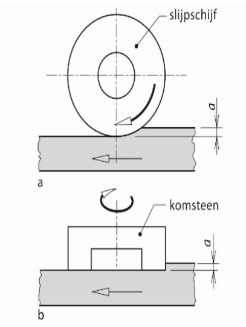
  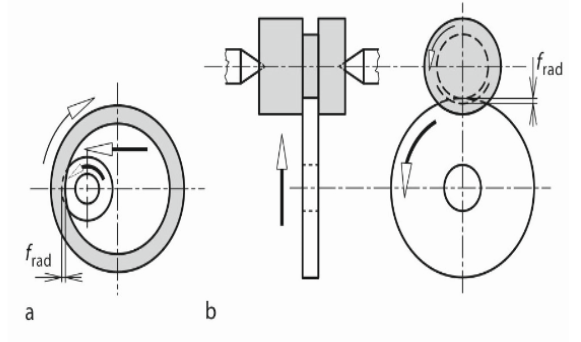
</div>

**Belangrijkste grootheden** in beide schetsen: v_s, v_w, a_e, b_s, en eventueel v_fa/v_fr/v_ft en a_p (verspaningsbreedte).

**2. Principe van het spaandebiet**

$$Q'_w = a_e \cdot v_w \quad \left[\frac{\text{mm}^3/\text{s}}{\text{mm}}\right]$$

Zelfde afleiding als bij "Definitie, principe en spaandebiet bij slijpen" (punt 5): per tijdseenheid wordt een laagje van dikte $a_e$, breedte $b_s$, lengte $v_w$ weggenomen ($\dot V=a_e\cdot b_s\cdot v_w$), gedeeld door $b_s$. Dit principe verandert niet tussen vlak- en rondslijpen — enkel de invulling van $a_e$ (radiale insteekdiepte / $v_{fr}$-instelling) en $v_w$ (omtreksnelheid werkstuk / tafelsnelheid $v_{ft}$) is configuratie-specifiek.

**Q'w is de centrale productiviteitsparameter:** hoger Q'w = sneller materiaal weg, maar ook hogere temperaturen en meer slijtage van de schijf.

**3. Effecten van de slijpschijf op het slijpproces**

De schijf bestaat uit $V_K + V_B + V_P = 1$ (korrels, bindmiddel, poriën) — elk element stuurt het proces:

**a) Korrelmateriaal (V_K).** Moet harder zijn dan het werkstuk, in toenemende hardheid:
- **Korund (Al2O3)** — taai, voor staal/RVS
- **SiC** — harder maar brozer, voor gietijzer/non-ferro/keramiek
- **Borcarbide (BC)** — zeer hard
- **CBN** — extreem hard en warmtestabiel, voor geharde staalsoorten
- **Diamant** — hardst, voor keramiek/glas/hardmetaal

**Friability** (neiging om te breken bij overbelasting): **friabel** → breekt af, stelt nieuw scherp snijvlak bloot (**zelfscherpend**, gunstig); **niet-friabel** → wordt en blijft stomp → meer rubbing/warmte. Algemeen: harder werkstuk → hardere korrels, maar tegelijk een **zachter wiel** (zie c).

**b) Korrelgrootte.** **Grotere korrels** → hogere afnamesnelheid, ruwer oppervlak; **kleinere korrels** → betere Ra, lagere afnamesnelheid. Bereik: slijpen 80-380 µm (honen 30-280 µm, lappen 5-60 µm). Let op: hoger **grit number** = kleinere korrel.

**c) Hardheidsgraad van de schijf** = hoe sterk het bindmiddel (V_B) de korrels vasthoudt (niet de hardheid van de korrels zelf). **Harde schijf** (hoog V_B) houdt korrels sterk vast; **zachte schijf** (laag V_B) laat ze sneller los. Keuzeregel: **zacht werkstuk → harde schijf** (anders slijt de schijf snel op); **hard werkstuk → zachte schijf** (stompe korrels laten sneller los, nieuwe scherpe korrels vrij).

**d) Structuur (V_P/V_K).** **Open** (V_P groot): veel ruimte voor spaanafvoer — grote verspaande volumes. **Dicht** (V_K groot): betere oppervlakteafwerking en maatcontrole — fijne bewerkingen.

**4. Mechanismen: cutting, plowing, rubbing**

Zelfde drie mechanismen als bij "Definitie, principe en spaandebiet bij slijpen" (punt 4) — **cutting** (voldoende diepe indringing → spaan, effectieve afname), **plowing** (te weinig diepte voor een spaan → plastische vervorming zonder afname) en **rubbing** (geen/onvoldoende indringing → enkel wrijving/warmte) — bepaald door de indringdiepte t.o.v. een kritische spaandikte.

**Waarom treden deze op?** Door de **sterk negatieve spaanhoek** van de korrels en de **zeer kleine, variabele indringdiepte** per korrel (afhankelijk van korrelvorm, -positie en -hoogte op de schijf) snijdt niet elke korrel effectief. Bij **lage Q'w** domineren rubbing/plowing (weinig afname, veel warmte); bij **hogere Q'w** neemt het aandeel cutting toe (efficiënter).

**5. Warmte-effecten bij slijpen — kan warmte ook gunstig zijn?**

**Oorzaken en gevolgen:** zie "Slijpen versus draaien" (punt 3) — hoge v_s, negatieve spaanhoek, lang afschuifvlak, hoge normaalkrachten, rubbing/plowing → contactzone tot **600-1000°C** → vonken, temperen (HAZ), verbranden/oxidatie, micro-scheurtjes, restspanningen. Micro-scheuren vooral bij **harde schijven** en **minder friabele korrels**.

**Grind hardening.** Normaal wordt warmte met koelvloeistof onderdrukt. Bij grind hardening wordt ze net **bewust en gecontroleerd** ingezet: met hoge Q'w en weinig/geen koeling warmt de contactzone razendsnel en lokaal op tot **austenitisatie**-temperatuur; zodra de schijf voorbij is, koelt dit dunne laagje **zelf razendsnel af** (de koude kern werkt als quench — zelfde principe als laserharden) → **martensitische omzetting** → **harde oppervlaaglaag**, terwijl de kern zacht/taai blijft.

Hetzelfde mechanisme dat normaal schade veroorzaakt (snelle op-/afkoeling → micro-scheuren, restspanningen) levert hier dus, **gecontroleerd toegepast**, in één stap zowel de gewenste vorm/maat als een geharde oppervlaaglaag — zonder afzonderlijke warmtebehandeling. Het blijft een uitzondering: de nadelen wegen normaal op tegen dit voordeel, en het proces moet zeer precies gestuurd worden om enkel harding (en geen schade) te bekomen.

---

### Nabewerkingsprocessen en slijpschijf-onderhoud

*Gesteld in: 25 juni 2024.*

**Vraag:** Welke nabewerkingsprocessen bestaan er na slijpen (honen, superfijnen, lappen) en hoe werken ze? Hoe is een slijpschijf opgebouwd (V_K+V_B+V_P=1)? Wat is de equivalente spaandikte h_eq en de spaanverhouding? Wat is profileren/africhten (dressing) van een slijpschijf en waarom is dit nodig?

**Modelantwoord.**

**1. Opbouw van de slijpschijf**

$$V_K + V_B + V_P = 1$$

- **V_K** = korrels — snijmateriaal, harder dan het werkstuk (korund, SiC, BC, CBN, diamant)
- **V_B** = bindmiddel — houdt de korrels vast: **keramisch/vitrified** (≈75% van alle schijven), silicaat, elastisch/rubber-hars, of metaalbinding (diamant/CBN)
- **V_P** = poriën — ruimte voor spaan- en warmteafvoer

→ **hardheidsgraad**: hoog V_B = harde schijf (korrels lang vast, voor zachte werkstukken); laag V_B = zachte schijf (stompe korrels laten snel los, voor harde werkstukken). **Structuur**: V_P/V_K groot = open (veel spaanruimte, grote afnamevolumes); V_P/V_K klein = dicht (betere afwerking/maatcontrole).

**2. Equivalente spaandikte h_eq en slijpverhouding G**

**Equivalente spaandikte:**

$$h_{eq} = \frac{Q'_w}{v_s}$$

$h_{eq}$ = dikte van de theoretische spaan als al het verspaande volume gelijk verdeeld over alle korrelcontacten zou worden weggenomen (in werkelijkheid dunnere, talrijkere spanen) — laat toe processen onderling te vergelijken. **Intuïtie:** hoog Q'w + hoog v_s → h_eq blijft beperkt (elke korrel snijdt dun); laag v_s + hoog Q'w → korrels snijden dikker → meer belasting/slijtage per korrel.

**Slijpverhouding G:**

$$G = \frac{V_w}{V_s} = \frac{\text{verspaand volume werkstuk}}{\text{versleten volume slijpschijf}}$$

Maat voor de **efficiëntie van de schijf**: hoeveel werkstukmateriaal per eenheid schijfslijtage. **Hoge G is wenselijk** — schijf slijt traag, werkstuk wordt snel verspaand.

**3. Profileren en africhten (dressing) van de slijpschijf**

Na verloop van tijd raken de korrels **stomp** (slijtplateaus, "worn flat") of **verstopt** (spaanders in de poriën): de schijf snijdt minder goed, genereert meer warmte en verliest haar geometrische nauwkeurigheid.

**Dressing** (richten/africhten), in twee stappen:
1. **Profileren (truing):** schijf terug op de juiste geometrie (cirkelvormig, vlak of specifiek profiel) — corrigeert ook onbalans/vormafwijkingen door slijtage.
2. **Africhten (sharpening/dressing):** schijfoppervlak scherpstellen — stompe korrels worden actief weggebroken zodat scherpe korrels en vrije poriën (spaanafvoer) vrijkomen.

Vereist gespecialiseerd gereedschap (bv. diamantrollen, single-point diamond dresser).

**Waarom nodig?** Zonder dressing: meer wrijving (rubbing) en warmte-inbreng (verbranden, temperen, micro-scheuren, restspanningen), slechtere oppervlaktekwaliteit, en verlies van geometrische — dus maat — nauwkeurigheid.

**Balanceren.** Een slijpschijf is een grote, nooit volledig homogene roterende massa. Bij de hoge toerentallen voor v_s leidt elke onbalans tot trillingen → **oppervlaktegolven (waviness)** op het werkstuk, **lagerslijtage**, en een **veiligheidsrisico** bij eventueel brekende schijven. Balanceren van spil + schijf is standaard bij elke opspanning.

**4. De drie nabewerkingsprocessen: honen, superfijnen, lappen**

Nabewerkingsprocessen gebruiken **kleinere korrels** en verwijderen zeer weinig materiaal — ze verbeteren enkel de oppervlaktekwaliteit van een reeds nauwkeurig bewerkt vlak. **Korrelgrootte:** slijpen 80-380 µm, honen 30-280 µm, lappen 5-60 µm (fijnst).

**a) Honen.** Nabewerking van **boringen** (of uitwendige cilindrische vlakken) na slijpen/fijnboren — bv. cilinderlopers, versnellingsbaklagers, hydraulische cilinders. Een hoongereedschap met abrasieve stenen (honing stones) in een houder voert een **roterende hoofdbeweging** + **axiale (heen-en-weer) voedingsbeweging** uit → **kruisgestreept patroon** ("hatch pattern") dat smeermiddel vasthoudt.

**b) Superfijnen (superfinishing/microhoning).** Nabewerking van **uitwendige cilindrische vlakken** (assen, rollagers) — verwijdert de laatste ruwheidstopjes. Een slijpsteentje, vorm aangepast aan de diameter, beweegt met lichte oscillatie en zeer lage druk over het draaiende werkstuk. Cilindrisch (werkstuk draait) of centerloos.

**c) Lappen.** Extreme oppervlaktekwaliteit/vlakheid op vlakke of cilindrische oppervlakken — precisie-optiek, afdichtingsvlakken, pompcomponenten. Abrasieve korrels in vloeistof/pasta (lapmiddel) tussen werkstuk en een zachte lepschijf; de relatieve beweging wrijft de korrels over het werkstuk (werkstukken tussen twee roterende lepschijven, positie bepaald door een kooi). Verwijdert slechts enkele µm — enkel kwaliteitsverbetering, geen materiaalafname.

**Samengevat:** honen → boringen (kruisgestreept patroon); superfijnen → uitwendige cilinders; lappen → vlakke/cilindrische oppervlakken met extreme kwaliteitsvereisten.

---

## Lassen

### Puntlassen vs. projectielassen, lasbaarheid van staal, radiator, toevoegmateriaal-technieken, temperatuursverloop bij puntlassen

*Gesteld in: examen juni 2019, met een variant op 8 juni 2018.*

**Vraag:** Vergelijk puntlassen en projectielassen (principe, proces, toepassing). Wat bepaalt de lasbaarheid van staal (koolstofequivalent)? Een radiator wordt samengesteld via lassen — welk lasproces wordt hiervoor gebruikt en waarom? Welke technieken bestaan om toevoegmateriaal aan te brengen bij smeltlassen? Schets het temperatuursverloop tijdens het puntlassen (als functie van de tijd, op verschillende plaatsen in de las).

**Modelantwoord:**

**1) Puntlassen (weerstandslassen).** Twee (koperen) elektroden klemmen de te verbinden platen samen onder een **elektrodekracht** (in kN). Daarna stuurt men een korte, krachtige **stroompuls** (wissel- of gelijkstroom, kA-klasse) door elektroden en platen. Door het **Joule-effect** ontstaat weerstandswarmte:

$$Q = I^2 \cdot R \cdot t$$

In het begin van de puls is de **contactweerstand tussen de twee platen** (op het grensvlak) veel groter dan de weerstand van het materiaal zelf — daardoor ontstaat de warmte precies daar waar de las moet komen. Lokaal smelt het materiaal tot een **laslens** ("nugget"), die onder aanhoudende elektrodedruk stolt zodra de stroom wordt afgezet. De diameter van de laslens:

$$d_{lens} = 4 \cdot \sqrt{t}$$

met $t$ de plaatdikte in mm. De laslensdiameter mag nooit groter zijn dan de elektrodediameter; de stroomdichtheid bedraagt typisch **circa 0,5 kA/mm²**. **Toepassingen:** automotive (carrosserie-/plaatdelen), elektronica, dunne platen — eenvoudig te automatiseren (robotlassen) in grote series.

**2) Projectielassen.** Verwant aan puntlassen (weerstandswarmte via Joule-effect, onder druk), maar op één werkstuk zijn vooraf **uitstulpingen (projecties/"bumps")** aangebracht. De elektroden zelf zijn vlak met groot contactoppervlak en leveren enkel stroom en druk — zij bepalen niet waar de las ontstaat. De projecties hebben een klein contactoppervlak, dus daar zijn stroomdichtheid en lokale weerstandswarmte veel hoger. De projecties smelten/versmelten onder druk met het andere werkstuk, waardoor **meerdere lasverbindingen tegelijk** ontstaan in **één enkele stroomstoot**.

**Vergelijking met puntlassen:** bij projectielassen is de plaats en stroomverdeling van de las **vooraf vastgelegd door de werkstukgeometrie** (de projecties), terwijl bij puntlassen de elektroden zelf de stroom lokaliseren. Gevolgen:

- **meerdere lasverbindingen tegelijk** in één cyclus;
- **minder elektrodeslijtage** (vlakke, brede elektroden);
- **dikkere platen/combinaties** lasbaar dan met klassiek puntlassen.

**Toepassingen:** bevestigen van moeren/bouten op plaatwerk, massa-assemblage in de automobielindustrie.

**3) Lasbaarheid van staal — koolstofequivalent (CE).** De lasbaarheid wordt sterk bepaald door de **chemische samenstelling**, via het koolstofequivalent:

$$CE_{IIW} = C + \frac{Mn}{6} + \frac{Cr + Mo + V}{5} + \frac{Ni + Cu}{15}$$

CE is een maat voor de neiging van het staal om bij snelle afkoeling na het lassen **martensiet** te vormen in de warmte-beïnvloede zone (HAZ/WBZ). Martensiet is hard maar bros, en verhoogt — samen met opgeloste waterstof en restspanningen — sterk het risico op **koudscheuren** (scheurvorming uren tot dagen na het lassen, gelokaliseerd in de WBZ).

- **CE < 0,4:** amper risico op koudscheuren — geen bijzondere maatregelen nodig.
- **CE > 0,4:** reëel risico op koudscheuren — maatregelen: **voorverwarmen** (vertraagt afkoelsnelheid, minder kans op martensiet), **laagwaterstof-/basische elektroden**, eventueel naverwarmen/laagtemperdraad.

Hoe hoger het CE, hoe groter het risico en hoe meer voorzorgen nodig.

**4) Lasproces voor een radiator.** Voor het samenstellen van een (plaat)radiator wordt **rolnaadlassen** gebruikt: een variant van puntlassen waarbij de elektroden geen vaste pennen zijn maar **rollen**, die continu over de platen rollen terwijl telkens stroompulsen doorgestuurd worden. Het resultaat is een opeenvolging van sterk overlappende laslenzen die samen een **continue, lekdichte naad** vormen — in plaats van losse, discrete punten zoals bij klassiek puntlassen. Dit is precies vereist voor een radiator (of brandstoftank, conservenblik): de naad moet vloeistof-/drukdicht zijn, wat met losse puntlassen niet gegarandeerd is.

**5) Technieken om toevoegmateriaal aan te brengen bij smeltlassen.**

- **BMBE (booglassen met beklede elektrode):** de elektrode bestaat uit een metalen **kern** (300-500 mm lang, diameter 1,6-6 mm) omhuld met een **bekleding** (rutiel, basisch of cellulose). De boog smelt zowel de kern (= toevoegmateriaal) als het basismateriaal; de bekleding smelt mee en vormt een beschermende slak/gaswolk.
- **MIG/MAG-lassen:** een **continu-aangevoerde draadelektrode** (dikte 0,8-1,2 mm, massief of gevuld) is zowel elektrode (boogvorming) als toevoegmateriaal. De draad wordt automatisch aangevoerd vanaf een spoel en smelt continu af in de boog; het smeltbad wordt beschermd door een apart toegevoerd beschermgas (Ar, CO₂ of mengsels).
- **TIG-lassen:** toevoegmateriaal **gescheiden** van de elektrode. Een niet-afsmeltende **wolfraamelektrode** wekt de boog op; een **losse toevoegstaaf** (ca. 1000 mm lang, diameter 1,6-2 mm) wordt met de hand of automatisch in het smeltbad gebracht en smelt daar. TIG kan ook zonder toevoegmateriaal op dunne platen.
- **OP-lassen (onder poederdek):** een **afsmeltende draad- of strip-elektrode** (diameter ≥ 3 mm) smelt onder een laag korrelig poeder (flux) af in de boog. De flux beschermt zowel boog als smeltbad (geen apart beschermgas nodig) en kan legeringselementen leveren.
- **Autogeen lassen:** optioneel een **losse toevoegstaaf** met de hand in de vlam (zuurstof-acetyleen) en het smeltbad — niet verplicht.

**6) Temperatuursverloop bij puntlassen.** Grafiek: horizontale as = **tijd** (van begin stroomimpuls tot na uitschakelen), verticale as = **temperatuur**, op verschillende plaatsen (centrum/grensvlak van de las, en dichter bij de elektroden):

- **Bij t = 0:** de contactweerstand tussen de platen, op het grensvlak waar de las moet komen, is dan het grootst (klein, ruw raakvlak). Hier ontstaat onmiddellijk de meeste Joule-warmte: de temperatuur stijgt er het snelst en het hoogst.
- **Toenemende tijd tijdens de puls:** naarmate de temperatuur in het grensvlak stijgt, neemt de contactweerstand af, en neemt de **volumieke (bulk-)weerstand** het over als belangrijkste warmtebron. De warmte breidt zich uit doorheen de plaatdikte: de temperatuur in het centrum (hart van de toekomstige laslens) blijft het hoogst en bereikt de smelttemperatuur, terwijl ze naar de plaatoppervlakken/elektroden toe geleidelijk afneemt — een **piekvormig (klokvormig) profiel** doorheen de dikte, met maximum in het centrum.
- **Na uitschakelen van de stroom:** de temperatuur in het centrum daalt zeer snel (**"zelfafschrikking", self-quenching**), door (a) wegvallen van de stroom (en dus warmteopwekking), (b) snelle warmteafvoer via de gekoelde koperen elektroden, en (c) de omliggende koude plaatmassa als koellichaam. De laslens stolt onder aanhoudende elektrodedruk van buiten naar binnen.

**Samengevat:** elke curve (centrum versus punten dichter bij de elektroden) toont een **snelle, steile stijgflank** tot een piektemperatuur (centrum boven smelttemperatuur, daarbuiten lager), gevolgd — zodra de stroom stopt — door een **zeer snelle daalflank** (afschrikking). Deze snelle afkoeling draagt bij tot een hardere, mogelijk brossere microstructuur in de WBZ rond de laslens (vergelijk met koudscheur-problematiek bij hoog CE, punt 3).

---

### Booglasprocessen — stroomgroottes, puntlassen/projectielassen, BMBE-bekleding, MAG-beschermgas, TIG-principe

*Gesteld in: 13 juni 2023.*

**Vraag:** Geef typische stroomgroottes voor MAG-lassen, OP-lassen en weerstandspuntlassen. Teken/beschrijf puntlassen en projectielassen. Welke functies heeft de bekleding van een BMBE-elektrode? Wat is de rol van de gascoating/beschermgas bij MAG-lassen? Leg het principe van TIG-lassen uit.

**Modelantwoord:**

**1) Typische stroomgroottes.**

- **MAG-lassen:** een continu-aangedreven draadelektrode (dikte 0,8-1,2 mm) smelt af onder een elektrische boog, gevoed door een **CV-bron** (constante spanning, vlakke karakteristiek). Stroomsterkte: orde van **enkele honderden Ampère**.
- **OP-lassen:** een veel dikkere draad of strip (diameter ≥ 3 mm) — stroomsterktes liggen daarom **veel hoger dan bij MIG/MAG**, eveneens orde van honderden tot meer dan duizend Ampère. Dit geeft een hoge neersmeltsnelheid (toepassing: lange, rechte naden met grote lasmetaalvolumes).
- **Weerstandspuntlassen:** de stroom vloeit door het volledige elektrode-contactoppervlak; via Joule-opwarming ($Q = I^2 \cdot R \cdot t$) moet op zeer korte tijd voldoende warmte ontstaan om het materiaal te smelten. Dit vereist stroomsterktes in de **kA-klasse** (duizenden Ampère) — veel hoger dan bij booglassen, al blijft de stroomdichtheid op het contactvlak met circa 0,5 kA/mm² relatief beperkt (groot contactoppervlak t.o.v. het smalle booggebied bij MAG/OP).

**Rangschikking** (laag naar hoog): MAG < OP-lassen << weerstandspuntlassen (kA-bereik). Reden: booglassen gebruikt een **geconcentreerde elektrische boog** over een klein gebied bij relatief hoge spanning, terwijl weerstandslassen werkt met een **laag spanningsniveau** over een **groot contactoppervlak met lage (maar tijdens de puls snel variërende) contactweerstand** — om bij die lage spanning toch voldoende vermogen ($Q = I^2Rt$) te ontwikkelen is een veel hogere stroom nodig.

**2) Puntlassen en projectielassen.**

*Puntlassen:* twee elektroden (boven en onder de samen te voegen platen) klemmen de platen onder elektrodekracht $F$ samen. Door beide elektroden en de platen loopt een korte stroompuls $I$. De contactweerstand tussen de platen — op hun grensvlak — is initieel het grootst, waardoor daar de meeste Joule-warmte ontstaat en een **laslens** smelt, die onder druk stolt bij uitschakelen van de stroom. Schematisch: twee platen tussen twee tegenoverstaande, ronde/cilindrische elektroden, met de laslens als lensvormig gesmolten gebied op het grensvlak, ter hoogte van de elektrode-as.

*Projectielassen:* dezelfde basisopstelling (twee platte, brede elektroden boven en onder), maar één werkstuk heeft vooraf aangebrachte **uitstulpingen (projecties)**. Bij het samenklemmen raken alleen de projecties het andere werkstuk — daar is het contactoppervlak klein en de stroomdichtheid (warmteontwikkeling) hoog. De projecties smelten/vervormen plastisch onder de elektrodedruk en versmelten met het andere werkstuk. Omdat meerdere projecties tegelijk aangebracht kunnen zijn, ontstaan er in **één stroompuls meerdere lasverbindingen** tegelijk, met een door de werkstukgeometrie vooraf bepaalde stroomverdeling — in tegenstelling tot puntlassen, waar de elektrodepositie de laslocatie bepaalt.

<div style="display: flex; gap: 16px; align-items: flex-start;">
  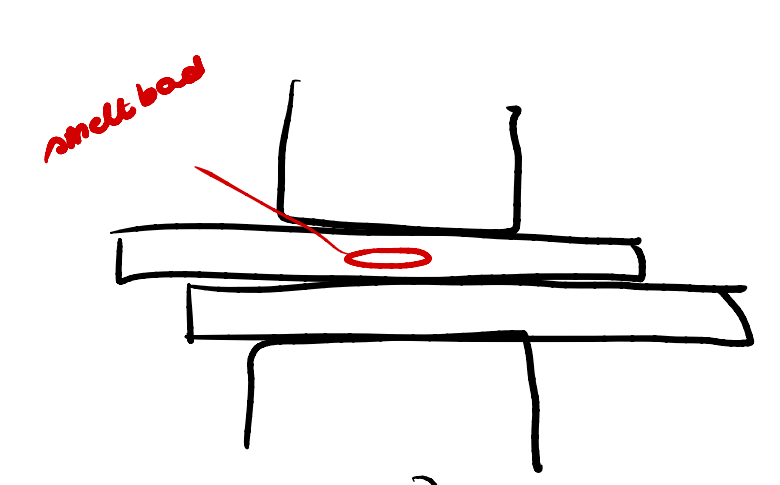
  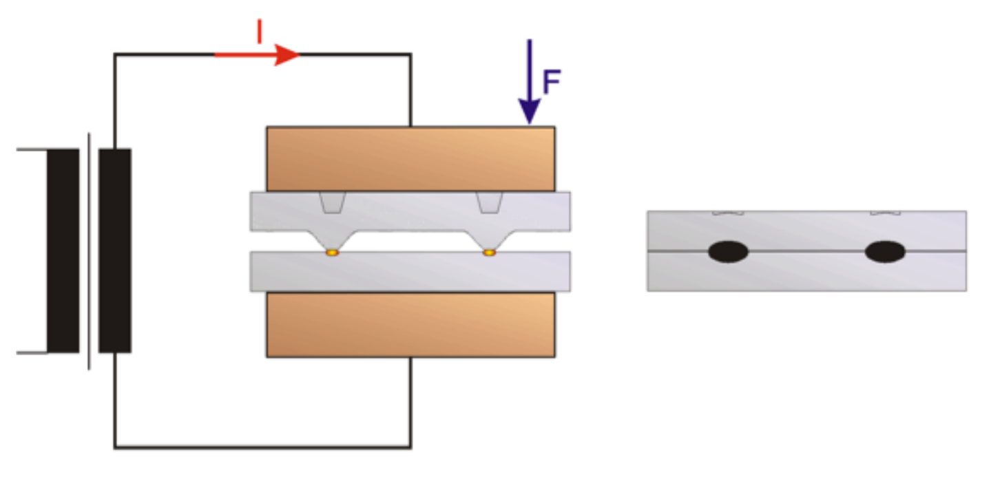
</div>

**3) Functies van de bekleding bij BMBE.**

- **De boog richten:** aan de elektrodetip vormt zich een kelkje in de bekleding, wat de boog concentreert/richt.
- **De boog stabiliseren:** bij verbranding van de bekleding ontstaat een geleidende (geïoniseerde) atmosfeer, die de boog stabiel houdt.
- **Bescherming tegen oxidatie:** verbrandingsgas schermt het smeltbad af van de omgevingslucht (zuurstof, stikstof).
- **Bescherming van de druppels tijdens de transfer:** de druppels worden omhuld door een slaklaag van elektrode tot smeltbad.
- **Bescherming van het stollende lasmetaal:** de slak vormt een laag boven het afkoelende lasmetaal, vertraagt de afkoelsnelheid en gaat oxidatie tegen.
- **Ondersteuning van het lasmetaal:** de slak kan het smeltbad mee ondersteunen — belangrijk bij positielassen (verticaal, boven het hoofd).
- **Legeren van het lasmetaal:** sommige bekledingen bevatten metaalpoeders die legeringselementen toevoegen.

Naargelang het type bekleding verschillen nadruk en eigenschappen: **rutiel** geeft goede aanvloeiing en zachte boog in alle posities; **basisch** geeft laag waterstofgehalte (minder koudscheuren) maar moeilijker verwijderbare slak; **cellulose** geeft hoge lassnelheid en diepe inbranding, maar hoog waterstofgehalte.

**4) Rol van het beschermgas bij MAG-lassen.** MAG = Metal **Active** Gas: het beschermgas (CO₂, of Ar/CO₂-mengsel) is hier **actief/reactief**, in tegenstelling tot het inerte gas (Ar, He) bij MIG. Functies:

- **Afschermen van smeltbad en boog** van de omgevingslucht, zodat geen zuurstof/stikstof in het smeltbad diffundeert (anders poriën en verminderde sterkte).
- **Beïnvloeden van boogeigenschappen en druppelovergang:** type en samenstelling van het gas bepalen mee of de druppelovergang kortsluit-, globulair-, spray- of pulse-spray-type is.
- Zuiver **CO₂** is goedkoop, geeft diepe inbranding maar minder stabiele boog (meer spatten); **Ar/CO₂-mengsels** vormen een compromis met stabielere boog.

Voor MAG-massieve draad is de draad bovendien steeds **verkoperd** — dit is een functie van de draadcoating (niet van het beschermgas): goede elektrische geleiding tussen contacttip en draad, en bescherming tegen corrosie tijdens opslag/transport.

**5) Principe van TIG-lassen.** TIG = **Tungsten Inert Gas**. Een **niet-afsmeltende wolfraamelektrode** wekt een elektrische boog op tussen elektrode en werkstuk; deze boog smelt het basismateriaal (en eventueel het apart toegevoerde toevoegmateriaal als staaf, diameter 1,6-2 mm, lengte ca. 1000 mm). De wolfraamelektrode smelt zelf niet mee en blijft intact. Smeltbad én elektrode worden volledig beschermd door een **inert gas** (Ar of He) — een actief gas zou de wolfraamelektrode chemisch aantasten.

De wolfraamelektrode hangt **steeds aan de negatieve pool**: bij omgekeerde polariteit zou de elektrode zelf circa 3× heter worden en (deels) smelten. TIG kan ook zonder toevoegmateriaal gebruikt worden op dunne platen.

Het proces geeft een **zeer hoge laskwaliteit maar lage afsmeltsnelheid**, en wordt gebruikt waar hoge kwaliteit vereist is (lucht- en ruimtevaart, voedingsindustrie, drukvaten), op dunne platen, en voor de wortellas bij meerlagige verbindingen.

---

### OP-lassen (onder poederdek) — principe en DCEP versus DCEN

*Gesteld in: examen 2019, 17 juni 2019, 8 juni 2018 voormiddag en namiddag.*

**Vraag:** Leg het OP-lasproces (onder poederdek) uit. Wat is het verschil tussen DCEP (elektrode positief) en DCEN (elektrode negatief) polariteit, en wanneer wordt welke gebruikt?

**Modelantwoord:**

**1) Principe van OP-lassen.** Bij OP-lassen (onder poederdek, "Submerged Arc Welding") smelt een **afsmeltende draad- of strip-elektrode** (diameter ≥ 3 mm, eventueel gevuld) onder een laag korrelig **flux** (poeder). De elektrische boog en het smeltbad zijn volledig bedekt door dit poederdek: niet zichtbaar, geen straling. De flux heeft een dubbele functie:

- beschermt zowel **boog** als **smeltbad** tegen de omgevingslucht (dus **geen apart beschermgas nodig**);
- kan bovendien **legeringselementen** aan het lasmetaal toevoegen.

Niet-versmolten poeder kan na het lassen gerecupereerd worden.

OP-lassen kan zowel met een CC- als een CV-bron geregeld worden en is sterk geautomatiseerd: bij uitstek geschikt voor **lange, rechte lassen** (buizen, platen, profielen) dankzij de hoge neersmeltsnelheid, wat het economisch maakt voor grote lasmetaalvolumes. Daarnaast wordt OP-lassen ook gebruikt voor het aanbrengen van **deklagen** (surfacing/cladding), bv. een corrosie- of slijtvaste laag op een goedkoper basismateriaal.

**2) DCEP versus DCEN.** Bij gelijkstroom-booglassen kan de elektrode aangesloten worden op de positieve of negatieve pool:

- **DCEP (Direct Current Electrode Positive — elektrode positief, werkstuk negatief):** de **meest gebruikte/standaard** instelling bij OP-lassen. Geeft **hogere inbranding (penetratie)** in het basismateriaal, maar **lagere neersmeltsnelheid** van de draad/elektrode.
- **DCEN (Direct Current Electrode Negative — elektrode negatief, werkstuk positief):** geeft **hogere neersmeltsnelheid** (meer draad/elektrode smelt af per tijdseenheid), maar **lagere inbranding (penetratie)** in het basismateriaal.

**3) Wanneer welke polariteit?**

- Wanneer een **diepe, volledige doorlassing** van het basismateriaal gewenst is (normale situatie bij het samenvoegen van twee werkstukken), is **DCEP** aangewezen (en meest gebruikt), omwille van de hogere inbranding.
- Wanneer men een **hooggelegeerde deklaag (surfacing/cladding)** wil aanbrengen op een **laaggelegeerd basismateriaal** (bv. corrosie- of slijtvaste toplaag), is **hoge neersmeltsnelheid met weinig inbranding** net gewenst. Een te diepe inbranding zou een groot deel van het laaggelegeerde basismateriaal mee opsmelten en in het lasmetaal vermengen, waardoor de samenstelling (en eigenschappen) van de deklaag "verdund" wordt (**dilutie**). Daarom wordt hier **DCEN** verkozen: snelle opbouw van de deklaag met minimale vermenging met het onderliggende basismateriaal.

**Samengevat:** **DCEP → hoge inbranding, lage neersmeltsnelheid → standaard bij gewone verbindingslassen**; **DCEN → lage inbranding, hoge neersmeltsnelheid → verkozen bij opbrengen van hooggelegeerde deklagen op laaggelegeerd basismateriaal, om dilutie te beperken**.


---

## Scheiden

### Subvraag A — Stansen/ponsen: snijspleet, krachten en afgeschuind gereedschap

*Gesteld in: 27 juni 2023 (en gelijkaardige varianten in eerdere examens)*

**Vraag**: "Bereken de maximale theoretische ponskracht voor een gegeven stans-/ponsbewerking. Wat zijn de afmetingen van pons en matrijs in functie van de snijspleet (clearance)? Geef het wiskundig bewijs dat het gebruik van afgeschuind ponsgereedschap (shear) de benodigde kracht vermindert (W = F·t_p = F_s·s ⇒ F_s/F = t_p/s). Vergelijk de kwaliteit van een gestanst oppervlak met een lasergesneden oppervlak."

**Modelantwoord**

**1) Het stansproces en de gesneden rand**

Bij stansen/ponsen wordt een vorm uit een metalen plaat gesneden zonder dat er spanen ontstaan. Een **pons** (stempel) beweegt verticaal omlaag en drukt de gewenste contour uit de plaat, ondersteund door een **matrijs**. Tussen pons en matrijs zit een kleine spleet: de **snijspleet u**.

- **Stansen (blanking)**: het uitgestanste deel is het eindproduct (de *blank*); de rest van de plaat is afval.
- **Ponsen (punching)**: het gat in de plaat is het product; het uitgedreven stukje (de *slug*) is afval.

**Vier fasen van het snijproces:**

1. **Elastische vervorming** — de pons raakt het werkstuk en het materiaal buigt elastisch door.
2. **Plastische vervorming** — de spanning overschrijdt de vloeigrens, het materiaal vloeit plastisch → glad, gepolijst oppervlak.
3. **Breukinitiatie** — aan de scherpe snijranden van pons en matrijs ontstaan scheurhaarden.
4. **Breukvoortplanting** — de scheuren propageren naar elkaar toe doorheen de plaatdikte tot het materiaal plots scheidt.

**Zones in de gesneden rand** (doorsnede van de plaat, van boven naar onder):

- **Rollover** (inzakking): afgeronde overgang bovenaan — resultaat van elastische/plastische vervorming vóór het eigenlijke snijden.
- **Burnish-zone** (polijstzone): glad en glanzend — gevolg van de plastische penetratie vóór breuk.
- **Breukzone**: ruw en schuin, met een **breukhoek** t.o.v. de verticale richting (idealiter 0.5°–1.5°, zodat de vorm makkelijk loskomt zonder dat het oppervlak te ruw wordt) — gevolg van de scheurvoortplanting.
- **Braam** (*burr*): scherpe rand onderaan (uittredezijde van de pons), ontstaan doordat het materiaal in de laatste fase nog uitrekt vóór het breekt.

Een **optimale snijspleet** geeft een grote burnishzone en een kleine braam.

**2) Snijspleet (clearance) en afmetingen van pons en matrijs**

De **snijspleet u** is de afstand tussen de snijkant van de pons en de snijkant van de matrijs (per zijde) — een van de meest kritische parameters:

- **Te klein**: de breuklijnen vanuit pons- en matrijskant kruisen elkaar/lopen langs elkaar → dubbele/onregelmatige polijstzone, hogere krachten, slechte randkwaliteit (in het slechtste geval scheuren door klemdrukken van het materiaal).
- **Te groot**: het materiaal wordt in de spleet getrokken (vloeit i.p.v. netjes afgeschoven) → grote bramen, grotere vervormingszone, slechte toleranties.
- **Optimaal**: de breuklijnen vanaf pons- en matrijskant propageren precies naar elkaar toe en ontmoeten elkaar in het midden van de plaatdikte → schone, rechte rand met grote burnishzone en kleine braam.

**Berekening:**

$$u = a \cdot t$$

waarbij:

- $u$ = snijspleet (per zijde)
- $t$ = plaatdikte
- $a$ = vergoedingsfactor, afhankelijk van het materiaal (typisch 2 % – 10 % van de plaatdikte)

**Typische waarden voor $a$:**

- Zacht aluminium: $a \approx 0.045$
- Harder aluminium / zacht staal / zacht RVS: $a \approx 0.060$
- Halfhard staal of halfhard/hard RVS: $a \approx 0.075$

Een **brosser materiaal** (breekt snel) vraagt een grotere snijspleet; een **ductiel materiaal** (lange plastische vervorming) vraagt een kleinere snijspleet.

**Afmetingen van pons en matrijs:**

De snijspleet wordt altijd zo aangebracht dat het **gewenste eindproduct** zijn exacte nominale afmeting krijgt. Welk onderdeel (pons of matrijs) de maatgevende afmeting bepaalt, hangt af van het product:

- **Bij stansen (blanking)** — het uitgestanste stuk is het product. De **blank** moet diameter $D_b$ hebben → de **matrijs** bepaalt de blankgrootte (matrijsopening = $D_b$). De pons moet kleiner zijn:
  - Matrijsdiameter $= D_b$ (gewenste blankdiameter)
  - Ponsdiameter $= D_b - 2u$

- **Bij ponsen (punching)** — het gat is het product. Het **gat** moet diameter $D_h$ hebben → de **pons** bepaalt de gatgrootte (ponsdiameter = $D_h$). De matrijs moet groter zijn:
  - Ponsdiameter $= D_h$ (gewenste gatdiameter)
  - Matrijsdiameter $= D_h + 2u$

**Kort gezegd**: de **pons** bepaalt de afmeting van het **gat**, de **matrijs** bepaalt de afmeting van de **blank**. Het onderdeel dat het eindproduct levert krijgt de nominale maat; het andere onderdeel wordt met $2u$ verkleind (stansen) of vergroot (ponsen), zodat de snijspleet rondom de contour aanwezig is.

**3) Maximale theoretische ponskracht**

De maximale theoretische ponskracht is de kracht om de volledige snijcontour in één keer door de plaatdikte af te schuiven:

$$F_{th} = \tau \cdot L \cdot t$$

waarbij:

- $\tau$ = afschuifsterkte (schuifsterkte) van het materiaal $\approx 0.75 \cdot R_m$, met $R_m$ de treksterkte (UTS) — standaardaanname
- $L$ = totale lengte van de snijcontour (omtrek van de vorm); voor een cirkelvormig gat/blank: $L = \pi \cdot d$
- $t$ = plaatdikte

**Aangrijpingspunt**: deze resulterende kracht moet overeenkomen met het centrum (as) van de pers-ram. Bij een niet-symmetrische contour (bv. meerdere gaten) bepaal je het **zwaartepunt (centroid) van de snijlijn**:

$$x_0 = \frac{\sum L_i \cdot x_i}{\sum L_i} \qquad y_0 = \frac{\sum L_i \cdot y_i}{\sum L_i}$$

waarbij $L_i$ de lengte is van elk deelsegment van de snijcontour en $(x_i, y_i)$ het middelpunt van dat segment. Als de ram niet gecentreerd is op dit punt, ontstaan **buigende momenten** op de pons die het gereedschap kunnen beschadigen of een ongelijkmatige snijwerking veroorzaken.

**4) Afgeschuind ponsgereedschap (shear on tools) — wiskundig bewijs**

**Probleem**: wanneer de pons de volledige contour **gelijktijdig** doorsnijdt, treedt de maximale kracht $F_{th}$ plots en piekvormig op (schokbelasting) → trillingen, schokken op de pers en versnelde slijtage van het gereedschap.

**Oplossing**: door de snijkant van de pons (of matrijs) een **hoek (afschuining/shear)** te geven, snijdt het gereedschap niet de volledige omtrek tegelijk, maar **progressief** (stuk voor stuk) over een **langere slag**.

**Wiskundig bewijs (stappenplan):**

1. **Zonder afschuining**: de arbeid wordt geleverd door de maximale (piek)kracht $F_{th}$, werkend over de penetratiediepte $t_p$ die nodig is om de plaat te breken ($t_p = p \cdot t$, met $p$ het penetratiepercentage, typisch 30–60 % van de plaatdikte $t$):

   $$W = F_{th} \cdot t_p$$

2. **Met afschuining**: dezelfde arbeid wordt geleverd door een (lagere) kracht $F_s$, werkend over een **grotere verplaatsing $s$** — de afschuifafstand, groter dan $t_p$ doordat de pons door zijn hellingshoek een langere weg moet afleggen vooraleer de volledige contour doorsneden is:

   $$W = F_s \cdot s$$

3. **De totale arbeid** (om hetzelfde materiaalvolume te scheiden) blijft gelijk, dus:

   $$F_{th} \cdot t_p = F_s \cdot s$$

4. **Hieruit volgt:**

   $$\frac{F_s}{F_{th}} = \frac{t_p}{s}$$

5. **Voorwaarde voor verlaging** van de piekkracht ($F_s < F_{th}$):

   $$\frac{F_s}{F_{th}} = \frac{t_p}{s} < 1 \quad \Longleftrightarrow \quad s > t_p$$

6. **Conclusie**: dit is precies wat een afgeschuind gereedschap realiseert — door de hellingshoek wordt de effectieve snijweg $s$ **groter** dan de penetratiediepte $t_p$ die zonder afschuining nodig zou zijn. Bijgevolg is $F_s/F_{th} < 1$, dus de benodigde **piekkracht $F_s$ is kleiner dan $F_{th}$** — bij gelijke totale arbeid $W$, maar gespreid over een langere slag.

**Voordelen van afgeschuind gereedschap:**

- **Lagere benodigde (piek)ponskracht** $F_s$.
- **Minder schokken/trillingen** op de pers (geleidelijke belastingsopbouw i.p.v. plotse piek).
- **Geleidelijk, progressief snijden** over een langere slag → betere levensduur pers en gereedschap.

**5) Vergelijking: kwaliteit gestanst oppervlak vs. lasergesneden oppervlak**

**Stansen/ponsen**: de gesneden rand is **niet-uniform** over de plaatdikte (vier zones: rollover, burnish, breukzone, braam). Belangrijkste defecten:

- **Ruwe breukzone** met breukhoek (afwijking van de verticale rand) — onvermijdelijk gevolg van de scheurvoortplanting.
- **Braam (burr)**: scherpe rand aan de onderkant (uittredezijde), door materiaalrek in de laatste fase.
- **Verharding (work hardening)** aan de snijranden door grote plastische vervorming → rand wordt harder en brosser dan het basismateriaal.

**Vermindering**: een correct gekozen (optimale) snijspleet $u = a \cdot t$ laat de breuklijnen vanuit pons en matrijs netjes in het midden samenkomen → grotere/gladdere burnishzone en kleinere braam. Voor een nóg betere kwaliteit (volledig vrij van breukzone en braam) wordt **fijnstansen** toegepast.

**Lasersnijden**: levert in het algemeen een goede randkwaliteit, maar **sterk afhankelijk van de snijsnelheid** (en van vermogen en gasdebiet). Belangrijkste defecten:

- **Dross formation**: gesmolten materiaal dat aan de onderzijde van de snede opnieuw stolt — een "metallische braam" door smelten/herstollen i.p.v. mechanische rek.
- **Grote ruwheidsvariaties**, vooral bij te trage snijsnelheid: het materiaal krijgt meer tijd om opnieuw te smelten/stollen → golvende/ruwe zijwand.
- **Plasmavorming** boven het smeltbad bij te hoog vermogen → verstoort de energie-inkoppeling en verlaagt de snedekwaliteit.
- **Warmte-beïnvloede zone (HAZ)**: zone naast de snede waar het materiaal door hoge temperatuur metallurgisch verandert (microstructuurverandering, mogelijk verminderde mechanische eigenschappen).

**Vermindering**: optimalisatie van de snijsnelheid (niet te traag, niet te snel) in combinatie met juiste vermogen en hulpgas, om dross, ruwheid en HAZ te minimaliseren.

**Vergelijking — kernpunten:**

- **Mechanisch (stansen) vs. thermisch (laser)**: stansen scheidt materiaal door plastische vervorming en breuk (mechanisch); lasersnijden door lokaal smelten/verdampen (thermisch). Defectmechanismen zijn fundamenteel anders: braam/breukhoek/verharding bij stansen versus dross/HAZ/golvende wand bij lasersnijden.
- **Maatnauwkeurigheid**: lasersnijden geeft typisch nauwere toleranties zonder de mechanische vervorming (rollover, uitrekking) van stansen; stansen heeft de snijspleet als extra tolerantiebron.
- **Oppervlaktekwaliteit**: stansen geeft een gemengd oppervlak (deels glad/burnish, deels ruw/breuk + braam, eventueel verharding); lasersnijden geeft een meer continue smeltrand, met dross en HAZ als kwaliteitsbeperkende factoren.
- **Nabewerking**: gestanste onderdelen vereisen vaak ontbramen; lasergesneden onderdelen vereisen eventueel verwijderen van dross-aanhechtingen en, indien de HAZ problematisch is (bv. vermoeiing, corrosie), een nabehandeling om de HAZ te verwijderen/te ontspannen.
- **Gereedschapskosten vs. flexibiliteit**: stansen vereist een specifiek (duur) gereedschap (pons + matrijs) per vorm — ideaal voor grote series; lasersnijden vereist geen vormgebonden gereedschap, is flexibeler voor kleine series/vormveranderingen, maar trager per stuk bij grote series.

---

### Subvraag B — Meerdere ponsen tegelijk en fijnstansen

*Gesteld in: 11 juni 2025*

**Vraag**: "Bij het gelijktijdig ponsen van meerdere gaten in één stap: hoe wordt de totale benodigde kracht berekend, en welke ontwerptechniek kan gebruikt worden om de piekkracht te verlagen? Wat is fijnstansen (fine blanking) en wat zijn de voordelen ten opzichte van conventioneel stansen?"

**Modelantwoord**

**1) Totale benodigde kracht bij meerdere gaten/ponsen tegelijk**

Wanneer in één enkele persslag meerdere ponsen tegelijk door de plaat snijden (bv. meerdere gaten in een compleetstempel of volgstempel), moet de pers op elk moment de **som** leveren van de krachten die elke individuele pons op dat moment vraagt. Als alle ponsen exact op hetzelfde moment door de volledige plaatdikte snijden, is de totale (piek)kracht gelijk aan de som van de afzonderlijke maximale theoretische krachten:

$$F_{totaal} = \sum F_i = \sum (\tau \cdot L_i \cdot t) = \tau \cdot t \cdot \sum L_i$$

waarbij:

- $\tau$ = afschuifsterkte van het materiaal ($\approx 0.75 \cdot R_m$)
- $t$ = plaatdikte (dezelfde voor alle gaten, in dezelfde plaat)
- $L_i$ = omtreklengte van de snijcontour van gat/pons $i$
- $\sum L_i$ = som van alle afzonderlijke snijcontourlengtes (totale "snijomtrek" van alle gaten samen)

**Conclusie**: de totale kracht hangt enkel af van de **totale snijlengte** van alle contouren samen, vermenigvuldigd met $\tau \cdot t$ — net zoals bij één pons, maar met $L$ vervangen door $\sum L_i$.

**2) Ontwerptechniek om de piekkracht te verlagen: gestaffelde (getrapte) ponsen**

**Probleem**: als alle ponsen op exact hetzelfde tijdstip in contact komen met de plaat en snijden, moet de pers plots de volledige som $F_{totaal} = \tau \cdot t \cdot \sum L_i$ leveren → grote, plotse piekbelasting met schokken op pers en gereedschap (analoog aan het probleem van één niet-afgeschuinde pons die zijn volledige contour in één keer doorsnijdt, zie Subvraag A).

**Oplossing**: de afzonderlijke ponsen worden op **lichtjes verschillende hoogtes (getrapt/gestaffeld)** geplaatst, zodat ze niet allemaal op exact hetzelfde moment in contact komen met de plaat en beginnen te snijden. De langste (laagst geplaatste) pons snijdt eerst, gevolgd door de volgende, enzovoort — het voltooiingsmoment van elke snede wordt zo gespreid in de tijd in plaats van samen te vallen.

Het principe is **identiek aan dat van het afgeschuind gereedschap** uit Subvraag A, maar toegepast op het niveau van een **set van meerdere ponsen** i.p.v. op de snijrand van één enkele pons:

- **Bij één afgeschuinde pons**: de snijlijn van die ene pons wordt niet gelijktijdig maar progressief (punt voor punt langs de contour) doorsneden, over een langere slag $s$.
- **Bij meerdere getrapte ponsen**: de snede van de verschillende ponsen wordt niet gelijktijdig maar na elkaar (pons voor pons) uitgevoerd, over een langere totale slag van de pers.

In beide gevallen blijft de **totale arbeid $W$** dezelfde (er moet nog steeds evenveel materiaal over evenveel afstand worden afgeschoven/gesneden), maar omdat de individuele bijdragen **niet meer allemaal op hetzelfde moment** optreden, wordt de **instantane piekkracht op de pers verlaagd**: op elk moment levert de pers enkel de kracht van de pons(en) die op dat moment effectief snijden, niet van alle ponsen samen.

**Resultaat:**

- **Lagere piekkracht** (kleinere/lichtere pers mogelijk, of minder belasting op een bestaande pers).
- **Minder schokken en trillingen.**
- **Geleidelijkere, meer verspreide krachtsopbouw** over de persslag.

**3) Fijnstansen (fine blanking)**

**Wat is het?** Fijnstansen is een speciale variant van stansen waarbij de gesneden rand **over de volledige plaatdikte volledig glad en scheurvrij** is. Bij conventioneel stansen ontstaan de vier typische zones (rollover, burnish, breukzone, braam); bij fijnstansen is het volledige snijoppervlak één doorlopende **burnish-zone**, zonder apart breukgedeelte en zonder braam.

**Hoe werkt het?** Het proces combineert **drie elementen gelijktijdig**:

1. De **pons** snijdt het materiaal uit, net als bij conventioneel stansen, maar met een veel **kleinere snijspleet** (≈ 1 % van de plaatdikte, t.o.v. 2–10 % bij conventioneel stansen).
2. Een **klemring (blankholder) met V-ring/V-stinger** rond de omtrek van de blank drukt in het materiaal en klemt het stevig vast, zodat het materiaal niet zijwaarts kan wegvloeien of uitrekken tijdens het snijden.
3. Een **tegendrukplaat (tegenpons)** onder de blank ondersteunt het materiaal van onderaf en oefent een tegendruk uit tijdens het snijden.

De combinatie van deze drie elementen verhoogt de **hydrostatische druk** in de snijzone sterk — dit is de sleutel van het proces: door de druk in alle richtingen te verhogen, wordt **scheurvorming (breukinitiatie) onderdrukt**, en kan het materiaal **plastisch blijven vervormen zonder te breken** doorheen de volledige plaatdikte. Resultaat: een volledig glad (burnish) snijoppervlak, in plaats van een overgang naar een ruwe breukzone met braam.

**Voordelen van fijnstansen t.o.v. conventioneel stansen:**

| Eigenschap | Conventioneel stansen | Fijnstansen |
|---|---|---|
| Randkwaliteit | Rollover + burnish + breukzone + braam (niet-uniform) | Volledig glad/burnish over de hele plaatdikte |
| Scheurvrij | Nee — breukzone is per definitie aanwezig | Ja — geen breukinitiatie dankzij hoge hydrostatische druk |
| Toleranties | Matig | Nauw — engere toleranties mogelijk |
| Snijspleet | Groter (typisch 2–10 % van $t$) | Veel kleiner ($\approx 1\%$ van $t$) |
| Benodigde kracht | "Normale" stanskracht $F_{th} = \tau \cdot L \cdot t$ | Hoger — bijkomende klem- en tegendrukkrachten nodig (klemring + tegendrukplaat) |
| Gereedschap | Pons + matrijs | Pons + matrijs + klemring met V-ring + tegendrukplaat (complexer) |

**Kortom**: fijnstansen levert dankzij de hogere hydrostatische druk (door klemring + tegendrukplaat + kleine snijspleet) een product met een veel betere, volledig scheurvrije randkwaliteit en nauwere toleranties dan conventioneel stansen — vaak zonder verdere nabewerking (ontbramen) — maar ten koste van een complexer gereedschap en hogere benodigde krachten.


---

## Oervormen

### Zandgieten, wet van Chvorinov en ontwerp van een opkomer

*Gesteld in: 10 juni 2024, met een variant op 24 juni 2025.*

**Vraag:** Leg het zandgietproces uit (vormholte, gietsysteem, stolling). Wat zegt de regel van Chvorinov (TTS = C_m·(V/A)^n, met n=2)? Een gietstuk heeft een bepaald volume V en oppervlak A. Ontwerp een cilindrische opkomer (riser) met diameter D=6cm zodanig dat de stollingstijd van de opkomer minstens 10% langer is dan die van het gietstuk (zodat de opkomer als laatste stolt en krimpholtes naar de opkomer worden verplaatst in plaats van naar het gietstuk). Bereken de benodigde hoogte H van de opkomer.

**Modelantwoord:**

**1. Het zandgietproces**

Bij zandgieten wordt een vochtig zandmengsel — samengehouden door een bindmiddel — rond een **patroon** (model van het werkstuk) verpakt en verdicht. Na het verwijderen van het patroon blijft een holte over: het **negatief** van het werkstuk, de **vormholte**. Het zand smelt niet mee omdat het een veel hogere smelttemperatuur heeft dan het gegoten metaal.

- **Krimpallocatie**: het patroon (en dus de vormholte) wordt **iets groter** gemaakt dan het eindproduct, omdat het metaal tijdens afkoeling en stolling krimpt. Zo komt het gietstuk na afkoeling toch op de juiste afmetingen uit.
- De vorm bestaat uit een **bovenkast** en **onderkast**, gescheiden door de **vormdeling** (lijn waarlangs de vorm geopend wordt).
- **Kernen**: inzetstukken van zand/keramiek die **interne holtes** in het gietstuk definiëren (bv. een doorgang in een motorblok); apart vervaardigd en vóór het gieten in de vorm geplaatst.
- **Het gietsysteem** voert het vloeibare metaal naar de vormholte:
  - **Gietkom/gietbak**: reservoir waarin het metaal vanuit de gietpan terechtkomt.
  - **Gietloop (sprue)**: verticaal kanaal, typisch **taps toelopend** (smaller naar onder) zodat de toenemende stroomsnelheid (Bernoulli) consistent blijft met de continuïteitswet, zonder luchtaanzuiging (aspiratie).
  - **Aansnijding (runner/gate)**: horizontaal kanaal dat het metaal rustig (laminair) in de vormholte laat instromen.
  - **Opkomer (riser)**: extra reservoir vloeibaar metaal, in verbinding met de vormholte, dat de krimp tijdens het stollen opvangt (zie verder).

**Stolling**: het vloeibare metaal stolt via **nucleatie** (vorming van kristalkernen, meestal heterogeen aan de koude vormwand) en **kristalgroei** (kernen groeien tot korrels tot ze botsen op andere korrels). De stolling verloopt **van buiten naar binnen** (vormwand het eerst, centrum het laatst), wat drie korrelzones geeft:

1. **Chill zone**: dunne laag fijne, willekeurig georiënteerde korrels tegen de vormwand (snelste afkoeling).
2. **Kolomvormige korrels (columnar grains)**: groeien radiaal naar het centrum, in de richting van de warmteafvoer — enkel korrels met de juiste groeirichting overleven en groeien lang uit.
3. **Equiaxiaal centrumgebied**: midden van het gietstuk, trage en isotrope afkoeling, grotere willekeurig georiënteerde korrels.

Na afkoeling wordt de zandvorm opengebroken, het gietsysteem (gietloop, aansnijding, opkomer) afgesneden en het stuk geïnspecteerd.

**2. De regel van Chvorinov**

$$TTS = C_m \cdot \left(\frac{V}{A}\right)^n, \quad n = 2$$

- $TTS$ = totale stollingstijd (tot het gietstuk volledig vast is)
- $V$ = volume van het gietstuk
- $A$ = afkoelend oppervlak (in contact met de vormwand, waarlangs warmte afgevoerd wordt)
- $C_m$ = gietvormconstante (zie punt 3)

**Fysische betekenis:** de stollingstijd hangt af van $V/A$ — hoeveel materiaal moet stollen (volume) t.o.v. hoeveel oppervlak beschikbaar is om warmte af te voeren. **Hoe groter $A/V$ (kleiner $V/A$), hoe sneller** het gietstuk stolt: minder materiaal te doorkruisen, relatief meer afkoeloppervlak. **Hoe groter $V/A$, hoe trager** de stolling. Bij gelijk volume heeft een **bol** de kleinste $A/V$ (stolt traagst), een **kubus** een grotere $A/V$ (stolt sneller).

**3. De gietvormconstante $C_m$**

Geen universele constante, maar **proces-specifiek**, afhankelijk van:

- het **gietvormmateriaal** (bv. zand isoleert en koelt trager af dan een metalen matrijs),
- de **thermische eigenschappen van het metaal** (warmtegeleiding, soortelijke warmte, stollingswarmte),
- het **giet- en stolpunt** van het metaal (bepalen samen het temperatuurverschil met de vorm).

In de praktijk wordt $C_m$ **experimenteel** bepaald via een referentiestuk (gekend $V_{ref}$, $A_{ref}$, gemeten $TTS_{ref}$):

$$C_m = \frac{TTS_{ref}}{\left(\frac{V_{ref}}{A_{ref}}\right)^2}$$

Alternatief: analytisch schatten uit thermische eigenschappen van vorm en metaal (warmtegeleidingscoëfficiënt, warmtecapaciteit, dichtheid, stollingswarmte, oververhitting). **Kernpunt voor deze opgave: $C_m$ is hetzelfde voor het gietstuk en de opkomer**, zolang beide in dezelfde vorm (zelfde zandmateriaal) en met hetzelfde metaal bij dezelfde giettemperatuur gegoten worden.

**4. Stappenplan: ontwerp van de opkomer**

**Stap 1 — Ontwerpvoorwaarde opstellen.** Een opkomer kan zijn functie (bijvoeden van krimp) enkel vervullen als hij **trager stolt** dan het gietstuk — anders is hij al vast vóór het gietstuk volledig gestold is en kan er geen vloeibaar metaal meer naartoe vloeien. De opgave eist:

$$TTS_{opkomer} \geq 1{,}1 \cdot TTS_{gietstuk}$$

**Stap 2 — Chvorinov invullen, $C_m$ wegwerken.** Omdat $C_m$ identiek is voor opkomer en gietstuk:

$$C_m \cdot \left(\frac{V_{opkomer}}{A_{opkomer}}\right)^2 \geq 1{,}1 \cdot C_m \cdot \left(\frac{V_{gietstuk}}{A_{gietstuk}}\right)^2$$

$C_m$ valt weg, en na worteltrekking (beide leden positief):

$$\frac{V_{opkomer}}{A_{opkomer}} \geq \sqrt{1{,}1} \cdot \frac{V_{gietstuk}}{A_{gietstuk}}$$

**Stap 3 — Modulus-eis $K$ definiëren.** De rechterkant is een **gekend getal** (eenheid van lengte, bv. cm) zodra $V_{gietstuk}$ en $A_{gietstuk}$ gekend zijn:

$$K := \sqrt{1{,}1} \cdot \frac{V_{gietstuk}}{A_{gietstuk}}$$

De ontwerpeis voor de opkomer wordt dus: $\dfrac{V_{opkomer}}{A_{opkomer}} \geq K$.

**Stap 4 — Geometrie van de cilindrische opkomer ($D = 6$ cm).** De opkomer staat met zijn **onderkant op het gietstuk** (in verbinding met de vormholte), de rest is omsloten door zand. Het afkoelend oppervlak $A_{opkomer}$ bestaat uit:

- de **zijmantel**: $\pi \cdot D \cdot H$
- het **bovenvlak**: $\dfrac{\pi \cdot D^2}{4}$

De **onderkant telt niet mee** (in contact met het nog vloeibare gietstuk, geen warmteafvoer naar de vorm via dat vlak).

$$V_{opkomer} = \frac{\pi \cdot D^2 \cdot H}{4} \qquad A_{opkomer} = \pi \cdot D \cdot H + \frac{\pi \cdot D^2}{4}$$

**Stap 5 — Oplossen naar $H$.** Werk met het grensgeval (gelijkheid) voor de **minimale** hoogte $H$:

$$\frac{V_{opkomer}}{A_{opkomer}} = \frac{\dfrac{\pi D^2 H}{4}}{\pi D H + \dfrac{\pi D^2}{4}} = K$$

Factor $\pi \cdot D$ wegdelen uit teller en noemer (teller houdt extra factor $D/4$ over):

$$\frac{\dfrac{D \cdot H}{4}}{H + \dfrac{D}{4}} = K$$

Vermenigvuldigen met de noemer en oplossen naar $H$:

$$\frac{D \cdot H}{4} = K \cdot H + K \cdot \frac{D}{4} \;\; \Rightarrow \;\; H\left(\frac{D}{4} - K\right) = K \cdot \frac{D}{4} \;\; \Rightarrow \;\; H = \frac{K \cdot \frac{D}{4}}{\frac{D}{4} - K}$$

Met $D = 6$ cm $\Rightarrow D/4 = 1{,}5$ cm:

$$H = \frac{1{,}5 \cdot K}{1{,}5 - K} \quad \text{[cm, met } K \text{ in cm]}$$

**Stap 6 — Geldigheidscontrole.** Deze uitdrukking is enkel fysisch zinvol ($H>0$) als de noemer positief is, dus **$K < D/4 = 1{,}5$ cm**. Reden: de $V/A$-verhouding van een cilinder met vaste straal $r=D/2$ nadert $r/2 = D/4$ als $H \to \infty$, en kan dus nooit groter worden dan $D/4$. Is $K \geq 1{,}5$ cm, dan voldoet **geen enkele eindige $H$** bij deze diameter — de diameter $D$ moet dan vergroot worden.

**Samenvatting van de methode** (zodra $V_{gietstuk}$ en $A_{gietstuk}$ gekend zijn):

1. Bereken $(V/A)_{gietstuk}$.
2. Bereken $K = \sqrt{1{,}1} \cdot (V/A)_{gietstuk}$ — minimaal vereiste $V/A$ van de opkomer.
3. Vul $D = 6$ cm in ($D/4 = 1{,}5$ cm) en bereken $H = \dfrac{1{,}5 \cdot K}{1{,}5 - K}$.
4. Controleer $K < 1{,}5$ cm (anders is de diameter te klein voor een eindige oplossing).
5. Controleer door $H$ terug in te vullen in $V_{opkomer}/A_{opkomer}$ en te verifiëren dat dit $\geq K$ is (dus $TTS_{opkomer} \geq 1{,}1 \cdot TTS_{gietstuk}$).

**5. De drie fasen van krimp en de rol van de opkomer**

Tijdens afkoeling en stolling treedt krimp op in drie fasen:

1. **Vloeistofcontractie**: het vloeibare metaal krimpt al tijdens afkoeling, vóór het stollen begint (boven het smeltpunt/de liquidustemperatuur).
2. **Stollingskrimp**: tijdens de faseovergang vloeibaar→vast krimpt het metaal extra, omdat de vaste fase compacter (hogere dichtheid) is dan de vloeibare.
3. **Thermische contractie**: het reeds vaste gietstuk krimpt verder tijdens afkoeling tot kamertemperatuur.

Onopgevangen krimp geeft **krimpholtes, poriën of insunkingen** — defecten die de mechanische sterkte aantasten. De **opkomer** vangt dit op: zolang hij nog vloeibaar/pappig is terwijl het gietstuk al (verder) stolt en krimpt, kan vloeibaar metaal vanuit de opkomer naar het gietstuk stromen om de krimpende volumes bij te vullen. Daarvoor moet de opkomer een **grotere $V/A$-verhouding** hebben dan het gietstuk (en dus later stollen, zoals afgeleid in stappen 1-6), zodat krimpholtes zich **in de opkomer** vormen — die toch wordt afgesneden — in plaats van in het functionele gietstuk.

---

### Turbinebladen — gerichte stolling (DS): conductie versus radiatie

*Gesteld in: 5 juni 2025.*

**Vraag:** Bij gerichte stolling (Directional Solidification, DS) van een turbineblad wordt het blad uit een hete zone (T=1500K) langzaam naar een koude zone (T0=300K) getrokken, waarbij het oppervlak warmte uitstraalt naar de omgeving (emissiviteit ε=0,5). De warmtegeleidingscoëfficiënt van het vaste materiaal is K_s=15 W/(m·K), de Stefan-Boltzmann constante is σ=5,67×10⁻⁸ W/(m²K⁴).
(a) Stel de energiebalans op tussen geleiding (conductie) langsheen het blad over een lengte L en stralingsverlies (radiatie) vanaf het oppervlak, en bepaal de lengte L waarbij beide warmtestromen gelijk zijn.
(b) Wat is de fysische betekenis van deze lengte L in de context van gericht stollen?
(c) Vergelijk bij een bladlengte L=500mm welk warmtetransportmechanisme (conductie of radiatie) dominant is, en wat betekent dit voor het DS-proces bij grotere bladlengtes?

**Modelantwoord:**

**Context — wat is gerichte stolling (DS)?**

Turbinebladen in de hete sectie van een straalmotor staan continu onder centrifugale belasting bij hoge temperatuur (1000-1100°C). Het dominante faalmechanisme is **creep** — trage, progressieve plastische vervorming bij constante belasting. Bij **conventioneel gegoten (CC) bladen** (investment casting) stolt de superlegering tegen de keramische vormwanden in willekeurige richtingen, wat een polykristallijne structuur geeft met **korrelgrenzen in alle richtingen** — net deze korrelgrenzen zijn de zwakste schakel bij hoge temperatuur (intergranulaire breuk domineert).

Bij **gerichte stolling (DS)** wordt de stollingsrichting gecontroleerd: de keramische matrijs rust op een **water-gekoelde koelplaat**, en na het gieten van de vloeibare superlegering (onder vacuüm, ~1550°C) wordt de matrijs **langzaam omlaag getrokken**. De stolling start aan de koelplaat (koude zone) en propageert gecontroleerd naar boven (hete zone), met een typische thermische gradiënt van ~4000 K/m. Resultaat: een structuur met **kolomvormige korrels (columnar grains)**, parallel aan de richting van warmteafvoer — en dus parallel aan de longitudinale as van het blad, d.w.z. parallel aan de centrifugaalkracht/hoofdspanning tijdens bedrijf. Omdat er **geen transversale korrelgrenzen** meer zijn (loodrecht op de belastingsrichting — precies de zwakste plekken onder centrifugale belasting), verbetert de creepweerstand in de kritische richting sterk t.o.v. CC-bladen.

**Cruciaal voor dit proces**: een **voldoende steile en stabiele axiale temperatuursgradiënt** over het blad tijdens het terugtrekken — enkel dan blijft het stollingsfront vlak en gericht (loodrecht op de trekrichting), met kolomvormige korrels als resultaat. Deze opgave onderzoekt wanneer geleiding langsheen het blad nog voldoende is om die gradiënt te handhaven tegenover het stralingsverlies aan het oppervlak.

**(a) Energiebalans en berekening van L**

**Conductie (Fourier)** — uit het formularium is de conductiecoëfficiënt $h_c = \dfrac{\kappa_s}{X}$, met $\kappa_s$ de warmtegeleidingscoëfficiënt van het vaste materiaal en $X$ de afstand waarover geleid wordt. Hier is die afstand precies de bladlengte ($X=L$), en $\kappa_s$ neemt de plaats in van het in de vraag gegeven $K_s$. De warmteflux langsheen het blad over lengte $L$, met temperatuursverschil $(T-T_0)$ (lineair profiel veronderstelt), wordt dan $q_{cond}=h_c(T-T_0)$:

$$q_{cond} = h_c (T-T_0) = \kappa_s \frac{T - T_0}{L}, \qquad \kappa_s = 15 \text{ W/(m}\cdot\text{K)}$$

**Radiatie (Stefan-Boltzmann)** — uit het formularium is de radiatiecoëfficiënt $h_R = \dfrac{\sigma(\varepsilon T^4 - \alpha T_0^4)}{T-T_0}$, met $\sigma$ de Stefan-Boltzmann-constante, $\varepsilon$ de emissiviteit (uitstraling vanaf het bladoppervlak) en $\alpha$ de absorptiecoëfficiënt (opname van straling vanuit de omgeving op $T_0$). De warmteflux uitgestraald vanaf het oppervlak naar de omgeving is dan $q_{rad}=h_R(T-T_0)$:

$$q_{rad} = h_R (T-T_0) = \sigma\left(\varepsilon T^4 - \alpha T_0^4\right)$$

In deze opgave wordt de vereenvoudigende aanname $\alpha=\varepsilon$ gemaakt (het oppervlak absorbeert even goed als het uitstraalt). Dan herleidt dit tot:

$$h_R(T-T_0) = \sigma\varepsilon\,\frac{T^4-T_0^4}{T-T_0}(T-T_0) = \varepsilon\sigma(T^4-T_0^4) \quad \Rightarrow \quad q_{rad} = \varepsilon \sigma (T^4 - T_0^4)$$

wat de vertrouwde radiatieformule oplevert (zie ook de nota over $\varepsilon$ versus $\alpha$ onderaan).

**Energiebalans:** om een stabiele, voldoende steile gradiënt te handhaven moet de via geleiding aangevoerde warmte minstens gelijk zijn aan het stralingsverlies. $L$ is de lengte waarbij beide warmtestromen **gelijk** zijn:

$$q_{cond} = q_{rad} \quad \Rightarrow \quad \kappa_s \cdot \frac{T-T_0}{L} = \varepsilon \cdot \sigma \cdot (T^4 - T_0^4) \quad \Rightarrow \quad L = \frac{\kappa_s \cdot (T - T_0)}{\varepsilon \cdot \sigma \cdot (T^4 - T_0^4)}$$

**Numerieke uitwerking:**

Teller: $\kappa_s \cdot (T - T_0) = 15 \cdot (1500 - 300) = 15 \cdot 1200 = 18\,000$ W/m

Noemer — eerst $T^4 - T_0^4$:

- $1500^4 = 5{,}0625 \times 10^{12}$
- $300^4 = 8{,}1 \times 10^{9}$
- $T^4 - T_0^4 = 5{,}0625\times10^{12} - 0{,}0081\times10^{12} \approx 5{,}0544 \times 10^{12}$ K⁴

$$\varepsilon \cdot \sigma \cdot (T^4-T_0^4) = 0{,}5 \cdot 5{,}67\times10^{-8} \cdot 5{,}0544\times10^{12} \approx 0{,}5 \cdot 2{,}8658\times10^{5} \approx 1{,}4329 \times 10^{5} \text{ W/m}^2$$

$$L = \frac{18\,000}{1{,}4329\times10^{5}} \approx 0{,}1256 \text{ m} \approx \mathbf{0{,}126 \text{ m} \;(\approx 12{,}6 \text{ cm})}$$

**(b) Fysische betekenis van L**

$L \approx 0{,}126$ m is de **kritische lengte** waarbij de via geleiding aangevoerde warmte precies gelijk is aan het stralingsverlies aan het oppervlak.

- **Bladlengte $< L$**: geleiding is sterk genoeg om het stralingsverlies te compenseren — voldoende warmte kan langsheen het blad afgevoerd/aangevoerd worden om de axiale gradiënt te handhaven die nodig is voor een vlak, gericht stollingsfront.
- **Bladlengte $> L$**: het stralingsverlies overstijgt de capaciteit van de geleiding — het wordt steeds moeilijker om via geleiding alleen de gewenste gradiënt te behouden, wat de kwaliteit van de gerichte stolling (kolomvormige korrelstructuur) in het gedrang kan brengen.

$L$ is dus een **grenswaarde**: tot welke bladlengte het DS-proces, gebaseerd op pure geleiding, nog goed functioneert zonder dat radiatieverliezen het temperatuursprofiel verstoren.

**(c) Vergelijking bij L = 500 mm**

Bij $L = 0{,}5$ m herberekenen we de conductieve flux ($q_{rad}$ blijft **onveranderd** — hangt niet af van $L$):

$$q_{cond}(L=0{,}5) = \frac{\kappa_s\cdot(T-T_0)}{L} = \frac{18\,000}{0{,}5} = 36\,000 \text{ W/m}^2 = 3{,}6 \times 10^4 \text{ W/m}^2$$

$$q_{rad} = 1{,}4329 \times 10^5 \text{ W/m}^2 \quad (\text{ongewijzigd})$$

$$q_{rad} \approx 1{,}43\times10^5 \text{ W/m}^2 \;\gg\; q_{cond} \approx 3{,}6\times10^4 \text{ W/m}^2 \quad (\text{factor} \approx 4)$$

**Conclusie: bij L = 500 mm domineert radiatie.**

**Betekenis voor het DS-proces bij grotere bladlengtes:** omdat $q_{cond} \propto 1/L$ (omgekeerd evenredig met $L$) terwijl $q_{rad}$ **constant** blijft (oppervlakte-effect, onafhankelijk van de bladlengte), wordt geleiding steeds minder belangrijk naarmate het blad langer wordt, terwijl het stralingsverlies even groot blijft. Voor lange bladen (zoals moderne hogedruk-turbinebladen van ~500 mm) volstaat geleiding alleen niet meer om de axiale gradiënt te handhaven tegen de stralingsverliezen. Dit vormt een **fundamentele beperking** op de maximale bladlengte (of minimale terugtreksnelheid) haalbaar met zuiver geleidingsgedreven DS, en verklaart waarom lange bladen extra maatregelen nodig hebben — bv. **actieve koeling, stralingsschermen** rond het blad, of een **aangepast (vertraagd) terugtrekprofiel** — om toch een voldoende steile, gerichte gradiënt en dus een goede kolomvormige (of single-crystal) korrelstructuur te garanderen.

**Nota over ε versus α (formularium-notatie $h_R$):** in de algemene formule $h_R=\dfrac{\sigma(\varepsilon T^4-\alpha T_0^4)}{T-T_0}$ staat $\varepsilon$ voor de **emissiviteit** (uitstraling van het bladoppervlak op temperatuur $T$) en $\alpha$ voor de **absorptiecoëfficiënt** (opname van straling die vanuit de omgeving op $T_0$ inkomt). Hierboven is $\alpha=\varepsilon=0{,}5$ gesteld, wat $h_R(T-T_0)$ herleidt tot $\varepsilon\cdot\sigma\cdot(T^4-T_0^4)$, gebruikt in de uitgaande stralingsflux $q_{rad}$. Vermeldt de vraagstelling daarnaast een **afzonderlijke** absorptiecoëfficiënt $\alpha=0{,}5$ voor invallende straling (bv. straling die het blad aan het hete uiteinde ontvangt vanuit de ovenwand, $Q_{in}=\alpha\cdot\sigma\cdot T_{oven}^4$), dan is dit een **afzonderlijke term**: deze bepaalt mee hoeveel warmte het hete uiteinde opneemt (en draagt zo bij aan het handhaven van $T=1500K$ aan dat uiteinde), maar komt niet voor in de balans $q_{cond}=q_{rad}$ zelf, die enkel geleiding langsheen het blad vergelijkt met het stralingsverlies van het bladoppervlak naar de omgeving op $T_0$.


---

## Omvormen

---

### Cluster 1 — Walsen: theoretische afleidingen (gemiddelde vloeispanning, meeneemhoek, maximale diktereductie)

*Gesteld in: examen 2021, herhaald op 4 juni 2021, en 4 juni 2026 namiddag (afleiding van de gemiddelde-vloeispanningsformule voor de verstevigingskromme + oefening hierover).*

**Vraag:** "(i) Leid, uitgaande van de wet van Hollomon σ = K·ε^n, een formule af voor de gemiddelde vloeispanning $\bar{Y}_f$ tijdens een vervorming tot rek ε. (ii) Leid de maximale meeneemhoek θ_max af in functie van de wrijvingscoëfficiënt µ bij walsen. (iii) Leid de maximale diktereductie d_max per wals-stap af."

**Modelantwoord.**

**(i) Gemiddelde vloeispanning $\bar{Y}_f$**

De **verstevigingskromme (wet van Hollomon)** beschrijft de ware vloeispanning σ in functie van de ware rek ε, met **K** de sterkteconstante (MPa) en **n** de verstevigingsexponent (0 < n < 1):

$$\sigma = K \cdot \varepsilon^n$$

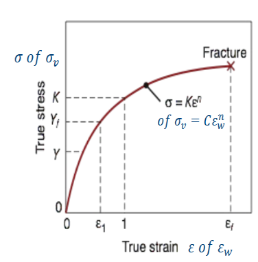


Tijdens een vervorming van ε = 0 tot ε = ε (eindrek) varieert σ voortdurend volgens deze wet. **Stappenplan:**

1. **Definitie** — de gemiddelde vloeispanning $\bar{Y}_f$ is de gemiddelde waarde van σ over het rek-interval [0, ε]:
$$\bar{Y}_f = \frac{1}{\varepsilon} \int_0^{\varepsilon} \sigma(\varepsilon') \, d\varepsilon' = \frac{1}{\varepsilon} \int_0^{\varepsilon} K \cdot \varepsilon'^n \, d\varepsilon'$$

2. **Integraal uitwerken:**
$$\int_0^{\varepsilon} K \cdot \varepsilon'^n \, d\varepsilon' = K \cdot \left[\frac{\varepsilon'^{n+1}}{n+1}\right]_0^{\varepsilon} = \frac{K \cdot \varepsilon^{n+1}}{n+1}$$

3. **Delen door ε:**
$$\bar{Y}_f = \frac{1}{\varepsilon} \cdot \frac{K \cdot \varepsilon^{n+1}}{n+1} = \frac{K \cdot \varepsilon^{n+1}}{\varepsilon \cdot (n+1)} = \frac{K \cdot \varepsilon^n}{n+1}$$

4. **Resultaat:**
$$\bar{Y}_f = \frac{K \cdot \varepsilon^n}{n+1}$$

**Interpretatie:** $\bar{Y}_f$ is steeds **kleiner dan de eindwaarde** σ(ε) = K·ε^n, omdat de spanning tijdens het hele proces opbouwt vanaf 0 (bij ε=0 is σ=0) tot de eindwaarde — de gemiddelde waarde wordt "gedeeld" door (n+1) > 1. Deze $\bar{Y}_f$ is precies de grootheid die je nodig hebt om de **arbeid per volume-eenheid** te berekenen (u = $\bar{Y}_f$·ε) en die je gebruikt in de **walskrachtformule** $F = wL\left(\dfrac{2}{\sqrt3}\bar{Y}_f\right)\left(1+\dfrac{\mu L}{2h_{av}}\right)$.

---

**(ii) Maximale meeneemhoek θ_max**

Bij walsen wordt het werkstuk tussen twee tegenroterende rollen door getrokken. Op het contactvlak tussen rol en werkstuk, ter hoogte van de **invoerzijde** (waar het materiaal de wals "binnenkomt"), maakt het contactoppervlak een hoek θ met de horizontale (walsings-)richting.

In dat contactpunt werken twee krachten op het werkstuk in:

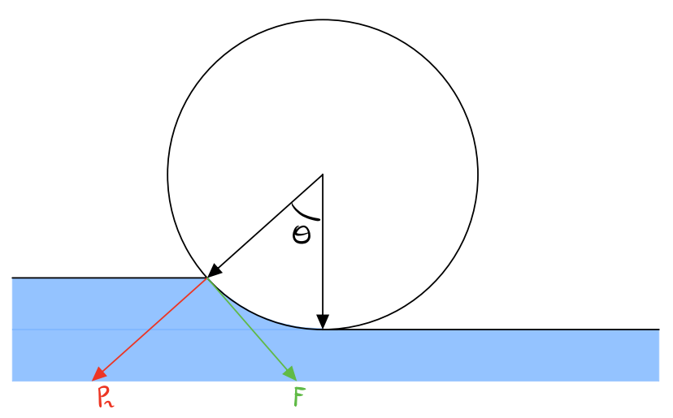

- **Normaalkracht N** (loodrecht op het rol-oppervlak): heeft een **horizontale component N·sinθ** die het materiaal **uit** de wals duwt (tegen de walsrichting in), omdat het rol-oppervlak schuin staat t.o.v. de invoerrichting.
- **Wrijvingskracht F_w = µ·N** (tangentieel aan het rol-oppervlak, in de bewegingsrichting van het rol-oppervlak t.o.v. het werkstuk): heeft een **horizontale component F_w·cosθ = µ·N·cosθ** die het materiaal de wals **in** trekt (in de walsrichting).

**Stappenplan — meeneemvoorwaarde:**

1. Het werkstuk wordt enkel door de rollen "ingeslikt" (meegenomen) als de horizontale wrijvingscomponent ≥ de horizontale normaalcomponent die het materiaal terugduwt:
$$F_w \cdot \cos\theta \geq N \cdot \sin\theta$$

2. Invullen van F_w = µ·N geeft de **meeneemvoorwaarde**: µ moet minstens gelijk zijn aan tanθ van de contacthoek, anders glijdt het werkstuk weg in plaats van ingetrokken te worden.
$$\mu \cdot N \cdot \cos\theta \geq N \cdot \sin\theta \quad\Rightarrow\quad \mu \geq \tan\theta$$

3. De **maximale** contacthoek waarvoor het materiaal nog net wordt meegenomen, volgt uit de gelijkheid (grensgeval µ = tanθ):
$$\tan(\theta_{max}) = \mu \quad\Rightarrow\quad \theta_{max} = \tan^{-1}(\mu)$$

**Interpretatie:** hoe groter de wrijvingscoëfficiënt µ, hoe groter de hoek θ_max waarbij het materiaal nog wordt aangegrepen door de rol — een **ruwer rol-oppervlak (hoger µ)** laat dus toe om met een **grotere contacthoek** (en dus grotere diktereductie per stap, zie (iii)) te walsen.

---

**(iii) Maximale diktereductie per stap d_max**

De contacthoek θ tussen rol en werkstuk is rechtstreeks gekoppeld aan de diktereductie per stap. De rol met straal R drukt het werkstuk in over een diktereductie Δh = d = h₀ − h_f. Op het punt waar het werkstuk het contact met de rol verlaat (of binnenkomt), maakt de rol-omtrek een hoek θ met het horizontale vlak.

**Stappenplan:**

1. **Cirkelgeometrie van de rol** — de verticale indringing (hoogte waarover de rol "inzakt" in het materiaal over de hoek θ):
$$\Delta h = R \cdot (1 - \cos\theta)$$

2. **Kleine-hoekbenaderingen** (in radialen), toegepast op de maximale toelaatbare contacthoek θ_max = tan⁻¹(µ) uit deel (ii):
$$1 - \cos\theta \approx \frac{\theta^2}{2} \qquad \text{en} \qquad \tan\theta \approx \theta \;\Rightarrow\; \theta_{max} \approx \mu$$

3. **Substitueren** in de uitdrukking voor Δh:
$$\Delta h_{max} = R \cdot (1 - \cos\theta_{max}) \approx R \cdot \frac{\theta_{max}^2}{2} \approx R \cdot \frac{\mu^2}{2}$$

4. **Resultaat** (notatie van de cursus):
$$d_{max} = \mu^2 \cdot R$$

**Interpretatie:** de maximaal haalbare diktereductie per wals-stap is **kwadratisch afhankelijk van µ** en **lineair afhankelijk van de walsstraal R**. Een grotere rol (groter R) of een ruwer contactoppervlak (groter µ) laat een grotere reductie per stap toe. Omgekeerd: als de gewenste reductie d groter is dan µ²R, kan de meeneemvoorwaarde niet voldaan worden en moet je ofwel een grotere wals gebruiken, ofwel de reductie over **meerdere stappen** verdelen (zie Cluster 2).

---

### Cluster 2 — Walsen: numerieke oefening (minimale walsdiameter)

*Gesteld in: examen 2021, herhaald op 4 juni 2021.*

**Gegeven:**

- Plaat van 24 mm → 16 mm dikte → totale gewenste diktereductie Δh = 24 − 16 = 8 mm = 0.008 m.
- Wrijvingscoëfficiënt µ = 0.12.
- De wals draait met n = 50 t/min.
- Beschikbare wals: maximale diameter D_max = 600 mm = 0.6 m.

**Vraag:** "Bereken de minimaal benodigde walsdiameter om deze diktereductie in ÉÉN stap te realiseren. Is de beschikbare wals (D_max=600mm) hiervoor voldoende? Indien niet, stel een alternatief voor (bv. in meerdere stappen) en bereken de benodigde walsdiameter voor dat alternatief. Wat is het voordeel van een kleinere walsstraal?"

**Modelantwoord.**

**Stap 1: Meeneemvoorwaarde toepassen op de totale reductie (1 stap)**

Uit Cluster 1 (iii) volgt de maximale diktereductie die een wals met straal R en wrijvingscoëfficiënt µ kan realiseren:

$$d_{max} = \mu^2 \cdot R$$

1. Om de gewenste reductie Δh in **één stap** uit te voeren, moet d_max ≥ Δh. De **minimale walsstraal** R_min volgt uit de grensvoorwaarde d_max = Δh:
$$R_{min} = \frac{\Delta h}{\mu^2}$$

2. **Invullen** met Δh = 0.008 m en µ = 0.12 (µ² = 0.0144):
$$R_{min} = \frac{0.008}{0.0144} \approx 0.556 \text{ m}$$

3. **Minimale walsdiameter:**
$$D_{min} = 2 \cdot R_{min} \approx 2 \cdot 0.556 \approx 1.11 \text{ m}$$

**Stap 2: Vergelijk met de beschikbare wals**

$$D_{min} \approx 1.11 \text{ m} > D_{max} = 0.6 \text{ m}$$

De minimaal benodigde diameter (≈ 1.11 m) is **groter** dan de beschikbare maximale walsdiameter (0.6 m).

**Conclusie:** de beschikbare wals is **niet voldoende** om de volledige reductie van 24 mm naar 16 mm in één enkele stap te realiseren. Bij een poging hiertoe is de meeneemvoorwaarde (θ ≤ θ_max = tan⁻¹(µ)) niet vervuld: het werkstuk zou onder de rol **doorslippen** in plaats van ingetrokken te worden — het walsproces start gewoon niet (de rol "pakt" het materiaal niet).

**Stap 3: Alternatief — verdeel de reductie over meerdere stappen**

Splits de totale reductie in **meerdere kleinere stappen**, elk met een kleinere Δh, zodat elke afzonderlijke stap wél binnen de meeneemvoorwaarde van de beschikbare wals (D = 0.6 m, R = 0.3 m) valt.

Probeer **2 gelijke stappen**: 24 mm → 20 mm → 16 mm, dus per stap Δh = 4 mm = 0.004 m.

1. **Minimale walsstraal** voor één deelstap:
$$R_{min} = \frac{\Delta h}{\mu^2} = \frac{0.004}{0.0144} \approx 0.278 \text{ m}$$

2. **Minimale walsdiameter:**
$$D_{min} = 2 \cdot R_{min} \approx 0.556 \text{ m}$$

**Conclusie:** 0.556 m < D_max = 0.6 m → met **2 stappen** van elk 4 mm reductie (via een tussenmaat van 20 mm) kan de beschikbare wals (D = 600 mm) de gevraagde totale reductie wél realiseren, met zelfs nog een kleine marge.

> **Algemene methode** (cijfers kunnen lichtjes verschillen naargelang afrondingen of gekozen verdeling, bv. niet-gelijke stappen):
> 1. Toets d_max = µ²·R (of, equivalent, R_min = Δh/µ²) tegen de beschikbare D_max.
> 2. Indien R_min > D_max/2 (= R_max beschikbaar): splits de reductie in meerdere stappen met kleinere Δh per stap, totdat R_min per stap ≤ R_max beschikbaar.

**Stap 4 (optioneel): walssnelheid voor een vermogensberekening**

Voor een vermogensberekening (P = F·v) is ook de **omtreksnelheid** van de wals nodig. Met toerental n = 50 t/min en D = 0.6 m:

$$v = \pi \cdot D \cdot n = \pi \cdot 0.6 \cdot 50 \approx 94.2 \text{ m/min} \approx 1.57 \text{ m/s}$$

Deze v vul je in de vermogensformule P = 2π·N·F·L (N = toerental in toeren/s of rad/s; merk op dat dit overeenkomt met de formularium-vorm $P = 2\omega T$ met $T = \dfrac{FL}{2}$ het walskoppel en $\omega = 2\pi N$ de hoeksnelheid), samen met de walskracht $F = wL\left(\dfrac{2}{\sqrt3}\bar{Y}_f\right)\left(1+\dfrac{\mu L}{2h_{av}}\right)$ (met $h_{av}=\dfrac{h_0+h_f}{2}$) en de contactlengte $L=\sqrt{R\cdot\Delta h}=\sqrt{Rd}$ (met $d=\Delta h=h_0-h_f$), om het benodigde aandrijfvermogen van de wals te bepalen.

**Voordeel van een kleinere walsstraal R:**

- **Contactlengte** $L=\sqrt{R\cdot\Delta h}=\sqrt{Rd}$ is kleiner bij een kleinere R (voor gegeven Δh).
- **Walskracht** $F = wL\left(\dfrac{2}{\sqrt3}\bar{Y}_f\right)\left(1+\dfrac{\mu L}{2h_{av}}\right)$ is bijgevolg ook kleiner (F is rechtstreeks proportioneel met L).
- **Vermogen** P = 2π·N·F·L neemt eveneens af, omdat zowel F als L kleiner worden.

Een kleinere wals — of het opdelen van de reductie in meerdere stappen met kleinere Δh per stap — **vermindert dus de belasting (kracht en vermogen) op de wals en de aandrijving per stap**, ook al blijft de **totale arbeid** over alle stappen samen ongeveer gelijk: arbeid is een toestandsfunctie die afhangt van de totale vervorming (rek), niet van het aantal stappen waarin die vervorming wordt opgedeeld.

---

### Cluster 3 — Verstevigingskromme, arbeid, terugvering en warm vs. koud omvormen

*Gesteld in: 5 juni 2025 (tweede examenvariant van die dag), en 4 juni 2026 namiddag (vergelijking warm vs. koud omvormen).*

**Vraag:** "Leg de verstevigingskromme (vloeispanning vs. rek) uit, en hoe hangt de arbeid bij plastische vervorming samen met de gemiddelde vloeispanning $\bar{Y}_f$? Wat is terugvering (springback) bij buigen, en hoe wordt dit gecompenseerd? Vergelijk warm en koud omvormen (invloed van temperatuur op de materiaalwet, krachten, microstructuur, nauwkeurigheid)."

**Modelantwoord.**

**1. De verstevigingskromme**

Het verband tussen de **ware vloeispanning σ** en de **ware rek ε** bij plastische vervorming wordt beschreven door de **verstevigingsfunctie (Hollomon-wet)**:

$$\sigma = K \cdot \varepsilon^n$$

- **K** = sterkteconstante (MPa) — bepaalt de algemene "sterkte"-schaal van de kromme.
- **n** = verstevigingsexponent ($0 < n < 1$) — bepaalt hoe sterk σ toeneemt met ε.
- σ en ε zijn **ware** spanning/rek (bij omvormen werkt men steeds met ware grootheden, niet nominaal, wegens de grote vervormingen).

De kromme is **stijgend**: naarmate het materiaal al meer vervormd is, is meer spanning nodig om het verder te vervormen ($0 < n < 1$, maar de afgeleide blijft positief). Dit heet **versteviging (work hardening / strain hardening)**.

**Versteviging — mechanisme**: bij plastische vervorming bewegen **dislocaties** door het kristalrooster. Bij toenemende vervorming blokkeren deze dislocaties elkaar steeds meer (ophoping/verstrengeling), waardoor verdere vervorming meer spanning vereist. Gevolg: het materiaal wordt **harder en sterker**, maar **brosser** (minder ductiel). Na voldoende koudverstevigen is verdere vervorming bijna onmogelijk zonder scheurvorming. Dit kan ongedaan gemaakt worden door **gloeien (annealing)**: verwarmen boven de rekristallisatietemperatuur, waardoor de dislocatiedichtheid daalt en de ductiliteit terugkeert.

**2. Arbeid bij plastische vervorming en het verband met $\bar{Y}_f$**

De **arbeid per volume-eenheid** om het materiaal van rek 0 tot $\varepsilon_f$ plastisch te vervormen, is de oppervlakte onder de σ-ε-curve:

$$u = \int_0^{\varepsilon_f} \sigma \, d\varepsilon$$

Met de Hollomon-wet $\sigma = K \cdot \varepsilon^n$ ingevuld:

$$u = \int_0^{\varepsilon_f} K \cdot \varepsilon^n \, d\varepsilon = \frac{K \cdot \varepsilon_f^{\,n+1}}{n+1}$$

Met de **gemiddelde vloeispanning** $\bar{Y}_f = \dfrac{K \cdot \varepsilon_f^{\,n}}{n+1}$ herschrijft dit tot:

$$u = \bar{Y}_f \cdot \varepsilon_f$$

**Interpretatie**: de arbeid per volume-eenheid is het product van de **gemiddelde vloeispanning** $\bar{Y}_f$ tijdens het hele proces en de **totale ware rek** $\varepsilon_f$. $\bar{Y}_f$ vertegenwoordigt de "gemiddelde weerstand" van het materiaal: vermenigvuldigd met de totale rek levert dit dezelfde oppervlakte/energie als de exacte integraal onder de variërende σ-ε-kromme. Deze $\bar{Y}_f$ wordt ook gebruikt in krachtberekeningen, zoals de walskracht ($F = wL\left(\dfrac{2}{\sqrt3}\bar{Y}_f\right)\left(1+\dfrac{\mu L}{2h_{av}}\right)$).

**3. Terugvering (springback) bij buigen**

Bij het buigen van een plaat ontstaat in de buigzone zowel een **plastische** als een **elastische** vervormingscomponent. De plastische component is permanent; de elastische component is **reversibel**: zodra de buigkracht (stempel) wegvalt, **veert het elastisch vervormde materiaal terug** naar zijn ongespannen toestand.

Gevolg: de **werkelijke buighoek na het lossen van de stempel is kleiner** dan de opgelegde hoek, en de **buigradius wordt iets groter** dan de matrijsradius. Dit heet **terugvering (springback)** en is **onvermijdelijk** bij elk buigproces, omdat plastische vervorming altijd met een elastische component gepaard gaat.

De **terugveerhoek** wordt gegeven door:

$$\alpha_t = 3 \cdot \frac{R_e}{E} \cdot \frac{r_b + C_a \cdot s_0}{s_0} \cdot \alpha_b$$

waarbij:

- $R_e$ = rekgrens (vloeigrens),
- $E$ = elasticiteitsmodulus,
- $\alpha_b$ = opgelegde (initiële) buighoek,
- $r_b$ = binnenste buigradius,
- $s_0$ = plaatdikte, $C_a$ = correctiefactor voor de neutrale-aspositie.

De **resulterende hoek** na terugvering:

$$\alpha_{res} = \alpha_b - \alpha_t$$

**Interpretatie**: hoe groter de rekgrens $R_e$ (of hoe kleiner $E$), hoe groter $\alpha_t$. **Aluminium** (lage E) veert daarom doorgaans **meer** terug dan **staal** (hoge E, ~3× groter dan aluminium) bij eenzelfde rekgrens.

**Compensatiemethoden**:

1. **Overbuigen**: het werkstuk wordt verder gebogen dan de gewenste eindhoek, zodat na terugvering precies de gewenste hoek overblijft (bv. buigen tot 85° om na terugvering 90° te bekomen).
2. **Bottoming** (matrijsbuigen met hoge slotdruk): het werkstuk wordt met grote kracht volledig in de matrijs gedrukt, wat extra plastische vervorming opwekt. Hierdoor wordt de **elastische energie die kan terugveren kleiner** — resultaat: een veel kleinere terugveerhoek dan bij luchtbuigen.

**4. Warm vs. koud omvormen**

De omvormtemperatuur beïnvloedt de materiaalwet, de benodigde krachten, de microstructuur en de nauwkeurigheid.

**Invloed op de materiaalwet**:

- **Koud omvormen (kamertemperatuur)**: de **rek** is dominant, Hollomon-wet geldt:
$$\sigma = K \cdot \varepsilon^n$$
- **Warm omvormen (hoge temperatuur)**: de **reksnelheid** wordt dominant:
$$\sigma = C^* \cdot \dot{\varepsilon}^m$$
waarbij $\dot{\varepsilon} = \dfrac{d\varepsilon}{dt}$ de reksnelheid is, $m$ de reksnelheidsexponent en $C^*$ de materiaalconstante (notatie van het formularium: $\dot\sigma = C^*\dot\varepsilon^m$).

**Koud omvormen (cold forming)**, rond kamertemperatuur:

- **Krachten**: **hoger** — het materiaal verstevigt (σ stijgt met ε) en de basis-vloeispanning is bij lage temperatuur hoger.
- **Microstructuur**: **versteviging** (work hardening) treedt op — dislocatiedichtheid stijgt, materiaal wordt harder/sterker maar brosser. Geen herkristallisatie tijdens het proces.
- **Nauwkeurigheid/oppervlak**: **betere maatnauwkeurigheid en oppervlakteafwerking** — geen thermische uitzetting/krimp, en de hoge resterende sterkte (door versteviging) is vaak gewenst.

**Warm omvormen (hot forming)**, boven de rekristallisatietemperatuur:

- **Krachten**: **lager** — de vloeispanning is bij hoge temperatuur veel kleiner, grote vervormingen mogelijk met beperkte krachten.
- **Microstructuur**: het metaal **rekristalliseert tijdens het vervormen**, waardoor **geen (of nauwelijks) netto versteviging** optreedt (nieuwe, onvervormde korrels vormen zich continu). Resultaat: doorgaans een **grovere korrelstructuur**, en het oppervlak kan oxideren (walshuid/oxidelaag).
- **Nauwkeurigheid**: **minder nauwkeurig** — bij afkoelen treedt **thermische krimp** op, wat de eindafmetingen minder voorspelbaar maakt; oppervlaktekwaliteit doorgaans minder goed dan bij koud omvormen.

**Samengevat (kernverschil)**: koud omvormen kost meer kracht maar levert een nauwkeuriger, oppervlaktegevoelig en versterkt (verstevigd) product op; warm omvormen vraagt minder kracht en laat grote vervormingen toe zonder versteviging (dankzij herkristallisatie), maar levert een minder nauwkeurig product met grovere korrelstructuur en mogelijke oxidatie.

Tussen beide ligt **halfwarm omvormen** (tussen kamertemperatuur en de rekristallisatietemperatuur), waarbij versteviging slechts gedeeltelijk vermindert.

---

### Cluster 4 — Minimale buigradius / maximale buigstraal: afleiding

*Gesteld in: 27 juni 2018.*

**Vraag:** "Leid een formule af voor de minimale buigradius van een plaat, in functie van de plaatdikte en de breukrek (ductiliteit) van het materiaal. Waarom bestaat er een minimale buigradius?"

**Modelantwoord.**

**Waarom bestaat er een minimale buigradius?**

Bij het buigen van een plaat wordt de **buitenzijde** uitgerekt (trek), de **binnenzijde** samengedrukt (druk), en de **neutrale laag** (ergens tussenin) ondervindt geen lengteverandering. Hoe **kleiner** de buigradius bij gegeven plaatdikte, hoe **groter** de rek die de buitenste vezel moet ondergaan.

Elk materiaal heeft een **maximale toelaatbare rek (breukrek = maat voor ductiliteit)**: zodra de rek in de buitenvezel deze grens overschrijdt, **scheurt** de buitenzijde. Daarom bestaat er voor elk materiaal en elke plaatdikte een **minimale buigradius $R_{min}$**: de kleinste radius waarbij de rek in de buitenvezel nog net niet de breukrek overschrijdt.

**STAPPENPLAN — Afleiding van $R_{min}$**

**1. Geometrie opstellen.** Beschouw een plaat met dikte $t$, gebogen tot binnenstraal $R$ (gemeten tot de binnenkant/drukzijde). De **neutrale laag** ligt bij benadering op de halve dikte, dus op afstand $R + t/2$ van het krommingscentrum. De **buitenvezel** (trekzijde) ligt op afstand $R + t$.

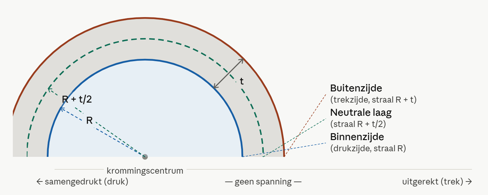


**2. Lengtes vóór en na het buigen.** Vóór het buigen hadden alle vezels (binnen-, neutrale en buitenvezel) dezelfde lengte, namelijk die van de neutrale vezel (de neutrale laag verandert per definitie niet van lengte). Voor een hoeksegment met openingshoek $\theta$ (rad):

$$L_{neutraal} = \left(R + \tfrac{t}{2}\right)\theta \qquad L_{buiten} = (R + t)\,\theta$$

De lengte van de buitenvezel **vóór** het buigen is gelijk aan $L_{neutraal}$ (alle vezels waren nog recht en ongerekt).

**3. Rek in de buitenvezel berekenen.**

$$\varepsilon = \frac{L_{buiten} - L_{neutraal}}{L_{neutraal}} = \frac{(R+t)\theta - (R+\tfrac{t}{2})\theta}{(R+\tfrac{t}{2})\theta} = \frac{(R+t)-(R+\tfrac{t}{2})}{R+\tfrac{t}{2}} = \frac{t/2}{R+t/2}$$

Teller en noemer × 2 geeft de **exacte geometrische relatie**:

$$\varepsilon = \frac{t}{2R+t}$$

Voor $R \gg t$ (grote buigradius t.o.v. plaatdikte) mag $t$ in de noemer verwaarloosd worden:

$$\varepsilon \approx \frac{t}{2R}$$

**4. Grensgeval: rek = breukrek.** $R_{min}$ wordt bereikt wanneer de rek in de buitenvezel gelijk wordt aan de **breukrek $A$** (maximale toelaatbare rek, ductiliteitsgrens):

$$\varepsilon = A \quad \text{bij } R = R_{min}$$

Invullen in de exacte relatie:

$$\frac{t}{2R_{min}+t} = A$$

**5. Oplossen naar $R_{min}$.**

$$t = A\cdot(2R_{min}+t) = 2A\,R_{min} + A\,t$$
$$t - A\,t = 2A\,R_{min} \quad\Rightarrow\quad t(1-A) = 2A\,R_{min}$$

$$\boxed{R_{min} = \frac{t(1-A)}{2A} = \frac{t}{2}\left(\frac{1}{A}-1\right)}$$

**6. Benaderde versie (R ≫ t).** Met $\varepsilon \approx t/(2R)$ en hetzelfde grensgeval $\varepsilon = A$:

$$A \approx \frac{t}{2R_{min}} \quad\Rightarrow\quad R_{min} \approx \frac{t}{2A}$$

**7. Interpretatie van het resultaat.**

- Hoe **groter** de breukrek $A$ (= hoe **ductieler** het materiaal), hoe **kleiner** $R_{min}$ — een zeer ductiel materiaal kan tot een zeer kleine radius gebogen worden zonder te scheuren.
- Omgekeerd: een **bros** materiaal (kleine $A$) heeft een **grote** $R_{min}$ nodig.
- $R_{min}$ is **proportioneel met de plaatdikte $t$** — dikkere platen hebben (bij gelijk materiaal) een grotere minimale buigradius.

**Alternatieve formulering (oppervlaktereductie r)**: via $\varepsilon_f = \ln(A_0/A_f) = \ln\!\left(\dfrac{100}{100-r}\right)$ volgt de equivalente relatie $\dfrac{R_{min}}{t} = \dfrac{50}{r}-1$. Beide formuleringen (via breukrek $\varepsilon_f$ resp. oppervlaktereductie $r$) drukken hetzelfde fysische principe uit: $R_{min}$ wordt bepaald door het punt waarop de rek in de buitenvezel de ductiliteitsgrens van het materiaal bereikt.

**Factoren die de buigbaarheid (en dus $R_{min}$) beïnvloeden:**

- **Materiaalvervormbaarheid/ductiliteit**: een hogere breukrek (of oppervlaktereductie $r$) laat een kleinere $R_{min}$ toe. Voor een volledig buigbaar materiaal ($r \to 50\%$) gaat $R_{min} \to 0$: de plaat kan dan plat dichtgevouwen worden zonder te scheuren.
- **Niveau van koudverstevigen**: hoe meer het materiaal al koudversteviging heeft ondergaan, hoe brosser het wordt en hoe **groter** $R_{min}$ wordt.
- **Randkwaliteit**: ruwe, gestanste of beschadigde randen vormen spanningsconcentraties van waaruit scheuren makkelijker initiëren — een betere randafwerking laat een kleinere $R_{min}$ toe.
- **Anisotropie (walsrichting)**: plaatmateriaal is anisotroop door het walsen — de ductiliteit verschilt naargelang de richting t.o.v. de walsrichting. Buigen **loodrecht op de walsrichting** is gunstiger (hogere effectieve ductiliteit, kleinere $R_{min}$ mogelijk) dan buigen **parallel** aan de walsrichting. Daarom legt men onderdelen in de praktijk bij voorkeur zo neer dat de buigas loodrecht op de walsrichting staat.

---

## Additive Manufacturing

### Voor- en nadelen van AM, SLS vs. FDM, en metaalkeuze bij SLM

*Gesteld in: 25 juni 2024 (herhaalde/recurrente vraag).*

**Vraag:** Wat zijn de voor- en nadelen van 3D-printen (Additive Manufacturing) in vergelijking met conventionele productietechnieken? Wat is het verschil tussen SLS en FDM (proces en materialen)? Kunnen alle metalen verwerkt worden met SLM (Selective Laser Melting)?

**Modelantwoord:**

**1. Voor- en nadelen van AM t.o.v. conventionele productie**

Bij conventionele (subtractieve) productie (frezen, draaien) wordt materiaal van een blok **weggenomen**; bij AM wordt materiaal **laag per laag toegevoegd**, vanaf niets. Dit verschil verklaart de meeste voor- en nadelen.

*Voordelen:*
- **Hoge designvrijheid / complexiteit "gratis"** — bij conventionele bewerking is complexiteit direct gekoppeld aan productiekost; bij AM kost een complex onderdeel niet meer dan een eenvoudig onderdeel van dezelfde grootte. Interne koelkanalen, organische vormen en topologie-geoptimaliseerde structuren worden mogelijk.
- **Lichtgewicht ontwerpen** — via topologie-optimalisatie en lattice (skelet)structuren kan materiaal weggelaten worden zonder verlies van stijfheid. Voorbeeld: vliegtuigdeurscharnier in SLM Ti6Al4V → 65% gewichtsbesparing; ruimtevaartbracket in SLM-AlSi10Mg → 35% gewichtsbesparing, 40% stijver, en reductie van 34 onderdelen (4 stukken + 30 klinknagels) naar 1 geprint onderdeel (functie-integratie).
- **Weinig materiaalverspilling** — geen chips zoals bij frezen; ongebruikt poeder kan (gedeeltelijk) gerecycleerd worden.
- **Geen gereedschap/matrijs nodig** — direct vanaf CAD-model, ideaal voor prototypes en kleine series (geen gereedschapskosten).
- **Personalisatie zonder meerkost** — elk onderdeel kan verschillend zijn (tandheelkundige implantaten, gehoorapparaten) zonder extra kost per variant.
- **Functie-integratie** — meerdere onderdelen samenvoegen tot één geprint stuk.

*Nadelen:*
- **Lage oppervlaktekwaliteit** — ruwer dan gefreesde/geslepen oppervlakken; post-processing bijna altijd nodig.
- **Anisotropie en thermische historiek** — laag-per-laag opbouw met lokale, snelle opwarmings-/afkoelingscycli geeft residuele spanningen en richtingsafhankelijke (anisotrope) mechanische eigenschappen.
- **Traag en duur bij grote series** — productietijd en kost per stuk dalen niet sterk met aantal stuks (geen schaalvoordeel zoals bij matrijsgebonden processen); bij grote volumes economisch niet te rechtvaardigen t.o.v. conventionele processen.
- **Beperkte materiaalkeuze** — niet elk materiaal verwerkbaar via AM; gecertificeerde materialen vaak duurder.
- **Nabewerking vrijwel altijd nodig** — supports verwijderen, baseplate losmaken, spanningsarm gloeien/HIP, oppervlaktebehandeling (gritblasten, polijsten, machinen voor nauwkeurige toleranties).
- **Design for manufacturing complex** — overhangende vlakken vereisen supportstructuren; oriëntatie in de bouwkamer beïnvloedt kwaliteit en kost sterk.
- **Veiligheid** — lasers, fijn metaalpoeder (explosiegevaar) en chemische harsen vereisen specifieke voorzorgen.

**Conclusie:** AM vervangt conventionele technieken niet, maar is complementair: interessant bij kleine tot middelgrote series, personalisatie, geïntegreerde functionaliteit (bv. koelkanalen) en lichtgewichtstructuren (lucht- en ruimtevaart), of wanneer een ontwerp niet met andere processen te maken is.

**2. Verschil tussen SLS en FDM**

*FDM (Fused Deposition Modeling, ook FFF):*
- **Principe:** een thermoplastisch **filament** (draad) wordt van een spoel door een verwarmde **nozzle** geperst en gesmolten. De nozzle beweegt over het XY-vlak en deponeert het gesmolten materiaal laag per laag; het materiaal stolt onmiddellijk door koeling. Na elke laag verplaatst de nozzle (of het platform) zich een laagdikte.
- **Materialen:** ABS, PLA, PEEK, gevulde polymeren, was.
- **Eigenschappen:** goedkoop, desktop-formaat, breed materiaalspectrum, maar **matige nauwkeurigheid en matig oppervlak** (zichtbare laagstructuur) en relatief traag.
- Omdat materiaal in de lucht wordt afgezet, zijn voor overhangende geometrieën **supportstructuren** nodig.

*SLS (Selective Laser Sintering):*
- **Principe:** een dunne laag **poeder** wordt over het bouwplatform uitgespreid. Een laser (typisch Nd:YAG) scant het poeder en **sintert** (smelt lokaal aan elkaar) de korrels op de gewenste plaatsen, laag per laag. Het bouwplatform zakt telkens een laagdikte en een nieuwe poederlaag wordt aangebracht.
- **Materialen:** voornamelijk polymeren — amorfe polymeren (bv. polycarbonaat), semi-kristallijne polymeren (bv. nylon PA, meest gebruikt), elastomeren, en versterkte/gevulde polymeren (glasvezel, koolstofvezel).
- **Belangrijk voordeel:** het **ongesmolten poeder rondom het onderdeel fungeert als support**, waardoor géén aparte supportstructuren nodig zijn. Dit maakt ook **part nesting** mogelijk (meerdere onderdelen 3D "gestapeld" in de bouwtank), wat de machine-efficiëntie sterk verhoogt.
- **Eigenschappen:** gemiddeld tot goede snelheid, **goede nauwkeurigheid**, maar matig oppervlak; machines zijn groter, zwaarder en duurder dan FDM-toestellen.

*Samengevat (incl. SLA ter referentie):*

| | FDM | SLS | (SLA, ter referentie) |
|---|---|---|---|
| Materiaaltoevoer | Gesmolten filament via nozzle | Poederbed + laser | Vloeibare fotopolymeer + UV-laser |
| Faseovergang | Stollen bij koeling | Sinteren/smelten | Fotopolymerisatie |
| Supports nodig? | Ja | Nee (poederbed = support) | Ja |
| Nauwkeurigheid | Matig | Goed | Zeer goed |
| Oppervlak | Matig (zichtbare lagen) | Matig | Zeer goed |
| Snelheid | Slecht (traag) | Gemiddeld–goed | Gemiddeld |
| Kost | Goedkoop | Duurder (grotere/duurdere machines) | — |

**Kernverschil:** FDM smelt en deponeert materiaal lokaal via een nozzle (extrusie, supports nodig); SLS gebruikt een volledig poederbed en de laser sintert enkel de gewenste zones (geen supports nodig, part nesting mogelijk).

**3. Kunnen alle metalen verwerkt worden met SLM?**

Nee. De geschiktheid van een metaalpoeder voor SLM hangt af van een combinatie van materiaal- en poedereigenschappen:

- **Laserabsorptie bij de gebruikte golflengte** — SLM-machines gebruiken meestal een Yb-fiber laser (golflengte rond 1 µm, vermogen 200–400 W). Metalen met een **hoge reflectiviteit** bij die golflengte (bv. koper, aluminium, goud) absorberen de laserenergie veel slechter, waardoor een veel hoger vermogen nodig is. Dit maakt deze materialen moeilijker te verwerken met standaard (infrarood) lasers.
- **Smelttemperatuur en warmtegeleiding** — bepalen samen met de laser- en scanparameters of het ingebrachte vermogen voldoende is om een stabiel smeltbad te vormen. Metalen met zeer hoge warmtegeleiding (bv. koper) voeren de warmte snel weg uit het smeltbad, wat het smelten bemoeilijkt.
- **Vorming van een stabiel smeltbad** — het smeltbad moet continu zijn, verbonden met de vorige laag, voldoende hoog, en een verbindingshoek van ongeveer 90° hebben (goede wetting). Bij sommige materialen/parametercombinaties ontstaat in plaats daarvan **balling** (gesmolten materiaal trekt samen tot losse bolletjes i.p.v. een continue smeltlijn) of **spattering** (druppelvorming door te hoog vermogen/te lage snelheid), wat een poreuze of onregelmatige structuur geeft.
- **Scheurvorming door snelle afkoeling** — SLM gaat gepaard met zeer snelle, lokale opwarmings- en afkoelingscycli, wat grote temperatuursgradiënten en residuele spanningen veroorzaakt. Bepaalde legeringen (bv. sommige hoogsterkte aluminium- of nikkellegeringen) zijn gevoelig voor **scheurvorming** onder deze thermische spanningen.
- **Poederkwaliteit (vorm en grootteverdeling)** — het poeder moet bij voorkeur **sferisch** zijn (ronde korrels stromen beter, uniforme laag); onregelmatige (platte, geblokte) korrels geven een slechte laagkwaliteit. Ook een **optimale deeltjesgrootteverdeling** is nodig (mix van grote en kleine korrels die ruimtes opvullen), met korrelgrootte afgestemd op de laagdikte (typisch 5–60 µm voor lagen van ongeveer 30 µm).

**Conclusie:** SLM heeft op zich een **breed materiaalspectrum** (ferro-, non-ferro-metalen, composieten) en is daarin flexibeler dan EBM (enkel geschikt voor geleidende non-ferro metalen). Maar niet elk metaal is even geschikt: sterk reflecterende metalen zoals koper en aluminium zijn moeilijker te verwerken met courante (infrarood-)lasers, en sommige legeringen zijn gevoelig voor scheurvorming door de snelle thermische cycli. De keuze van het metaal moet dus afgestemd zijn op de laserkarakteristieken (golflengte, vermogen) en op de beschikbaarheid van een geschikt, sferisch poeder met de juiste korrelgrootteverdeling.

---

### EBM — opstelling en vergelijking met SLM

*Gesteld in: examen 2019, herhaald op 27 juni 2018.*

**Vraag:** Schets de opstelling van een EBM-machine (Electron Beam Melting) en benoem de belangrijkste onderdelen. Vergelijk EBM met SLM: wat zijn de gelijkenissen en verschillen (snelheid, thermische spanningen, oppervlaktekwaliteit, herbruikbaarheid van poeder, vacuümvereiste, materialen)?

**Modelantwoord:**

**1. Opstelling van een EBM-machine (te schetsen)**

Van boven naar onder opgebouwd uit:

1. **Elektronenkanon (elektronenbron)** — bovenaan de machine. Een **wolframfilament** wordt verhit tot extreem hoge temperaturen en geeft daardoor elektronen vrij (thermische emissie).
2. **Versnelspanning (elektrisch veld)** — net onder de bron wordt een hoge spanning aangelegd die de vrijgekomen elektronen versnelt tot een gerichte elektronenbundel.
3. **Elektromagnetische lenzen/spoelen** — focusseren de elektronenbundel tot een nauwe straal en buigen (deflecteren) deze elektromagnetisch naar de gewenste positie op het poederbed. Geen bewegende spiegels nodig.
4. **Vacuümkamer** — de volledige opstelling (bron, lenzen, bouwkamer) bevindt zich in een **vacuümkamer**, nodig omdat elektronen anders door botsingen met luchtmolecules verstrooid zouden worden, en om oxidatie van het hete poeder/metaal te voorkomen.
5. **Rake/spreidmechanisme** — verspreidt een dunne laag metaalpoeder over het bouwplatform vanuit een poedervoorraad/cassette.
6. **Poederbed op een voorverwarmd bouwplatform** — het platform wordt op hoge temperatuur gehouden (voorverwarmd), zodat het aangebrachte poeder al op hoge temperatuur start.
7. **Bouwplatform dat per laag zakt** — na het smelten van elke laag zakt het platform een laagdikte (typisch 20–200 µm), zodat een nieuwe poederlaag kan worden aangebracht.

*Bij het natekenen:* elektronenbundel van boven (elektronenkanon) door de elektromagnetische focus-/deflectiespoelen naar onder, het geheel omhuld door een vacuümkamer-omtrek, met onderaan het poederbed/bouwplatform en de rake ernaast die poeder aanbrengt.

**Procesverloop (kan ook gevraagd worden):**
1. Poeder deponeren met de rake (dunne laag).
2. **Voor-sinteren** van het poeder met een **gedefocusseerde** elektronenbundel — verhit het poeder en geeft mechanische cohesie, zodat het zelf als support kan dienen (geen aparte steunstructuren nodig).
3. Selectief **smelten** met een **gefocusseerde** elektronenbundel volgens het scanpatroon.
4. Platform zakt een laagdikte; herhaal voor alle lagen.
5. Post-processing: "cake breaking" (het voorgesinterde poederblok openbreken om de onderdelen vrij te maken), reinigen van holten, machinale nabewerking, polijsten, thermische nabehandeling.

**2. Vergelijking EBM versus SLM**

| Aspect | EBM | SLM |
|---|---|---|
| **Snelheid** | Sneller — de elektronenbundel wordt elektromagnetisch afgebogen zonder bewegende spiegels, en er kan met hogere vermogens gewerkt worden | Trager — de laser wordt afgebogen via een spiegelsysteem (scanner), en de laservermogens zijn doorgaans lager |
| **Thermische spanningen** | Lager — het poederbed wordt voorverwarmd en op hoge temperatuur gehouden, waardoor de temperatuursgradiënten tussen smeltzone en omgeving kleiner zijn en er minder krimp-/restspanningen ontstaan | Hoger — er is geen (sterke) voorverwarming, dus grotere temperatuursgradiënten en meer residuele spanningen (vaak is spanningsarm gloeien nodig) |
| **Oppervlaktekwaliteit** | Ruwer — grotere poederkorrels (20–300 µm) en de hogere procestemperatuur doen meer poederkorrels aan het oppervlak aansinteren ("kleven"), wat de ruwheid verhoogt | Beter — fijner poeder en volledige smelting geven een gladder, nauwkeuriger oppervlak |
| **Herbruikbaarheid van poeder** | Het voorgesinterde poeder is moeilijker te recycleren (het zit aan elkaar gesinterd en moet losgebroken worden); echter, dankzij het vacuüm is er minder oxidatie van het poeder | Poeder is over het algemeen makkelijker te scheiden van het onderdeel, maar kan gevoeliger zijn voor oxidatie omdat er met inert gas (geen vacuüm) gewerkt wordt |
| **Vacuümvereiste** | Vereist een **vacuümkamer** — nodig voor een goede elektronenbundel (geen verstrooiing door luchtmolecules) en om oxidatie/reactie met de atmosfeer te voorkomen; ook geen gasinsluitsels | Werkt onder **inert gas** (Ar of N₂) bij (nagenoeg) atmosfeerdruk — geen vacuüm nodig, enkel een lage zuurstofconcentratie (O₂ < 0,1%) om oxidatie te beperken |
| **Materialen** | Beperkt tot **geleidende, non-ferro metalen** (bv. titanium Ti6Al4V, kobalt-chroom CoCrMo) — de bundel bestaat uit elektrisch geladen deeltjes, dus het poeder moet elektrisch geleidend zijn en mag niet te sterk opladen | **Breed materiaalspectrum** — ferro- en non-ferrometalen en composieten zijn mogelijk, al zijn sterk laserreflecterende metalen (bv. koper, aluminium) moeilijker te verwerken |

**Gelijkenissen:** beide zijn poederbed-gebaseerde AM-technieken die laag per laag werken volgens hetzelfde principe (poeder aanbrengen → lokaal smelten volgens scanpatroon → platform zakt → herhalen), en beide vereisen post-processing (onderdeel losmaken van platform/poederblok, eventuele supports verwijderen, thermische en mechanische nabewerking).

---

### SLM-machine — schets, onderdelen en workflow

*Gesteld in: 8 juni 2018 namiddag.*

**Vraag:** Schets de opbouw van een SLM-machine (Selective Laser Melting) en benoem de belangrijkste onderdelen. Beschrijf de volledige workflow van een digitaal ontwerp (CAD) tot het finale, afgewerkte product.

**Modelantwoord:**

**1. Opbouw van een SLM-machine (te schetsen)**

Belangrijkste onderdelen:

1. **Laserbron** — meestal een Yb-fiber laser (typisch 200–400 W), bovenaan of langs de zijkant van de machine, buiten de bouwkamer.
2. **Scanner / spiegelsysteem (galvanometerspiegels)** — tussen laserbron en bouwkamer, bovenaan de bouwkamer. Stuurt en focusseert de laserstraal en buigt deze af zodat elk punt van het poederbed bereikt kan worden volgens het vooraf berekende scanpatroon.
3. **Bouwkamer** — afgesloten ruimte gevuld met **inert gas** (argon of stikstof, O₂-gehalte < 0,1%) om oxidatie van het hete metaalpoeder en de gesmolten laag te voorkomen.
4. **Bouwplatform (build platform)** — centraal in de bouwkamer; hier wordt het onderdeel laag per laag opgebouwd. Zakt na elke laag een laagdikte (typisch 20–200 µm) via een z-as aandrijving.
5. **Poedertoevoersysteem / feedcontainer** — aan één (of beide) zijde(n) van het bouwplatform, reservoir met vers metaalpoeder.
6. **Recoater / wiper (doseerarm)** — arm of rol die over het bouwplatform beweegt en een dunne, gelijkmatige laag poeder uit de feedcontainer over het platform uitstrijkt (spreidt).
7. **Overloopbak (overflow container)** — aan de andere zijde van het bouwplatform, vangt overtollig poeder op dat door de recoater wordt weggeveegd.

*Bij het natekenen:* laserbron met daaronder het spiegel-/scannersysteem dat de laserstraal naar het bouwplatform richt; het geheel omsloten door de bouwkamer (gevuld met inert gas); links en rechts van het bouwplatform respectievelijk de poedertoevoer (feedcontainer, die omhoog beweegt om poeder aan te bieden) en de overloopbak; de recoaterarm die horizontaal over het platform beweegt om poeder te verspreiden; en het bouwplatform dat trapsgewijs naar onder zakt naarmate er meer lagen worden opgebouwd.

**Procesverloop op de machine:**
1. De recoater spreidt een dunne laag poeder (vanuit de feedcontainer) over het bouwplatform.
2. De laser scant de laag volgens het scanpatroon en **smelt het poeder volledig** (in tegenstelling tot SLS, waar enkel gesinterd wordt). Na het stollen ontstaat een dichte, metallische laag verbonden met de laag eronder.
3. Het bouwplatform zakt één laagdikte.
4. Herhaal stap 1–3 voor elke laag tot het onderdeel volledig is opgebouwd.

**2. Volledige workflow: van CAD tot eindproduct**

De volledige AM-procesketen doorloopt vijf stappen, ongeacht de specifieke technologie:

**Stap 1 — CAD-ontwerp:** het onderdeel wordt ontworpen als 3D solid model in een CAD-pakket. Hier wordt al rekening gehouden met "design for AM": oriëntatie, vermijden van onnodige overhangen, eventueel topologie-optimalisatie of lattice-structuren.

**Stap 2 — Export naar STL-bestand:** het CAD-model wordt omgezet naar een **STL-bestand (Standard Tessellation Language)**, dat het buitenoppervlak beschrijft als een netwerk van driehoekjes (triangulatie), elk met hun normaalvector. Hoe meer driehoekjes, hoe nauwkeuriger gekromde oppervlakken benaderd worden — maar hoe groter het bestand. In deze fase worden ook bouworiëntatie en eventuele supportstructuren bepaald (CAPP-fase).

**Stap 3 — Slicen:** de software snijdt het STL-model in **horizontale lagen** met vaste laagdikte (typisch 20–200 µm voor metalen zoals bij SLM). Voor elke laag wordt het **scanpatroon** berekend dat de laser moet volgen (contouren, vulling/hatching, eventuele supports) — dit resulteert in het NC-programma voor het printproces.

**Stap 4 — Bouwen (het SLM-proces):** de machine bouwt het onderdeel laag per laag op zoals hierboven beschreven: poeder aanbrengen met de recoater, laser smelt het poeder selectief volgens het scanpatroon, platform zakt een laagdikte — herhaald tot het volledige onderdeel opgebouwd is.

**Stap 5 — Post-processing:** Na het printen zijn vrijwel altijd nabewerkingsstappen nodig:
- **Onderdeel losmaken van het bouwplatform** — zagen of vonken (EDM) van het onderdeel + supports van de bouwplaat.
- **Supports verwijderen** — de structuren die tijdens het printen overhangende zones ondersteunden, worden mechanisch verwijderd.
- **Thermische nabehandeling** — spanningsarm gloeien om residuele (thermische) spanningen te reduceren, eventueel HIP (Hot Isostatic Pressing) om interne poriën dicht te drukken en de dichtheid/mechanische eigenschappen te verbeteren.
- **Oppervlaktebehandeling/machining** — gritblasten of polijsten voor een betere oppervlakteruwheid, en/of machinale nabewerking (frezen, boren) waar nauwkeurige toleranties of vlakheid vereist zijn.

Na deze stappen is het **eindonderdeel** klaar voor gebruik of assemblage.

> **Belangrijk voor examen:** De volledige keten CAD → STL (triangulatie) → slicen (lagen + scanpatroon) → bouwen (laag-per-laag SLM-proces) → post-processing (loszagen, supports verwijderen, thermisch behandelen, machinen) moet je kunnen reproduceren en motiveren waarom elke stap noodzakelijk is.


---

## Laserbewerking

### Lasersnijden — proces, snijgas en bundelkwaliteit

*Gesteld in: examen 4 juni 2026*

**Vraag:**
1. Leg het proces van lasersnijden uit aan de hand van een schema, en geef de belangrijkste procesparameters.
2. Waarom wordt er snijgas gebruikt? Geef voorbeelden van welk gas optimaal is voor een bepaald metaal.
3. Geef 2 parameters waarop je de kwaliteit van een laserstraal kunt beoordelen.
4. Hoe wordt de bundeldiameter gedefinieerd en gemeten?

---

**Modelantwoord**

**1. Proces van lasersnijden (schema + procesparameters)**

Bij lasersnijden smelt en/of verdampt een **laserstraal** lokaal het materiaal, terwijl een **gasstraal** het gesmolten/verdampte materiaal uit de snede blaast. Schema van de opstelling (van boven naar onder):

- **Laserbron**: genereert de (ruwe) laserstraal met bepaalde golflengte, vermogen en bundelkwaliteit.
- **Focusseeroptiek (lens)**: focusseert de laserstraal tot een klein focuspunt (de "spot"). De **focuspositie** t.o.v. het werkstukoppervlak (boven, op of onder het oppervlak) is instelbaar.
- **Snijkop met coaxiale snijgastoevoer**: coaxiaal (concentrisch) met de laserstraal voert een nozzle een straal **snijgas (assist gas)** aan, dat meestroomt naar het focuspunt.
- **Focuspunt op het werkstuk**: hier smelt/verdampt het materiaal lokaal door de hoge energie-intensiteit van de gefocuste bundel.
- **Werkstuk**: de plaat waarin gesneden wordt; snijkop of werkstuk beweegt volgens de gewenste snijcontour voor een doorlopende snede.
- **Snede/kerf**: de opening die ontstaat doordat het gesmolten/verdampte materiaal continu wordt weggeblazen terwijl de snijkop voortbeweegt.

**Belangrijkste procesparameters**:

- **Laservermogen $P$**: hoe meer vermogen, hoe meer energie per tijdseenheid ingebracht wordt.
- **Snijsnelheid $v$**: voortbewegingssnelheid van de snijkop langs de contour; bepaalt de energie per lengte-eenheid.
- **Focuspositie $f$**: positie van het focuspunt t.o.v. het plaatoppervlak (boven/op/onder), en de focusdiameter (spotgrootte).
- **Stand-off distance**: afstand tussen nozzle en werkstukoppervlak.
- **Gasdruk $p$**: druk van het snijgas door de nozzle.
- **Type snijgas**: inert (N₂, Ar) of reactief (O₂) — bepaalt zowel de chemische werking als de uitstootkracht.

Deze parameters moeten op elkaar afgestemd worden: bv. een **te hoge snelheid** in combinatie met een **onvoldoende gasdruk** leidt tot **onvolledige uitstoot** van het smeltbad.

---

**2. Waarom snijgas? En welk gas voor welk metaal?**

Het snijgas (*assist gas*) heeft **twee functies**:

1. **Uitstootkracht (mechanisch)**: de gasstraal blaast het gesmolten/verdampte materiaal uit de snede. Zonder voldoende uitstroomsnelheid blijft materiaal hangen of hecht het opnieuw aan de onderkant (*dross*).
2. **Chemische atmosfeer (thermisch/chemisch)**: het gas bepaalt of oxidatie van het snijvlak optreedt, en kan — indien reactief — een **exotherme reactie** met het materiaal aangaan die extra energie toevoegt ("brandsnijden").

Hieruit volgen **twee snijmodi**, elk met een optimaal gas afhankelijk van het materiaal:

- **Smeltsnijden (laser fusion cutting) — inert gas (N₂ of Ar)**: geen oxidatie → **oxidevrije, "blanke" snijrand**. Optimaal voor **roestvrij staal (RVS) en aluminium**, waar oxidatie de kwaliteit (corrosiebestendigheid/lasbaarheid van de rand) zou verslechteren. **Nadeel**: hoog gasdebiet nodig (puur mechanische functie, geen energiebijdrage) → duur.

- **Brandsnijden (laser flame cutting / oxidative cutting) — zuurstof (O₂)**: O₂ reageert **exotherm** met staal, wat extra thermische energie levert (verdubbelt ongeveer het thermisch beschikbaar vermogen) → dikkere platen en/of hogere snelheid. Optimaal voor **koolstofstaal**. Bij RVS/aluminium **niet** geschikt: de oxidatie geeft hier een slechte kwaliteit (verkleuring/oxidehuid).

**Conclusie — afweging snelheid/kost vs. kwaliteit**: O₂ geeft meer snijsnelheid/dikkere platen tegen lagere gaskost voor koolstofstaal, maar geeft een onaanvaardbaar oxidevlak op RVS/aluminium, waarvoor men het duurdere inerte gas (N₂/Ar) gebruikt voor een oxidevrije snede.

---

**3. Twee parameters om de kwaliteit van een laserstraal te beoordelen**

Een laser met **hoge bundelkwaliteit** kan gefocust worden tot een **kleine spot met hoge intensiteit** — cruciaal voor snijden en lassen: hoe kleiner de spot, hoe meer energie per oppervlakte-eenheid en hoe efficiënter het materiaal verwerkt wordt.

**a) Het Beam Parameter Product (BPP)**

$$\text{BPP} = w_0 \times \theta$$

waarbij:

- $w_0$ = straal van de bundel op het smalste punt (de *waist*/taille, in het focus)
- $\theta$ = halve divergentiehoek van de bundel buiten de focus

Het BPP combineert dus hoe "smal" de bundel in zijn taille is met hoe snel hij daarna weer uit elkaar loopt. Een **lage BPP** = betere bundelkwaliteit: de bundel kan tot een kleinere spot gefocust worden en blijft daarna relatief evenwijdig (lage divergentie). Voor een ideale Gaussiaanse bundel geldt het **minimaal mogelijke BPP**:

$$\text{BPP}_{Gauss} = \frac{\lambda}{\pi}$$

Een **kortere golflengte $\lambda$** geeft dus een lager (beter) minimaal BPP. Dit verklaart waarom fiber lasers ($\lambda \approx 1\ \mu m$) een veel lagere BPP (betere bundelkwaliteit) hebben dan CO₂-lasers ($\lambda = 10{,}6\ \mu m$).

**b) De M²-factor**

$$M^2 = \frac{\text{BPP}}{\text{BPP}_{Gauss}} = \frac{\text{BPP} \times \pi}{\lambda}$$

De M²-factor vergelijkt de werkelijke bundelkwaliteit (BPP) met die van een ideale Gaussiaanse bundel met dezelfde golflengte. Voor een **ideale Gaussiaanse (TEM₀₀) bundel is $M^2 = 1$** — de best mogelijke kwaliteit. In de praktijk is $M^2$ altijd groter dan 1: **hoe hoger $M^2$, hoe slechter de focusseerbaarheid** (hoe groter de minimaal haalbare spotgrootte bij gelijke optiek).

Ter illustratie: fiber lasers halen typisch $M^2 \approx 4$–$10$, CO₂-lasers en diodelasers veel hoger ($M^2 > 70$). **Zowel een lagere BPP als een lagere $M^2$ betekenen een betere bundelkwaliteit en een kleinere mogelijke focusspot.**

---

**4. Definitie en meting van de bundeldiameter**

De bundeldiameter van een (Gaussisch) laserlicht heeft geen scherpe rand (zoals een mechanisch object), omdat de intensiteit geleidelijk afneemt van centrum naar rand volgens een **Gaussisch intensiteitsprofiel**. Daarom gebruikt men een conventie:

- **Definitie**: de bundeldiameter = diameter van de cirkel waarbinnen de intensiteit gedaald is tot $1/e^2$ (ongeveer 13,5%) van de piekintensiteit in het centrum — de **"1/e²-diameter"**. Analoog wordt de bundelstraal $w_0$ in het focus (de *waist*) gedefinieerd: de straal waarbinnen de intensiteit tot $1/e^2$ van het maximum gedaald is.

- **Rayleighlengte $z_R$**: de afstand (langs de bundelas, vanaf het focus/de taille) waarover de bundeldoorsnede in oppervlakte verdubbelt, d.w.z. waar de bundelstraal met een factor $\sqrt{2}$ gegroeid is t.o.v. de minimale straal $w_0$. Een **grotere Rayleighlengte** betekent dat de bundel over een grotere afstand smal (gefocust) blijft — de focus is "dieper".

- **Meting**: experimenteel via **bundelprofielmeting (beam profiling)**:
  - **Knife-edge-meting**: een scherp mes wordt geleidelijk door de bundel geschoven terwijl het doorgelaten vermogen gemeten wordt met een vermogensdetector. Uit de vorm van deze "afsnijcurve" (0% tot 100% van het vermogen) wordt de $1/e^2$-diameter op die positie afgeleid.
  - **Camera- of scanning-slit beam profiler**: meet het volledige 2D-intensiteitsprofiel rechtstreeks, waaruit de $1/e^2$-diameter direct bepaald wordt.

  Om de volledige bundelkwaliteit ($w_0$, $\theta$, BPP, $M^2$, $z_R$) te bepalen, voert men deze diametermeting uit **op verschillende posities langs de bundelas** — typisch rond het focuspunt (de taille) en op een afstand $z_R$ ervan, waar de gemeten diameter $\sqrt{2}$ keer de minimale (taille-)diameter moet bedragen. Door de gemeten diameters als functie van de axiale positie te fitten aan het theoretische (hyperbolische) verloop van een Gaussische bundel, bepaalt men $w_0$, $\theta$ (en dus BPP en $M^2$).

---

## Algemeen overzicht — productietechnieken herkennen aan een voorwerp

### Gesteld in: 17 juni 2019 (bijvraag)

**Vraag:** *"Je krijgt een voorwerp van de prof te zien (of een foto/schets ervan). Welke productietechnieken zouden gebruikt kunnen zijn om dit voorwerp te maken? Verantwoord je antwoord aan de hand van vorm, materiaal en oppervlakte-eigenschappen van het voorwerp."*

### Modelantwoord — aanpak en herkenningsgids

Dit type vraag heeft geen vast "juist" antwoord: de bedoeling is **systematisch redeneren** vanuit vorm, materiaal en afwerking naar **plausibele combinaties** van productietechnieken (vaak meerdere stappen: ruwvormproces + nabewerking(en)). Onderstaande gids structureert deze redenering.

#### Stap 1 — Het grote plaatje: 6 hoofdgroepen

Elke productietechniek valt in een van deze 6 hoofdgroepen. Loop ze systematisch af: *"is dit proces fysisch mogelijk/plausibel gezien vorm, materiaal en afwerking van dit voorwerp?"*

| Hoofdgroep | Principe | Voorbeelden |
|---|---|---|
| **Oervormen** | Vorm geven aan vormloos/vloeibaar materiaal | Zandgieten, spuitgieten, additive manufacturing |
| **Omvormen** | Plastisch vervormen, **geen** materiaalverlies | Smeden, walsen, buigen, dieptrekken |
| **Scheiden/Afnemen** | Materiaal wordt **weggenomen** | Verspanen (draaien, frezen, boren), slijpen, lasersnijden, stansen/ponsen |
| **Verbinden** | Meerdere delen worden samengevoegd | Lassen, lijmen, klinken, schroeven |
| **Opbrengen van lagen** | Materiaal **toevoegen** op een oppervlak | Coaten, galvaniseren, laser cladding, verven |
| **Eigenschappen veranderen** | Microstructuur aanpassen zonder vormverandering | Harden, gloeien, vergroeven (grind hardening) |

Een voorwerp is vrijwel altijd het resultaat van **een combinatie**, bv.: *zandgieten (ruwvorm, Oervormen) → afdraaien van de lagerzittingen (Scheiden) → slijpen van de asdelen (Scheiden, precisie) → hardingsbehandeling (Eigenschappen veranderen)*.

#### Stap 2 — Kenmerken van het voorwerp en wat ze verklappen

**Vorm en symmetrie**

| Kenmerk | Wijst op |
|---|---|
| Rotatiesymmetrisch (as, schijf, bus) | **Draaien** (verspanen) — evt. voorafgegaan door **walsen** (staaf/buis als halffabricaat) of **smeden** |
| Prismatisch met vlakke vlakken, sleuven, kamers | **Frezen** |
| Dunwandig plaatwerk, constante dikte, gebogen/geplooid | **Omvormen van plaatwerk**: buigen, dieptrekken, walsen |
| Gat(en) met scherpe rand en evenwijdige wanden, dunne plaat | **Stansen/ponsen** |
| Complexe interne kanalen, holtes, ondersnijdingen niet bewerkbaar met gereedschap | **Gieten** (met kernen) of **Additive Manufacturing** |
| Lichte, periodieke, poreuze interne structuur (honingraat/lattice) | **Additive Manufacturing** (lattice structures) |
| Grote, complex gevormde structuur met variabele wanddikte, "organische" vormen | **Gieten** of **AM** (vrijheid van vorm) |

**Oppervlaktekwaliteit en ruwheid**

| Kenmerk | Wijst op |
|---|---|
| Zeer glad, spiegelend ($R_t$ zeer laag, $< 0{,}1\ \mu m$) | **Slijpen** gevolgd door **honen/superfijnen/lappen** (precisie-nabewerking) |
| Glad met regelmatige, fijne spiraal- of cirkelvormige bewerkingssporen | **Draaien/frezen** (verspanen) — sporen volgen de voedingsrichting van het gereedschap: $$R_t = \frac{f^2}{8 \cdot r_\varepsilon}$$ |
| Mat, korrelig, met kleine poriën of "huid" | **Gieten** (zandgieten geeft een typische zandstructuur-afdruk) |
| Ruw met zichtbare, evenwijdige laagjes/treden ("3D-print-look") | **Additive Manufacturing** (laagdikte zichtbaar, vooral op hellende/downfacing vlakken) |
| Glanzend, hard, met kleurverschil t.o.v. kernmateriaal | **Opbrengen van een laag**: coating, cladding, galvaniseren, of een **hardingslaag** (Eigenschappen veranderen) |
| Afgeronde rand aan één zijde, scherpe/ruwe rand met braam aan de andere zijde van een gat/plaat | **Stansen/ponsen** (rollover op intredezijde, breukvlak + braam op uittredezijde) |
| Smeltrand, evt. met aanhechting (dross) of inbranding | **Lasersnijden** |

**Scheidingslijnen, naden en symmetrie-onderbrekingen**

| Kenmerk | Wijst op |
|---|---|
| Dunne, vlakke "naadlijn" rond het hele voorwerp (vormnaad/flash line) | **Gieten** (scheidingsvlak van de mal) of **smeden in matrijs** (overtollig materiaal/flash) |
| Verhoogde, gestolde rups van materiaal tussen twee delen | **Lassen** (lasrups), evt. met zichtbare warmte-beïnvloede zone (kleurverandering) |
| Twee identieke, symmetrisch geplaatste lokale verdikkingen/deukjes op een plaat | **Puntlassen** (lasnoten) |
| Continue, overlappende rij van lasnoten | **Rolnaadlassen** (bv. radiatoren) |

**Materiaal en microstructuur (indien vermeld of zichtbaar, bv. op doorsnede)**

| Kenmerk | Wijst op |
|---|---|
| Fijne, willekeurig georiënteerde (dendritische) korrels, evt. poriën/krimpholtes | **Gieten** |
| Langwerpige, in de vervormingsrichting georiënteerde korrels ("vezelstructuur") | **Smeden/walsen** (omvormen) — sterker volgens de vezelrichting |
| Kolomvormige korrels, evenwijdig over de hele lengte (geen dwarse korrelgrenzen) | **Gericht gestold (DS)** gietstuk — typisch turbinebladen |
| Geen korrelgrenzen zichtbaar, één enkele kristalorientatie | **Single Crystal (SX)** gietstuk |
| Harde buitenlaag, zachte kern (of omgekeerd bij gericht harden) | **Eigenschappen veranderen**: oppervlakteharden (bv. slijpen/grind hardening, laserharden, of klassiek harden+ontlaten) |

#### Stap 3 — Snelle cross-checks (vaak verward in examenvragen)

- **Meeloop vs. tegenloop** (frezen): meeloopfrezen is de voorkeur bij CNC-machines (minder slijtage, betere oppervlaktekwaliteit), tegenloop wanneer speling in de aandrijving niet kan worden opgevangen.
- **MIG vs. MAG**: MIG gebruikt een inert gas (Ar) — voor non-ferro (Al, RVS); MAG gebruikt een actief gas (CO₂ of Ar/CO₂-mengsel) — voor staal.
- **Smeltsnijden vs. brandsnijden** (laser): smeltsnijden met N₂/Ar geeft een oxidevrije, blanke snede (RVS, Al); brandsnijden met O₂ is exotherm en sneller bij dikkere koolstofstaalplaten, maar geeft een geoxideerde rand.
- **EDM vs. ECM**: EDM is thermisch (vonkerosie, het gereedschap slijt mee af); ECM is elektrochemisch (anodische oplossing, het gereedschap slijt niet en is zelf-corrigerend).
- **ns- vs. fs-laser**: een nanoseconde-laser veroorzaakt smelt + een warmte-beïnvloede zone (HAZ); een femtoseconde-laser werkt via sublimatie (ablatie) zonder noemenswaardige HAZ — relevant voor precisiebewerking van gevoelige materialen.
- **SLS vs. SLM**: SLS sintert poederdeeltjes (deeltjes versmelten oppervlakkig, het omliggende poederbed ondersteunt het deel — geen support-structuren nodig); SLM smelt het poeder volledig (vereist support-structuren voor overhangende geometrie en warmteafvoer).
- **Harde vs. zachte slijpschijf**: contra-intuïtief! Een **harde** slijpschijf wordt gebruikt voor een **zacht** werkstukmateriaal (en omgekeerd) — zo blijft de afslijtsnelheid van de schijf in balans met de afslijting van het werkstuk (zelfscherpend effect).
- **Stansen vs. ponsen**: bij stansen (*blanking*) is het **uitgestanste stuk** het product (de matrijsopening = gewenste buitencontour); bij ponsen (*punching*) is het **gat** het product (de pons = gewenste gatcontour). Dit bepaalt welke afmeting (pons of matrijs) de nominale maat krijgt en welke gecorrigeerd wordt met de snijspleet.
- **DS vs. SX turbineblad**: een DS-blad (Directionally Solidified) heeft kolomvormige korrels evenwijdig aan de hoofdspanningsas (korrelgrenzen lopen niet dwars op de belasting); een SX-blad (Single Crystal) heeft **geen korrelgrenzen** — één enkel kristal, wat de hoogste creep-weerstand geeft maar het duurst/moeilijkst te produceren is.

#### Stap 4 — Structuur van een goed antwoord

Voor een concreet voorwerp in het examen:
1. **Beschrijf** kort de relevante kenmerken van het voorwerp (vorm, materiaal indien gegeven, oppervlaktekwaliteit, eventuele naden/lassen/poriën die je opmerkt).
2. **Loop de 6 hoofdgroepen af** en elimineer de groepen die fysisch niet plausibel zijn (bv. een dunwandig, scherp-hoekig plaatdeel sluit gieten als hoofdproces meestal uit).
3. **Stel een procesketen voor** (meestal 2-3 stappen): een ruwvorm-/halffabricaatproces (Oervormen of Omvormen — bv. gieten, walsen, smeden) gevolgd door een of meer bewerkingsstappen (Scheiden — verspanen voor pasvlakken/toleranties, slijpen voor precisie-oppervlakken) en eventueel een laatste stap (Verbinden, Opbrengen van lagen, of Eigenschappen veranderen) indien het voorwerp dat vereist (bv. een gelaste constructie, een coating, of een geharde slijtlaag).
4. **Verantwoord elke stap** kort aan de hand van een concreet kenmerk uit Stap 2 (bv. *"de spiraalvormige bewerkingssporen op de cilindrische as wijzen op draaien; de spiegelglans van de lagerzitting wijst op een bijkomende slijpbewerking"*).
